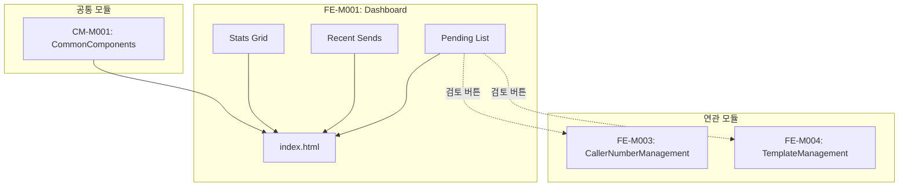

# FE-M001: Dashboard 모듈 상세 개발 설계서

## 1. 모듈 개요

### 1.1 모듈 식별 정보
- **모듈 ID**: FE-M001
- **모듈명**: Dashboard (대시보드)
- **담당 개발자**: Frontend Developer
- **예상 개발 기간**: 3일
- **우선순위**: P0 (최우선)

### 1.2 모듈 목적 및 범위
- **핵심 기능**:
  1. 실시간 서비스 현황 통계 표시
  2. 최근 발송 내역 요약 표시
  3. 승인 대기 목록 표시
  4. 시스템 상태 모니터링
  5. 빠른 메뉴 접근 지원

- **비즈니스 가치**: 관리자가 서비스 전반의 현황을 한눈에 파악하고 즉각적인 의사결정을 내릴 수 있도록 지원

- **제외 범위**:
  - 상세 통계 분석 (FE-M005에서 처리)
  - 개별 건 상세 조회 (각 관리 모듈에서 처리)
  - 데이터 수정/삭제 기능

### 1.3 목표 사용자
- **주 사용자 그룹**: 시스템 관리자, 운영 담당자
- **사용자 페르소나**:
  - 매일 아침 시스템 현황을 확인하는 운영 매니저
  - 실시간으로 서비스 상태를 모니터링하는 운영 담당자
  - 긴급 처리 건을 빠르게 파악해야 하는 CS 담당자
- **사용 시나리오**:
  - 출근 후 당일 실적 및 대기 건 확인
  - 긴급 처리가 필요한 승인 대기 건 파악
  - 시스템 이상 여부 확인

---

## 2. 기술 아키텍처

### 2.1 모듈 구조
```
FE-M001-Dashboard/
├── index.html              # 대시보드 메인 페이지
├── components/
│   ├── stats-grid/         # 통계 카드 그리드
│   │   ├── stat-card.html  # 개별 통계 카드
│   │   └── stat-card.css   # 통계 카드 스타일
│   ├── recent-activity/    # 최근 활동 테이블
│   │   ├── send-history.html
│   │   └── pending-list.html
│   └── quick-actions/      # 빠른 액션 버튼
├── services/
│   └── dashboard-service.js # 대시보드 데이터 서비스
├── utils/
│   └── dashboard-utils.js   # 유틸리티 함수
└── tests/
    └── dashboard.test.js    # 단위 테스트
```

### 2.2 기술 스택
- **마크업**: HTML5
- **스타일링**: CSS3 (CSS Variables, Flexbox, Grid)
- **스크립트**: Vanilla JavaScript (ES6+)
- **아이콘**: SVG (인라인)
- **의존성**: admin-common.css, admin-common.js

---

## 3. 인터페이스 정의

### 3.1 외부 의존성
```javascript
// 이 모듈이 의존하는 외부 모듈/서비스
const ExternalDependencies = {
    modules: ['CM-M001'],                    // 공통 컴포넌트 모듈
    apis: [
        '/api/admin/dashboard/stats',        // 통계 데이터
        '/api/admin/dashboard/recent-sends', // 최근 발송 내역
        '/api/admin/dashboard/pending'       // 승인 대기 목록
    ],
    sharedComponents: [
        'stat-card',
        'badge',
        'table',
        'btn'
    ],
    utils: [
        'formatNumber',
        'formatDate',
        'showToast'
    ]
};
```

### 3.2 제공 인터페이스
```javascript
// 이 모듈이 외부에 제공하는 인터페이스
const DashboardModule = {
    // 페이지 컴포넌트
    pages: {
        DashboardPage: 'index.html'
    },
    
    // 서비스 함수
    services: {
        loadDashboardStats: () => Promise,
        loadRecentSends: () => Promise,
        loadPendingList: () => Promise,
        refreshDashboard: () => void
    },
    
    // 이벤트
    events: {
        onStatsLoaded: 'dashboard:stats:loaded',
        onRefresh: 'dashboard:refresh'
    }
};
```

### 3.3 API 명세
```javascript
// REST API 엔드포인트
const APIEndpoints = {
    GET_STATS: {
        method: 'GET',
        path: '/api/admin/dashboard/stats',
        request: null,
        response: {
            todaySendCount: Number,
            todayChargeAmount: Number,
            todayNewUsers: Number,
            pendingApprovals: {
                callerNumber: Number,
                template: Number
            },
            pendingInquiries: {
                total: Number,
                urgent: Number
            },
            systemStatus: String // 'normal' | 'warning' | 'error'
        },
        errors: ['401', '500']
    },
    
    GET_RECENT_SENDS: {
        method: 'GET',
        path: '/api/admin/dashboard/recent-sends',
        request: {
            limit: Number // default: 10
        },
        response: [{
            sendDate: String,
            member: String,
            email: String,
            messageType: String,
            sendCount: Number,
            successCount: Number,
            failCount: Number,
            status: String
        }],
        errors: ['401', '500']
    },
    
    GET_PENDING_LIST: {
        method: 'GET',
        path: '/api/admin/dashboard/pending',
        request: {
            limit: Number // default: 10
        },
        response: [{
            requestDate: String,
            member: String,
            type: String, // 'callerNumber' | 'template'
            content: String,
            status: String
        }],
        errors: ['401', '500']
    }
};
```

---

## 4. 데이터 모델

### 4.1 엔티티 정의
```typescript
// 대시보드 통계 데이터
interface DashboardStats {
    todaySendCount: number;
    todaySendCountChange: number;     // 전일 대비 변화율 (%)
    todayChargeAmount: number;
    todayChargeAmountChange: number;
    todayNewUsers: number;
    todayNewUsersChange: number;
    pendingApprovals: PendingApproval;
    pendingInquiries: PendingInquiry;
    systemStatus: SystemStatus;
}

interface PendingApproval {
    callerNumber: number;
    template: number;
}

interface PendingInquiry {
    total: number;
    urgent: number;
}

type SystemStatus = 'normal' | 'warning' | 'error';

// 최근 발송 내역
interface RecentSend {
    sendDate: string;
    member: string;
    email: string;
    messageType: 'SMS' | 'LMS' | 'MMS' | 'ALIMTALK' | 'BRANDTALK';
    sendCount: number;
    successCount: number;
    failCount: number;
    status: 'completed' | 'processing' | 'failed';
}

// 승인 대기 항목
interface PendingItem {
    requestDate: string;
    member: string;
    type: 'callerNumber' | 'template';
    content: string;
    status: 'pending' | 'reviewing';
}
```

### 4.2 상태 관리 스키마
```javascript
// 대시보드 상태 (클라이언트)
const DashboardState = {
    stats: null,           // DashboardStats
    recentSends: [],       // RecentSend[]
    pendingList: [],       // PendingItem[]
    isLoading: false,
    lastUpdated: null,     // Date
    error: null,           // Error | null
    
    actions: {
        setStats(stats) { this.stats = stats; },
        setRecentSends(sends) { this.recentSends = sends; },
        setPendingList(list) { this.pendingList = list; },
        setLoading(loading) { this.isLoading = loading; },
        setError(error) { this.error = error; },
        refresh() { this.lastUpdated = new Date(); }
    }
};
```

---

## 5. 핵심 컴포넌트 명세

### 5.1 통계 카드 컴포넌트 (StatCard)
```html
<!-- stat-card.html -->
<div class="stat-card">
    <div class="stat-card-header">
        <div class="stat-card-title">{title}</div>
        <div class="stat-card-icon {iconClass}">
            <svg><!-- icon svg --></svg>
        </div>
    </div>
    <div class="stat-card-value">{value}</div>
    <div class="stat-card-change {changeClass}">
        <span>{changeIcon}</span>
        <span>{changeText}</span>
    </div>
</div>
```

```javascript
// stat-card.js
function createStatCard(config) {
    const { title, value, icon, change, iconClass } = config;
    
    return `
        <div class="stat-card">
            <div class="stat-card-header">
                <div class="stat-card-title">${title}</div>
                <div class="stat-card-icon ${iconClass}">
                    ${icon}
                </div>
            </div>
            <div class="stat-card-value">${formatNumber(value)}</div>
            <div class="stat-card-change ${change.positive ? 'positive' : 'negative'}">
                <span>${change.positive ? '↗' : '↘'}</span>
                <span>${change.text}</span>
            </div>
        </div>
    `;
}
```

### 5.2 최근 발송 내역 테이블
```javascript
// recent-sends.js
function renderRecentSends(sends) {
    const tbody = document.querySelector('#recentSendsTable tbody');
    
    tbody.innerHTML = sends.map(send => `
        <tr>
            <td>${formatDate(send.sendDate)}</td>
            <td>${send.member} (${send.email})</td>
            <td>${getBadge(send.messageType)}</td>
            <td>${formatNumber(send.sendCount)}</td>
            <td>${formatNumber(send.successCount)}</td>
            <td>${formatNumber(send.failCount)}</td>
            <td>${getStatusBadge(send.status)}</td>
        </tr>
    `).join('');
}

function getBadge(type) {
    const badges = {
        'ALIMTALK': '<span class="badge badge-info">알림톡</span>',
        'SMS': '<span class="badge badge-secondary">SMS</span>',
        'LMS': '<span class="badge badge-secondary">LMS</span>',
        'MMS': '<span class="badge badge-secondary">MMS</span>',
        'BRANDTALK': '<span class="badge badge-warning">브랜드 메시지</span>'
    };
    return badges[type] || '<span class="badge badge-secondary">기타</span>';
}

function getStatusBadge(status) {
    const badges = {
        'completed': '<span class="badge badge-success">완료</span>',
        'processing': '<span class="badge badge-warning">진행중</span>',
        'failed': '<span class="badge badge-danger">실패</span>'
    };
    return badges[status] || '<span class="badge badge-secondary">-</span>';
}
```

### 5.3 승인 대기 목록
```javascript
// pending-list.js
function renderPendingList(items) {
    const tbody = document.querySelector('#pendingListTable tbody');
    
    tbody.innerHTML = items.map(item => `
        <tr>
            <td>${formatDate(item.requestDate)}</td>
            <td>${item.member}</td>
            <td>${item.type === 'callerNumber' ? '발신번호' : '템플릿'}</td>
            <td>${item.content}</td>
            <td><span class="badge badge-warning">${getStatusText(item.status)}</span></td>
            <td>
                <button class="btn btn-primary btn-sm" 
                        onclick="goToReview('${item.type}')">
                    검토
                </button>
            </td>
        </tr>
    `).join('');
}

function goToReview(type) {
    const urls = {
        'callerNumber': 'caller-number-pending.html',
        'template': 'template-alimtalk-review.html'
    };
    location.href = urls[type];
}
```

---

## 6. 이벤트 및 메시징

### 6.1 발행 이벤트
```javascript
// 이 모듈이 발행하는 이벤트
const DashboardEvents = {
    STATS_LOADED: 'dashboard:stats:loaded',
    REFRESH_COMPLETED: 'dashboard:refresh:completed',
    NAVIGATION: 'dashboard:navigate'
};

// 이벤트 발행 예시
function emitStatsLoaded(stats) {
    document.dispatchEvent(new CustomEvent(DashboardEvents.STATS_LOADED, {
        detail: { stats, timestamp: new Date() }
    }));
}
```

### 6.2 구독 이벤트
```javascript
// 이 모듈이 구독하는 외부 이벤트
const SubscribedEvents = {
    // 없음 - 대시보드는 진입점으로 외부 이벤트 구독 없음
};
```

---

## 7. 에러 처리

### 7.1 에러 코드 정의
```javascript
const DashboardErrorCode = {
    STATS_LOAD_FAILED: 'DASHBOARD_001',
    SENDS_LOAD_FAILED: 'DASHBOARD_002',
    PENDING_LOAD_FAILED: 'DASHBOARD_003',
    NETWORK_ERROR: 'DASHBOARD_004',
    UNAUTHORIZED: 'DASHBOARD_005'
};

const ErrorMessages = {
    'DASHBOARD_001': '통계 데이터를 불러오는 데 실패했습니다.',
    'DASHBOARD_002': '최근 발송 내역을 불러오는 데 실패했습니다.',
    'DASHBOARD_003': '승인 대기 목록을 불러오는 데 실패했습니다.',
    'DASHBOARD_004': '네트워크 연결을 확인해주세요.',
    'DASHBOARD_005': '인증이 만료되었습니다. 다시 로그인해주세요.'
};
```

### 7.2 에러 처리 전략
```javascript
// 에러 처리 함수
function handleDashboardError(error, code) {
    console.error(`[Dashboard Error ${code}]`, error);
    
    // 사용자에게 토스트 메시지 표시
    showToast(ErrorMessages[code] || '오류가 발생했습니다.', 'error');
    
    // 통계 카드에 fallback 표시
    if (code === 'DASHBOARD_001') {
        showStatsFallback();
    }
    
    // 인증 오류 시 로그인 페이지로 이동
    if (code === 'DASHBOARD_005') {
        setTimeout(() => {
            location.href = '/login.html';
        }, 2000);
    }
}

function showStatsFallback() {
    document.querySelectorAll('.stat-card-value').forEach(el => {
        el.textContent = '-';
    });
}
```

---

## 8. 테스트 전략

### 8.1 단위 테스트
```javascript
describe('Dashboard Module', () => {
    describe('StatCard Component', () => {
        it('should render stat card with correct values', () => {
            const config = {
                title: '오늘 발송 건수',
                value: 12345,
                icon: '<svg>...</svg>',
                iconClass: 'icon-send',
                change: { positive: true, text: '전일 대비 +5.2%' }
            };
            
            const html = createStatCard(config);
            expect(html).toContain('12,345');
            expect(html).toContain('icon-send');
            expect(html).toContain('positive');
        });
        
        it('should format negative change correctly', () => {
            const config = {
                title: '테스트',
                value: 100,
                icon: '',
                iconClass: '',
                change: { positive: false, text: '전일 대비 -3.1%' }
            };
            
            const html = createStatCard(config);
            expect(html).toContain('negative');
            expect(html).toContain('↘');
        });
    });
    
    describe('Data Formatting', () => {
        it('should format number with comma separator', () => {
            expect(formatNumber(1234567)).toBe('1,234,567');
        });
        
        it('should format date correctly', () => {
            const date = '2024-11-19T14:30:00';
            expect(formatDate(date)).toContain('2024');
        });
    });
});
```

### 8.2 통합 테스트
```javascript
describe('Dashboard Integration', () => {
    it('should load all dashboard data on page load', async () => {
        // Mock API responses
        mockFetch('/api/admin/dashboard/stats', mockStatsData);
        mockFetch('/api/admin/dashboard/recent-sends', mockSendsData);
        mockFetch('/api/admin/dashboard/pending', mockPendingData);
        
        // Load page
        await loadDashboard();
        
        // Verify
        expect(document.querySelectorAll('.stat-card')).toHaveLength(6);
        expect(document.querySelectorAll('#recentSendsTable tbody tr')).toHaveLength(4);
        expect(document.querySelectorAll('#pendingListTable tbody tr')).toHaveLength(3);
    });
    
    it('should navigate to review page on button click', () => {
        const reviewBtn = document.querySelector('[onclick*="goToReview"]');
        reviewBtn.click();
        
        expect(location.href).toContain('pending.html');
    });
});
```

### 8.3 테스트 커버리지 목표
- **단위 테스트**: 80% 이상
- **통합 테스트**: 핵심 플로우 100%

---

## 9. 성능 최적화

### 9.1 캐싱 전략
```javascript
// 대시보드 데이터 캐싱
const DashboardCache = {
    data: null,
    timestamp: null,
    TTL: 30000, // 30초
    
    get() {
        if (this.data && Date.now() - this.timestamp < this.TTL) {
            return this.data;
        }
        return null;
    },
    
    set(data) {
        this.data = data;
        this.timestamp = Date.now();
    },
    
    invalidate() {
        this.data = null;
        this.timestamp = null;
    }
};
```

### 9.2 최적화 기법
- **Lazy Loading**: 최근 발송 내역과 승인 대기 목록은 통계 카드 로딩 후 비동기 로딩
- **DOM 최소화**: innerHTML 일괄 업데이트로 리플로우 최소화
- **이미지 최적화**: SVG 아이콘 인라인 사용으로 HTTP 요청 감소

```javascript
// 비동기 데이터 로딩 최적화
async function loadDashboard() {
    // 1. 통계 카드 먼저 로딩 (가장 중요)
    const statsPromise = loadDashboardStats();
    
    // 2. 나머지 데이터 병렬 로딩
    const [stats] = await Promise.all([statsPromise]);
    renderStats(stats);
    
    // 3. 나머지 데이터 후속 로딩
    Promise.all([
        loadRecentSends().then(renderRecentSends),
        loadPendingList().then(renderPendingList)
    ]);
}
```

---

## 10. 보안 고려사항

### 10.1 인증/인가
- **세션 검증**: 페이지 로드 시 관리자 세션 유효성 검증
- **권한 체크**: 대시보드 접근 권한 확인

```javascript
// 페이지 로드 시 인증 확인
document.addEventListener('DOMContentLoaded', () => {
    if (!checkAdminSession()) {
        location.href = '/login.html';
        return;
    }
    loadDashboard();
});

function checkAdminSession() {
    const session = sessionStorage.getItem('adminSession');
    return session && !isSessionExpired(session);
}
```

### 10.2 데이터 보호
- **민감 정보 마스킹**: 이메일, 전화번호 등 부분 마스킹 처리
- **XSS 방지**: 동적 HTML 생성 시 텍스트 이스케이프

```javascript
// XSS 방지 함수
function escapeHtml(text) {
    const div = document.createElement('div');
    div.textContent = text;
    return div.innerHTML;
}

// 안전한 HTML 생성
function safeRender(data) {
    return `<td>${escapeHtml(data.member)}</td>`;
}
```

---

## 11. 배포 및 모니터링

### 11.1 파일 구조
```
admin/
├── index.html         # 대시보드 메인
├── css/
│   └── admin-common.css
└── js/
    └── admin-common.js
```

### 11.2 환경 변수
```javascript
// 환경별 설정
const CONFIG = {
    development: {
        API_BASE_URL: 'http://localhost:8080/api',
        REFRESH_INTERVAL: 60000  // 1분
    },
    production: {
        API_BASE_URL: 'https://api.tokbell.com/api',
        REFRESH_INTERVAL: 30000  // 30초
    }
};
```

### 11.3 로깅 및 모니터링
```javascript
// 대시보드 액션 로깅
function logDashboardAction(action, data) {
    console.log(`[Dashboard] ${action}`, {
        timestamp: new Date().toISOString(),
        ...data
    });
    
    // 분석 서비스 전송 (선택적)
    // analytics.track('dashboard_action', { action, ...data });
}
```

---

## 12. 개발 가이드라인

### 12.1 코딩 컨벤션
- **네이밍**: 
  - 함수: camelCase (예: `loadDashboardStats`)
  - 상수: UPPER_SNAKE_CASE (예: `REFRESH_INTERVAL`)
  - CSS 클래스: kebab-case (예: `stat-card-value`)
  
- **파일 구조**: 기능별 그룹핑

### 12.2 Git 브랜치 전략
```
main
├── develop
│   ├── feature/FE-M001-dashboard-stats
│   ├── feature/FE-M001-recent-activity
│   └── fix/FE-M001-stat-card-responsive
```

### 12.3 PR 체크리스트
- [ ] 통계 카드 6개 정상 렌더링 확인
- [ ] 최근 발송 내역 테이블 정상 표시 확인
- [ ] 승인 대기 목록 테이블 정상 표시 확인
- [ ] 검토 버튼 클릭 시 해당 페이지 이동 확인
- [ ] 반응형 레이아웃 (1200px, 768px 브레이크포인트) 확인
- [ ] 에러 상황 시 fallback UI 표시 확인

---

## 13. 의존성 그래프



---

## 14. 버전 히스토리

| 버전 | 날짜 | 변경 내용 | 작성자 |
|------|------|----------|--------|
| 1.0.0 | 2024-12-15 | 초기 문서 작성 | - |


