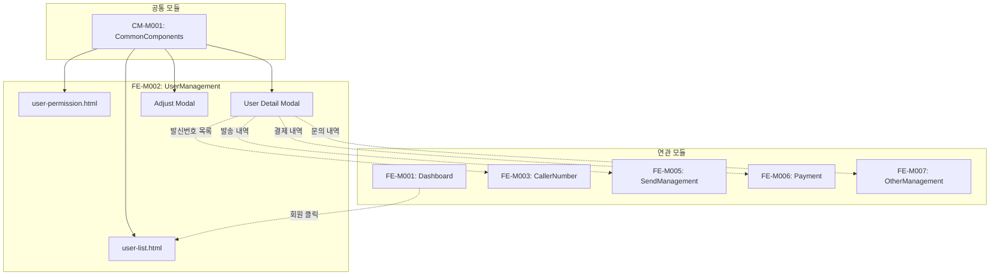

# FE-M002: UserManagement 모듈 상세 개발 설계서

## 1. 모듈 개요

### 1.1 모듈 식별 정보
- **모듈 ID**: FE-M002
- **모듈명**: UserManagement (사용자 관리)
- **담당 개발자**: Frontend Developer
- **예상 개발 기간**: 5일
- **우선순위**: P0 (최우선)

### 1.2 모듈 목적 및 범위
- **핵심 기능**:
  1. 회원 목록 조회 및 검색
  2. 회원 상세 정보 조회 (5개 탭)
  3. 회원 계정 관리 (정지/해제/삭제)
  4. 잔액/보너스 조정
  5. 권한 관리

- **비즈니스 가치**: 서비스 이용 회원의 통합 관리 및 모니터링을 통해 효율적인 고객 관리 지원

- **제외 범위**:
  - 회원 가입 처리 (프론트엔드 영역)
  - 결제 처리 (FE-M006에서 처리)
  - 발송 내역 상세 (FE-M005에서 처리)

### 1.3 목표 사용자
- **주 사용자 그룹**: 고객관리팀, 운영팀, 시스템 관리자
- **사용자 페르소나**:
  - 회원 문의 처리를 위해 정보를 조회하는 CS 담당자
  - 이상 행동 회원을 모니터링하는 운영 담당자
  - 권한 설정을 관리하는 시스템 관리자
- **사용 시나리오**:
  - 회원 문의 접수 시 해당 회원 정보 조회
  - 스팸 발송 의심 회원 계정 정지
  - 신규 관리자 권한 부여

---

## 2. 기술 아키텍처

### 2.1 모듈 구조
```
FE-M002-UserManagement/
├── user-list.html              # 회원 관리 메인 페이지
├── user-permission.html        # 권한 관리 페이지
├── components/
│   ├── user-table/             # 회원 목록 테이블
│   ├── user-detail-modal/      # 회원 상세 모달
│   │   ├── tab-basic.html      # 기본 정보 탭
│   │   ├── tab-company.html    # 기업 정보 탭
│   │   ├── tab-account.html    # 계정 정보 탭
│   │   ├── tab-activity.html   # 활동 정보 탭
│   │   └── tab-memo.html       # 메모 탭
│   ├── adjust-modal/           # 잔액/보너스 조정 모달
│   └── permission-modal/       # 권한 설정 모달
├── services/
│   └── user-service.js         # 사용자 데이터 서비스
├── utils/
│   └── user-utils.js           # 유틸리티 함수
└── tests/
    └── user.test.js            # 단위 테스트
```

### 2.2 기술 스택
- **마크업**: HTML5
- **스타일링**: CSS3 (CSS Variables, Flexbox, Grid)
- **스크립트**: Vanilla JavaScript (ES6+)
- **의존성**: admin-common.css, admin-common.js

---

## 3. 인터페이스 정의

### 3.1 외부 의존성
```javascript
const ExternalDependencies = {
    modules: ['CM-M001'],
    apis: [
        '/api/admin/users',
        '/api/admin/users/{id}',
        '/api/admin/users/{id}/suspend',
        '/api/admin/users/{id}/balance',
        '/api/admin/permissions'
    ],
    sharedComponents: [
        'modal', 'tabs', 'badge', 'table', 'pagination', 'btn', 'form-control'
    ],
    utils: [
        'openModal', 'closeModal', 'confirmAction', 'showToast',
        'formatNumber', 'formatDate', 'maskPhoneNumber', 'maskEmail'
    ]
};
```

### 3.2 제공 인터페이스
```javascript
const UserManagementModule = {
    pages: {
        UserListPage: 'user-list.html',
        PermissionPage: 'user-permission.html'
    },
    
    services: {
        loadUserList: (params) => Promise,
        getUserDetail: (userId) => Promise,
        suspendUser: (userId, reason) => Promise,
        unsuspendUser: (userId) => Promise,
        deleteUser: (userId) => Promise,
        adjustBalance: (userId, amount, reason) => Promise,
        adjustBonus: (userId, amount, reason) => Promise,
        saveMemo: (userId, memo) => Promise
    },
    
    events: {
        onUserSelected: 'user:selected',
        onUserUpdated: 'user:updated',
        onUserSuspended: 'user:suspended'
    }
};
```

### 3.3 API 명세
```javascript
const APIEndpoints = {
    GET_USERS: {
        method: 'GET',
        path: '/api/admin/users',
        request: {
            page: Number,
            size: Number,
            search: String,       // 검색어 (이름, 이메일, 전화번호)
            status: String,       // 'all' | 'active' | 'suspended' | 'dormant'
            dateFrom: String,
            dateTo: String
        },
        response: {
            content: Array,       // User[]
            totalElements: Number,
            totalPages: Number,
            currentPage: Number
        },
        errors: ['401', '403', '500']
    },
    
    GET_USER_DETAIL: {
        method: 'GET',
        path: '/api/admin/users/{id}',
        response: {
            basic: Object,        // 기본 정보
            company: Object,      // 기업 정보
            account: Object,      // 계정 정보
            activity: Object,     // 활동 정보
            memos: Array          // 메모 목록
        },
        errors: ['401', '403', '404']
    },
    
    POST_SUSPEND_USER: {
        method: 'POST',
        path: '/api/admin/users/{id}/suspend',
        request: {
            reason: String
        },
        response: {
            success: Boolean,
            message: String
        },
        errors: ['401', '403', '404', '400']
    },
    
    POST_ADJUST_BALANCE: {
        method: 'POST',
        path: '/api/admin/users/{id}/balance',
        request: {
            type: String,         // 'add' | 'subtract'
            amount: Number,
            reason: String
        },
        response: {
            success: Boolean,
            newBalance: Number
        },
        errors: ['401', '403', '404', '400']
    }
};
```

---

## 4. 데이터 모델

### 4.1 엔티티 정의
```typescript
// 회원 기본 정보
interface User {
    id: string;
    name: string;
    email: string;
    phone: string;
    status: 'active' | 'suspended' | 'dormant' | 'withdrawn';
    createdAt: string;
    lastLoginAt: string;
}

// 회원 상세 - 기본 정보 탭
interface UserBasicInfo {
    id: string;
    name: string;
    email: string;
    phone: string;
    profileImage: string;
    createdAt: string;
    lastLoginAt: string;
    loginCount: number;
}

// 회원 상세 - 기업 정보 탭
interface UserCompanyInfo {
    companyName: string;
    businessNumber: string;
    representativeName: string;
    businessType: string;
    businessCategory: string;
    address: string;
    contactPhone: string;
}

// 회원 상세 - 계정 정보 탭
interface UserAccountInfo {
    balance: number;
    bonus: number;
    totalCharge: number;
    totalUsage: number;
    grade: string;
    status: string;
    suspendReason: string;
    suspendDate: string;
}

// 회원 상세 - 활동 정보 탭
interface UserActivityInfo {
    totalSendCount: number;
    monthlySendCount: number;
    callerNumberCount: number;
    templateCount: number;
    lastSendDate: string;
    recentSends: Array<RecentSend>;
}

// 회원 메모
interface UserMemo {
    id: string;
    content: string;
    createdBy: string;
    createdAt: string;
}
```

### 4.2 상태 관리 스키마
```javascript
const UserManagementState = {
    users: [],              // User[]
    selectedUser: null,     // UserDetail | null
    currentPage: 1,
    totalPages: 1,
    searchParams: {
        search: '',
        status: 'all',
        dateFrom: '',
        dateTo: ''
    },
    isLoading: false,
    error: null,
    
    actions: {
        setUsers(users) { this.users = users; },
        setSelectedUser(user) { this.selectedUser = user; },
        setPage(page) { this.currentPage = page; },
        setSearchParams(params) { this.searchParams = { ...this.searchParams, ...params }; },
        reset() { this.searchParams = { search: '', status: 'all', dateFrom: '', dateTo: '' }; }
    }
};
```

---

## 5. 핵심 컴포넌트 명세

### 5.1 회원 상세 모달 (UserDetailModal)
```html
<!-- user-detail-modal.html -->
<div class="modal" id="userDetailModal">
    <div class="modal-content" style="max-width: 900px;">
        <div class="modal-header">
            <h3 class="modal-title">회원 상세 정보</h3>
            <button class="modal-close" onclick="closeModal('userDetailModal')">&times;</button>
        </div>
        
        <div class="tabs" id="userDetailTabs">
            <button class="tab active" data-tab="basic">기본 정보</button>
            <button class="tab" data-tab="company">기업 정보</button>
            <button class="tab" data-tab="account">계정 정보</button>
            <button class="tab" data-tab="activity">활동 정보</button>
            <button class="tab" data-tab="memo">메모</button>
        </div>
        
        <div id="tabContent">
            <!-- 탭 내용이 동적으로 로드됨 -->
        </div>
    </div>
</div>
```

```javascript
// user-detail-modal.js
function openUserDetail(userId) {
    loadUserDetail(userId).then(user => {
        currentUserId = userId;
        renderUserDetail(user);
        openModal('userDetailModal');
    });
}

function renderUserDetail(user) {
    // 기본 정보 탭 렌더링
    renderBasicTab(user.basic);
    
    // 탭 클릭 이벤트 설정
    document.querySelectorAll('#userDetailTabs .tab').forEach(tab => {
        tab.addEventListener('click', function() {
            const tabName = this.dataset.tab;
            switchTab(tabName, user);
        });
    });
}

function switchTab(tabName, user) {
    // 탭 활성화
    document.querySelectorAll('#userDetailTabs .tab').forEach(t => {
        t.classList.remove('active');
    });
    document.querySelector(`[data-tab="${tabName}"]`).classList.add('active');
    
    // 탭 내용 렌더링
    switch(tabName) {
        case 'basic': renderBasicTab(user.basic); break;
        case 'company': renderCompanyTab(user.company); break;
        case 'account': renderAccountTab(user.account); break;
        case 'activity': renderActivityTab(user.activity); break;
        case 'memo': renderMemoTab(user.memos); break;
    }
}
```

### 5.2 계정 정보 탭 (Account Tab)
```javascript
// tab-account.js
function renderAccountTab(account) {
    const content = `
        <div class="detail-grid">
            <div class="detail-section">
                <h4>잔액 정보</h4>
                <div class="detail-row">
                    <span class="detail-label">현재 잔액</span>
                    <span class="detail-value">
                        <strong style="font-size: 18px; color: var(--admin-primary);">
                            ₩${formatNumber(account.balance)}
                        </strong>
                        <button class="btn btn-sm btn-outline" onclick="openAdjustBalanceModal()">조정</button>
                    </span>
                </div>
                <div class="detail-row">
                    <span class="detail-label">보너스 잔액</span>
                    <span class="detail-value">
                        ₩${formatNumber(account.bonus)}
                        <button class="btn btn-sm btn-outline" onclick="openAdjustBonusModal()">조정</button>
                    </span>
                </div>
            </div>
            
            <div class="detail-section">
                <h4>계정 관리</h4>
                <div class="detail-row">
                    <span class="detail-label">계정 상태</span>
                    <span class="detail-value">
                        ${getStatusBadge(account.status)}
                        ${account.status === 'active' 
                            ? '<button class="btn btn-sm btn-warning" onclick="handleSuspendAccount()">계정 정지</button>'
                            : '<button class="btn btn-sm btn-success" onclick="handleUnsuspendAccount()">정지 해제</button>'
                        }
                    </span>
                </div>
                <div class="detail-row">
                    <button class="btn btn-outline" onclick="handleResetPassword()">비밀번호 초기화</button>
                    <button class="btn btn-danger" onclick="handleDeleteAccount()">계정 삭제</button>
                </div>
            </div>
        </div>
    `;
    
    document.getElementById('tabContent').innerHTML = content;
}
```

### 5.3 잔액 조정 모달 (AdjustBalanceModal)
```javascript
// adjust-balance-modal.js
function openAdjustBalanceModal() {
    openModal('adjustBalanceModal');
}

function saveAdjustBalance() {
    const type = document.getElementById('adjustBalanceType').value;
    const amount = parseInt(document.getElementById('adjustBalanceAmount').value);
    const reason = document.getElementById('adjustBalanceReason').value;
    
    if (!amount || amount <= 0) {
        showToast('올바른 금액을 입력해주세요.', 'error');
        return;
    }
    
    if (!reason.trim()) {
        showToast('조정 사유를 입력해주세요.', 'error');
        return;
    }
    
    confirmAction(`${formatNumber(amount)}원을 ${type === 'add' ? '추가' : '차감'}하시겠습니까?`, () => {
        adjustBalance(currentUserId, { type, amount, reason })
            .then(result => {
                showToast('잔액이 조정되었습니다.', 'success');
                closeModal('adjustBalanceModal');
                refreshUserDetail();
            })
            .catch(error => {
                showToast('잔액 조정에 실패했습니다.', 'error');
            });
    });
}
```

### 5.4 계정 정지/해제 기능
```javascript
// account-actions.js
function handleSuspendAccount() {
    const reason = prompt('정지 사유를 입력해주세요:');
    if (reason === null) return;
    
    if (!reason.trim()) {
        showToast('정지 사유를 입력해주세요.', 'error');
        return;
    }
    
    confirmAction('이 회원의 계정을 정지하시겠습니까?', () => {
        suspendUser(currentUserId, reason)
            .then(() => {
                showToast('계정이 정지되었습니다.', 'success');
                refreshUserDetail();
                refreshUserList();
            })
            .catch(error => {
                showToast('계정 정지에 실패했습니다.', 'error');
            });
    });
}

function handleUnsuspendAccount() {
    confirmAction('이 회원의 계정 정지를 해제하시겠습니까?', () => {
        unsuspendUser(currentUserId)
            .then(() => {
                showToast('계정 정지가 해제되었습니다.', 'success');
                refreshUserDetail();
                refreshUserList();
            })
            .catch(error => {
                showToast('정지 해제에 실패했습니다.', 'error');
            });
    });
}

function handleDeleteAccount() {
    confirmAction('정말 이 회원의 계정을 삭제하시겠습니까?\n이 작업은 되돌릴 수 없습니다.', () => {
        deleteUser(currentUserId)
            .then(() => {
                showToast('계정이 삭제되었습니다.', 'success');
                closeModal('userDetailModal');
                refreshUserList();
            })
            .catch(error => {
                showToast('계정 삭제에 실패했습니다.', 'error');
            });
    });
}
```

---

## 6. 이벤트 및 메시징

### 6.1 발행 이벤트
```javascript
const UserEvents = {
    USER_SELECTED: 'user:selected',
    USER_UPDATED: 'user:updated',
    USER_SUSPENDED: 'user:suspended',
    USER_DELETED: 'user:deleted',
    BALANCE_ADJUSTED: 'user:balance:adjusted'
};

function emitUserUpdated(userId, changes) {
    document.dispatchEvent(new CustomEvent(UserEvents.USER_UPDATED, {
        detail: { userId, changes, timestamp: new Date() }
    }));
}
```

### 6.2 구독 이벤트
```javascript
const SubscribedEvents = {
    // 대시보드에서 회원 클릭 시
    'dashboard:user:click': (userId) => openUserDetail(userId)
};
```

---

## 7. 에러 처리

### 7.1 에러 코드 정의
```javascript
const UserErrorCode = {
    USER_NOT_FOUND: 'USER_001',
    INVALID_AMOUNT: 'USER_002',
    SUSPEND_FAILED: 'USER_003',
    DELETE_FAILED: 'USER_004',
    PERMISSION_DENIED: 'USER_005',
    VALIDATION_ERROR: 'USER_006'
};

const ErrorMessages = {
    'USER_001': '회원 정보를 찾을 수 없습니다.',
    'USER_002': '올바른 금액을 입력해주세요.',
    'USER_003': '계정 정지 처리에 실패했습니다.',
    'USER_004': '계정 삭제에 실패했습니다.',
    'USER_005': '해당 작업에 대한 권한이 없습니다.',
    'USER_006': '입력 값을 확인해주세요.'
};
```

### 7.2 에러 처리 전략
```javascript
function handleUserError(error, code) {
    console.error(`[User Error ${code}]`, error);
    showToast(ErrorMessages[code] || '오류가 발생했습니다.', 'error');
    
    if (code === 'USER_005') {
        // 권한 없음 - 목록으로 이동
        setTimeout(() => {
            closeModal('userDetailModal');
        }, 2000);
    }
}
```

---

## 8. 테스트 전략

### 8.1 단위 테스트
```javascript
describe('UserManagement Module', () => {
    describe('User List', () => {
        it('should render user list correctly', () => {
            const users = mockUserData;
            renderUserList(users);
            
            const rows = document.querySelectorAll('#userTable tbody tr');
            expect(rows.length).toBe(users.length);
        });
        
        it('should filter users by status', () => {
            setSearchParams({ status: 'suspended' });
            const filteredUsers = filterUsers(mockUserData);
            
            expect(filteredUsers.every(u => u.status === 'suspended')).toBe(true);
        });
    });
    
    describe('User Detail Modal', () => {
        it('should switch tabs correctly', () => {
            renderUserDetail(mockUserDetail);
            switchTab('company', mockUserDetail);
            
            expect(document.querySelector('[data-tab="company"]').classList.contains('active')).toBe(true);
        });
        
        it('should validate balance adjustment input', () => {
            expect(validateBalanceInput(-100)).toBe(false);
            expect(validateBalanceInput(0)).toBe(false);
            expect(validateBalanceInput(1000)).toBe(true);
        });
    });
});
```

### 8.2 통합 테스트
```javascript
describe('User Management Integration', () => {
    it('should complete user suspend flow', async () => {
        // 1. 회원 상세 열기
        await openUserDetail('user123');
        
        // 2. 계정 정보 탭으로 이동
        switchTab('account', mockUserDetail);
        
        // 3. 정지 처리
        mockConfirm(true);
        mockPrompt('스팸 발송');
        await handleSuspendAccount();
        
        // 4. 결과 확인
        expect(showToast).toHaveBeenCalledWith('계정이 정지되었습니다.', 'success');
    });
});
```

### 8.3 테스트 커버리지 목표
- **단위 테스트**: 80% 이상
- **통합 테스트**: 핵심 플로우 100%

---

## 9. 성능 최적화

### 9.1 캐싱 전략
```javascript
const UserCache = {
    list: null,
    details: new Map(),  // userId -> userDetail
    TTL: 60000,          // 1분
    
    getDetail(userId) {
        const cached = this.details.get(userId);
        if (cached && Date.now() - cached.timestamp < this.TTL) {
            return cached.data;
        }
        return null;
    },
    
    setDetail(userId, data) {
        this.details.set(userId, { data, timestamp: Date.now() });
    }
};
```

### 9.2 최적화 기법
- **Virtual Scrolling**: 대량 회원 목록 렌더링 시 가상 스크롤 적용
- **Debounce**: 검색 입력 시 디바운스 적용 (300ms)
- **Pagination**: 서버 사이드 페이지네이션으로 데이터 분할 로딩

```javascript
// 검색 디바운스
const debouncedSearch = debounce((searchTerm) => {
    loadUserList({ search: searchTerm });
}, 300);

document.getElementById('searchInput').addEventListener('input', (e) => {
    debouncedSearch(e.target.value);
});
```

---

## 10. 보안 고려사항

### 10.1 인증/인가
- **권한 체크**: 회원 관리 페이지 접근 시 관리자 권한 확인
- **액션 권한**: 계정 삭제/정지 등 민감한 작업 시 추가 권한 검증

```javascript
// 권한 체크
function checkPermission(action) {
    const adminPermissions = getAdminPermissions();
    const requiredPermissions = {
        'view': 'USER_VIEW',
        'suspend': 'USER_SUSPEND',
        'delete': 'USER_DELETE',
        'adjustBalance': 'USER_BALANCE'
    };
    
    return adminPermissions.includes(requiredPermissions[action]);
}
```

### 10.2 데이터 보호
- **민감 정보 마스킹**: 전화번호, 이메일 부분 마스킹
- **감사 로그**: 모든 회원 정보 변경 작업 로깅

```javascript
// 액션 로깅
function logUserAction(action, userId, data) {
    fetch('/api/admin/audit-log', {
        method: 'POST',
        body: JSON.stringify({
            action,
            targetType: 'USER',
            targetId: userId,
            data,
            adminId: getCurrentAdminId(),
            timestamp: new Date().toISOString()
        })
    });
}
```

---

## 11. 배포 및 모니터링

### 11.1 파일 구조
```
admin/
├── user-list.html
├── user-permission.html
├── css/
│   └── admin-common.css
└── js/
    └── admin-common.js
```

### 11.2 환경 변수
```javascript
const CONFIG = {
    USER_LIST_PAGE_SIZE: 20,
    SEARCH_DEBOUNCE_MS: 300,
    CACHE_TTL_MS: 60000
};
```

---

## 12. 개발 가이드라인

### 12.1 코딩 컨벤션
- **함수 명명**: `handle` 접두어 (이벤트 핸들러), `render` 접두어 (렌더링 함수)
- **ID 명명**: camelCase (예: `userDetailModal`, `adjustBalanceForm`)

### 12.2 Git 브랜치 전략
```
main
├── develop
│   ├── feature/FE-M002-user-list
│   ├── feature/FE-M002-user-detail-modal
│   ├── feature/FE-M002-account-actions
│   └── fix/FE-M002-balance-validation
```

### 12.3 PR 체크리스트
- [ ] 회원 목록 정상 렌더링 확인
- [ ] 검색/필터 기능 정상 동작 확인
- [ ] 회원 상세 모달 5개 탭 전환 확인
- [ ] 잔액/보너스 조정 기능 확인
- [ ] 계정 정지/해제 기능 확인
- [ ] 권한 체크 로직 확인

---

## 13. 의존성 그래프



---

## 14. 버전 히스토리

| 버전 | 날짜 | 변경 내용 | 작성자 |
|------|------|----------|--------|
| 1.0.0 | 2024-12-15 | 초기 문서 작성 | - |

