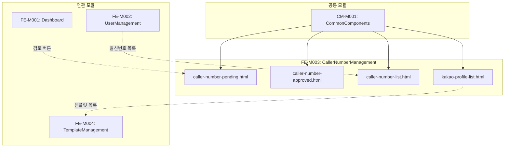

# FE-M003: CallerNumberManagement 모듈 상세 개발 설계서

## 1. 모듈 개요

### 1.1 모듈 식별 정보
- **모듈 ID**: FE-M003
- **모듈명**: CallerNumberManagement (발신번호 관리)
- **담당 개발자**: Frontend Developer
- **예상 개발 기간**: 5일
- **우선순위**: P0 (최우선)

### 1.2 모듈 목적 및 범위
- **핵심 기능**:
  1. 발신번호 승인 대기 목록 조회 및 검토
  2. 발신번호 일괄 승인/반려 처리
  3. 승인 완료 발신번호 관리 (정지/해제)
  4. 발신번호 전체 목록 조회
  5. 발신프로필(카카오) 관리

- **비즈니스 가치**: 법적 요건을 준수하는 발신번호 승인 프로세스 관리 및 서비스 품질 유지

- **제외 범위**:
  - 발신번호 신규 등록 (프론트엔드 영역)
  - 통신사 연동 처리 (백엔드 영역)

### 1.3 목표 사용자
- **주 사용자 그룹**: 발신번호 검토 담당자, 운영팀
- **사용자 페르소나**:
  - 발신번호 신청서를 검토하는 심사 담당자
  - 스팸 발신번호를 정지 처리하는 운영 담당자
  - 카카오 발신프로필을 관리하는 채널 담당자
- **사용 시나리오**:
  - 신청된 발신번호 서류 검토 및 승인
  - 이상 발신 패턴 감지 시 번호 정지
  - 카카오 비즈니스 채널 동기화

---

## 2. 기술 아키텍처

### 2.1 모듈 구조
```
FE-M003-CallerNumberManagement/
├── caller-number-pending.html       # 승인 대기 페이지
├── caller-number-approved.html      # 승인 완료 페이지
├── caller-number-list.html          # 발신번호 목록 페이지
├── kakao-profile-list.html          # 발신프로필 관리 페이지
├── components/
│   ├── pending-table/               # 승인 대기 테이블
│   ├── review-modal/                # 상세 검토 모달
│   ├── supplement-modal/            # 보완 요청 모달
│   ├── batch-reject-modal/          # 일괄 반려 모달
│   ├── suspend-modal/               # 정지 처리 모달
│   └── profile-detail-modal/        # 프로필 상세 모달
├── services/
│   └── caller-number-service.js     # 발신번호 서비스
└── tests/
    └── caller-number.test.js        # 단위 테스트
```

### 2.2 기술 스택
- **마크업**: HTML5
- **스타일링**: CSS3 (CSS Variables, Flexbox, Grid)
- **스크립트**: Vanilla JavaScript (ES6+)
- **의존성**: admin-common.css, admin-common.js

---

## 3. 인터페이스 정의

### 3.1 외부 의존성
```javascript
const ExternalDependencies = {
    modules: ['CM-M001'],
    apis: [
        '/api/admin/caller-numbers/pending',
        '/api/admin/caller-numbers/approved',
        '/api/admin/caller-numbers',
        '/api/admin/caller-numbers/{id}/approve',
        '/api/admin/caller-numbers/{id}/reject',
        '/api/admin/caller-numbers/{id}/supplement',
        '/api/admin/caller-numbers/{id}/suspend',
        '/api/admin/kakao-profiles'
    ],
    sharedComponents: [
        'modal', 'badge', 'table', 'pagination', 'btn', 'form-control', 'tabs'
    ],
    utils: [
        'openModal', 'closeModal', 'confirmAction', 'showToast',
        'formatDate', 'maskPhoneNumber', 'createPagination'
    ]
};
```

### 3.2 제공 인터페이스
```javascript
const CallerNumberModule = {
    pages: {
        PendingPage: 'caller-number-pending.html',
        ApprovedPage: 'caller-number-approved.html',
        ListPage: 'caller-number-list.html',
        ProfilePage: 'kakao-profile-list.html'
    },
    
    services: {
        loadPendingList: (params) => Promise,
        approveCallerNumber: (id) => Promise,
        rejectCallerNumber: (id, reason) => Promise,
        requestSupplement: (id, data) => Promise,
        bulkApprove: (ids) => Promise,
        bulkReject: (ids, reason) => Promise,
        suspendCallerNumber: (id, reason) => Promise,
        unsuspendCallerNumber: (id) => Promise,
        syncKakaoProfile: (profileId) => Promise
    },
    
    events: {
        onApprovalComplete: 'callerNumber:approved',
        onRejectionComplete: 'callerNumber:rejected',
        onSuspended: 'callerNumber:suspended'
    }
};
```

### 3.3 API 명세
```javascript
const APIEndpoints = {
    GET_PENDING_LIST: {
        method: 'GET',
        path: '/api/admin/caller-numbers/pending',
        request: {
            page: Number,
            size: Number,
            search: String,
            ownerType: String  // 'personal' | 'business' | 'all'
        },
        response: {
            content: Array,    // CallerNumberPending[]
            totalElements: Number,
            totalPages: Number
        },
        errors: ['401', '403', '500']
    },
    
    POST_APPROVE: {
        method: 'POST',
        path: '/api/admin/caller-numbers/{id}/approve',
        request: null,
        response: {
            success: Boolean,
            message: String
        },
        errors: ['401', '403', '404', '400']
    },
    
    POST_REJECT: {
        method: 'POST',
        path: '/api/admin/caller-numbers/{id}/reject',
        request: {
            reasonType: String,
            reasonDetail: String
        },
        response: {
            success: Boolean,
            message: String
        },
        errors: ['401', '403', '404', '400']
    },
    
    POST_SUPPLEMENT: {
        method: 'POST',
        path: '/api/admin/caller-numbers/{id}/supplement',
        request: {
            reason: String,
            items: Array,      // String[]
            deadline: String   // ISO date
        },
        response: {
            success: Boolean,
            message: String
        },
        errors: ['401', '403', '404', '400']
    },
    
    POST_BULK_APPROVE: {
        method: 'POST',
        path: '/api/admin/caller-numbers/bulk-approve',
        request: {
            ids: Array         // String[]
        },
        response: {
            success: Boolean,
            processedCount: Number,
            failedCount: Number
        },
        errors: ['401', '403', '400']
    },
    
    POST_SUSPEND: {
        method: 'POST',
        path: '/api/admin/caller-numbers/{id}/suspend',
        request: {
            reason: String
        },
        response: {
            success: Boolean,
            message: String
        },
        errors: ['401', '403', '404', '400']
    }
};
```

---

## 4. 데이터 모델

### 4.1 엔티티 정의
```typescript
// 승인 대기 발신번호
interface CallerNumberPending {
    id: string;
    callerNumber: string;
    memberName: string;
    memberEmail: string;
    ownerType: 'personal' | 'business';
    ownerName: string;
    requestDate: string;
    status: 'pending' | 'reviewing' | 'supplement_requested';
}

// 승인 완료 발신번호
interface CallerNumberApproved {
    id: string;
    callerNumber: string;
    memberName: string;
    memberEmail: string;
    ownerType: 'personal' | 'business';
    ownerName: string;
    approvedDate: string;
    status: 'active' | 'suspended';
    suspendReason?: string;
    suspendDate?: string;
}

// 발신번호 상세
interface CallerNumberDetail {
    id: string;
    callerNumber: string;
    member: {
        name: string;
        email: string;
        company: string;
    };
    ownerType: 'personal' | 'business';
    ownerName: string;
    documents: Document[];
    requestDate: string;
    status: string;
    reviewHistory: ReviewHistory[];
}

// 첨부 서류
interface Document {
    id: string;
    type: string;       // 'ID_CARD' | 'BUSINESS_LICENSE' | 'AUTHORIZATION'
    fileName: string;
    fileUrl: string;
    uploadDate: string;
}

// 검토 이력
interface ReviewHistory {
    date: string;
    action: string;     // 'submitted' | 'reviewed' | 'approved' | 'rejected' | 'supplement'
    adminName: string;
    comment?: string;
}

// 카카오 발신프로필
interface KakaoProfile {
    id: string;
    profileKey: string;
    channelName: string;
    memberName: string;
    memberEmail: string;
    createdDate: string;
    status: 'active' | 'suspended' | 'pending';
    templateCount: number;
    lastSyncDate: string;
}
```

### 4.2 상태 관리 스키마
```javascript
const CallerNumberState = {
    pendingList: [],
    approvedList: [],
    allList: [],
    selectedItem: null,
    selectedItems: [],     // 일괄 처리용
    currentPage: 1,
    totalPages: 1,
    searchParams: {},
    isLoading: false,
    
    actions: {
        setPendingList(list) { this.pendingList = list; },
        setSelectedItem(item) { this.selectedItem = item; },
        toggleSelection(id) {
            const index = this.selectedItems.indexOf(id);
            if (index > -1) {
                this.selectedItems.splice(index, 1);
            } else {
                this.selectedItems.push(id);
            }
        },
        selectAll(ids) { this.selectedItems = [...ids]; },
        clearSelection() { this.selectedItems = []; }
    }
};
```

---

## 5. 핵심 컴포넌트 명세

### 5.1 상세 검토 모달 (ReviewModal)
```html
<!-- review-modal.html -->
<div class="modal" id="reviewModal">
    <div class="modal-content" style="max-width: 900px;">
        <div class="modal-header">
            <h3 class="modal-title">발신번호 상세 검토</h3>
            <button class="modal-close" onclick="closeModal('reviewModal')">&times;</button>
        </div>
        
        <div style="max-height: 70vh; overflow-y: auto; padding: 20px;">
            <!-- 신청 정보 -->
            <div class="detail-section">
                <h4>신청 정보</h4>
                <div class="detail-grid">
                    <div class="detail-row">
                        <span class="detail-label">발신번호</span>
                        <span class="detail-value" id="reviewCallerNumber"></span>
                    </div>
                    <div class="detail-row">
                        <span class="detail-label">신청자</span>
                        <span class="detail-value" id="reviewMember"></span>
                    </div>
                    <div class="detail-row">
                        <span class="detail-label">명의 구분</span>
                        <span class="detail-value" id="reviewOwnerType"></span>
                    </div>
                    <div class="detail-row">
                        <span class="detail-label">명의자</span>
                        <span class="detail-value" id="reviewOwnerName"></span>
                    </div>
                </div>
            </div>
            
            <!-- 첨부 서류 -->
            <div class="detail-section">
                <h4>첨부 서류</h4>
                <div id="reviewDocuments"></div>
            </div>
            
            <!-- 검토 이력 -->
            <div class="detail-section">
                <h4>검토 이력</h4>
                <div id="reviewHistory"></div>
            </div>
        </div>
        
        <div class="modal-footer">
            <button class="btn btn-outline" onclick="openSupplementModal()">보완 요청</button>
            <button class="btn btn-danger" onclick="openRejectModal()">반려</button>
            <button class="btn btn-success" onclick="handleApprove()">승인</button>
        </div>
    </div>
</div>
```

```javascript
// review-modal.js
function openReviewModal(id) {
    loadCallerNumberDetail(id).then(detail => {
        currentReviewId = id;
        renderReviewModal(detail);
        openModal('reviewModal');
    });
}

function renderReviewModal(detail) {
    document.getElementById('reviewCallerNumber').textContent = detail.callerNumber;
    document.getElementById('reviewMember').textContent = `${detail.member.name} (${detail.member.email})`;
    document.getElementById('reviewOwnerType').textContent = detail.ownerType === 'personal' ? '개인' : '사업자';
    document.getElementById('reviewOwnerName').textContent = detail.ownerName;
    
    // 첨부 서류 렌더링
    document.getElementById('reviewDocuments').innerHTML = detail.documents.map(doc => `
        <div class="document-item">
            <span class="document-type">${getDocumentTypeName(doc.type)}</span>
            <span class="document-name">${doc.fileName}</span>
            <button class="btn btn-sm btn-outline" onclick="downloadDocument('${doc.fileUrl}')">
                다운로드
            </button>
            <button class="btn btn-sm btn-outline" onclick="previewDocument('${doc.fileUrl}')">
                미리보기
            </button>
        </div>
    `).join('');
    
    // 검토 이력 렌더링
    document.getElementById('reviewHistory').innerHTML = renderReviewHistory(detail.reviewHistory);
}

function handleApprove() {
    confirmAction('이 발신번호를 승인하시겠습니까?', () => {
        approveCallerNumber(currentReviewId)
            .then(() => {
                showToast('발신번호가 승인되었습니다.', 'success');
                closeModal('reviewModal');
                refreshPendingList();
            })
            .catch(error => {
                showToast('승인 처리에 실패했습니다.', 'error');
            });
    });
}
```

### 5.2 보완 요청 모달 (SupplementModal)
```javascript
// supplement-modal.js
function openSupplementModal() {
    closeModal('reviewModal');
    openModal('supplementModal');
}

function saveSupplementRequest(event) {
    event.preventDefault();
    event.stopPropagation();
    
    const reason = document.getElementById('supplementReason').value;
    const items = Array.from(document.querySelectorAll('input[name="supplementItem"]:checked'))
                       .map(cb => cb.value);
    const deadline = document.getElementById('supplementDeadline').value;
    
    if (!reason.trim()) {
        showToast('보완 사유를 입력해주세요.', 'error');
        return;
    }
    
    if (items.length === 0) {
        showToast('보완 요청 항목을 선택해주세요.', 'error');
        return;
    }
    
    if (!deadline) {
        showToast('보완 기한을 선택해주세요.', 'error');
        return;
    }
    
    requestSupplement(currentReviewId, { reason, items, deadline })
        .then(() => {
            showToast('보완 요청이 전송되었습니다.', 'success');
            closeModal('supplementModal');
            refreshPendingList();
        })
        .catch(error => {
            showToast('보완 요청에 실패했습니다.', 'error');
        });
}
```

### 5.3 일괄 승인/반려 기능
```javascript
// bulk-actions.js
let selectedIds = [];

function toggleSelectAll(checked) {
    const checkboxes = document.querySelectorAll('input[name="callerNumberCheck"]');
    checkboxes.forEach(cb => {
        cb.checked = checked;
    });
    
    if (checked) {
        selectedIds = Array.from(checkboxes).map(cb => cb.value);
    } else {
        selectedIds = [];
    }
    
    updateBulkActionButtons();
}

function toggleSelect(id) {
    const index = selectedIds.indexOf(id);
    if (index > -1) {
        selectedIds.splice(index, 1);
    } else {
        selectedIds.push(id);
    }
    updateBulkActionButtons();
}

function updateBulkActionButtons() {
    const count = selectedIds.length;
    document.getElementById('selectedCount').textContent = count;
    
    const bulkApproveBtn = document.getElementById('bulkApproveBtn');
    const bulkRejectBtn = document.getElementById('bulkRejectBtn');
    
    bulkApproveBtn.disabled = count === 0;
    bulkRejectBtn.disabled = count === 0;
}

function handleBulkApprove() {
    if (selectedIds.length === 0) {
        showToast('선택된 항목이 없습니다.', 'error');
        return;
    }
    
    confirmAction(`선택한 ${selectedIds.length}건을 일괄 승인하시겠습니까?`, () => {
        bulkApprove(selectedIds)
            .then(result => {
                showToast(`${result.processedCount}건이 승인되었습니다.`, 'success');
                
                // 테이블 UI 업데이트
                selectedIds.forEach(id => {
                    const row = document.querySelector(`tr[data-id="${id}"]`);
                    if (row) {
                        row.querySelector('td:nth-child(8)').innerHTML = 
                            '<span class="badge badge-success">승인완료</span>';
                    }
                });
                
                selectedIds = [];
                updateBulkActionButtons();
                setTimeout(() => refreshPendingList(), 1500);
            })
            .catch(error => {
                showToast('일괄 승인에 실패했습니다.', 'error');
            });
    });
}

function openBulkRejectModal() {
    if (selectedIds.length === 0) {
        showToast('선택된 항목이 없습니다.', 'error');
        return;
    }
    openModal('batchRejectModal');
}

function confirmBulkRejectFromModal() {
    const reason = document.getElementById('batchRejectReason').value;
    
    if (!reason.trim()) {
        showToast('반려 사유를 입력해주세요.', 'error');
        return;
    }
    
    bulkReject(selectedIds, reason)
        .then(result => {
            showToast(`${result.processedCount}건이 반려되었습니다.`, 'success');
            
            // 테이블 UI 업데이트
            selectedIds.forEach(id => {
                const row = document.querySelector(`tr[data-id="${id}"]`);
                if (row) {
                    row.querySelector('td:nth-child(8)').innerHTML = 
                        '<span class="badge badge-danger">반려</span>';
                }
            });
            
            closeModal('batchRejectModal');
            selectedIds = [];
            updateBulkActionButtons();
            setTimeout(() => refreshPendingList(), 1500);
        })
        .catch(error => {
            showToast('일괄 반려에 실패했습니다.', 'error');
        });
}
```

### 5.4 정지/해제 기능
```javascript
// suspend-actions.js
function handleSuspend(id) {
    currentSuspendId = id;
    openModal('suspendModal');
}

function confirmSuspend() {
    const reason = document.getElementById('suspendReason').value;
    
    if (!reason.trim()) {
        showToast('정지 사유를 입력해주세요.', 'error');
        return;
    }
    
    suspendCallerNumber(currentSuspendId, reason)
        .then(() => {
            showToast('발신번호가 정지되었습니다.', 'success');
            closeModal('suspendModal');
            
            // 버튼 및 상태 업데이트
            const row = document.querySelector(`tr[data-id="${currentSuspendId}"]`);
            if (row) {
                row.querySelector('.status-badge').innerHTML = 
                    '<span class="badge badge-danger">정지</span>';
                row.querySelector('.suspend-btn').outerHTML = 
                    `<button class="btn btn-sm btn-success" onclick="handleUnsuspend('${currentSuspendId}')">해제</button>`;
            }
        })
        .catch(error => {
            showToast('정지 처리에 실패했습니다.', 'error');
        });
}

function handleUnsuspend(id) {
    confirmAction('이 발신번호의 정지를 해제하시겠습니까?', () => {
        unsuspendCallerNumber(id)
            .then(() => {
                showToast('정지가 해제되었습니다.', 'success');
                
                // 버튼 및 상태 업데이트
                const row = document.querySelector(`tr[data-id="${id}"]`);
                if (row) {
                    row.querySelector('.status-badge').innerHTML = 
                        '<span class="badge badge-success">사용중</span>';
                    row.querySelector('.unsuspend-btn').outerHTML = 
                        `<button class="btn btn-sm btn-warning" onclick="handleSuspend('${id}')">정지</button>`;
                }
            })
            .catch(error => {
                showToast('정지 해제에 실패했습니다.', 'error');
            });
    });
}
```

---

## 6. 이벤트 및 메시징

### 6.1 발행 이벤트
```javascript
const CallerNumberEvents = {
    APPROVED: 'callerNumber:approved',
    REJECTED: 'callerNumber:rejected',
    SUSPENDED: 'callerNumber:suspended',
    UNSUSPENDED: 'callerNumber:unsuspended',
    BULK_PROCESSED: 'callerNumber:bulk:processed'
};

function emitApproved(id, callerNumber) {
    document.dispatchEvent(new CustomEvent(CallerNumberEvents.APPROVED, {
        detail: { id, callerNumber, timestamp: new Date() }
    }));
}
```

### 6.2 구독 이벤트
```javascript
const SubscribedEvents = {
    'dashboard:pending:click': (type) => {
        if (type === 'callerNumber') {
            location.href = 'caller-number-pending.html';
        }
    }
};
```

---

## 7. 에러 처리

### 7.1 에러 코드 정의
```javascript
const CallerNumberErrorCode = {
    NOT_FOUND: 'CALLER_001',
    ALREADY_APPROVED: 'CALLER_002',
    ALREADY_REJECTED: 'CALLER_003',
    INVALID_DOCUMENT: 'CALLER_004',
    BULK_PARTIAL_FAIL: 'CALLER_005',
    SYNC_FAILED: 'CALLER_006'
};

const ErrorMessages = {
    'CALLER_001': '발신번호 정보를 찾을 수 없습니다.',
    'CALLER_002': '이미 승인된 발신번호입니다.',
    'CALLER_003': '이미 반려된 발신번호입니다.',
    'CALLER_004': '첨부 서류가 유효하지 않습니다.',
    'CALLER_005': '일부 항목 처리에 실패했습니다.',
    'CALLER_006': '카카오 프로필 동기화에 실패했습니다.'
};
```

---

## 8. 테스트 전략

### 8.1 단위 테스트
```javascript
describe('CallerNumber Module', () => {
    describe('Bulk Actions', () => {
        it('should select all items', () => {
            renderPendingTable(mockPendingData);
            toggleSelectAll(true);
            
            expect(selectedIds.length).toBe(mockPendingData.length);
        });
        
        it('should update button states based on selection', () => {
            toggleSelectAll(true);
            updateBulkActionButtons();
            
            expect(document.getElementById('bulkApproveBtn').disabled).toBe(false);
        });
    });
    
    describe('Review Modal', () => {
        it('should render documents correctly', () => {
            renderReviewModal(mockDetailData);
            
            const docItems = document.querySelectorAll('.document-item');
            expect(docItems.length).toBe(mockDetailData.documents.length);
        });
    });
});
```

### 8.2 통합 테스트
```javascript
describe('CallerNumber Integration', () => {
    it('should complete approval flow', async () => {
        await openReviewModal('cn123');
        
        mockConfirm(true);
        await handleApprove();
        
        expect(showToast).toHaveBeenCalledWith('발신번호가 승인되었습니다.', 'success');
    });
    
    it('should complete bulk reject flow', async () => {
        toggleSelectAll(true);
        openBulkRejectModal();
        
        document.getElementById('batchRejectReason').value = '서류 미비';
        await confirmBulkRejectFromModal();
        
        expect(showToast).toHaveBeenCalledWith(expect.stringContaining('건이 반려되었습니다.'), 'success');
    });
});
```

---

## 9. 성능 최적화

### 9.1 캐싱 전략
```javascript
const CallerNumberCache = {
    details: new Map(),
    TTL: 120000,  // 2분
    
    getDetail(id) {
        const cached = this.details.get(id);
        if (cached && Date.now() - cached.timestamp < this.TTL) {
            return cached.data;
        }
        return null;
    }
};
```

### 9.2 최적화 기법
- **이미지 미리보기**: Lazy loading으로 문서 이미지 로딩
- **테이블 최적화**: 가상 스크롤 또는 서버 사이드 페이지네이션

---

## 10. 보안 고려사항

### 10.1 인증/인가
- **권한 체크**: 승인/반려 처리 권한 확인
- **문서 접근**: 첨부 서류 다운로드 시 권한 검증

### 10.2 데이터 보호
- **민감 정보**: 주민등록번호, 사업자번호 마스킹 처리
- **문서 보안**: 첨부 파일 접근 로그 기록

---

## 11. 배포 및 모니터링

### 11.1 파일 구조
```
admin/
├── caller-number-pending.html
├── caller-number-approved.html
├── caller-number-list.html
├── kakao-profile-list.html
├── css/
│   └── admin-common.css
└── js/
    └── admin-common.js
```

---

## 12. 개발 가이드라인

### 12.1 코딩 컨벤션
- **함수 명명**: `handle` (액션), `render` (렌더링), `toggle` (상태 전환)
- **상태 변수**: `selected`, `current` 접두어

### 12.2 PR 체크리스트
- [ ] 상세 검토 모달 정상 동작 확인
- [ ] 보완 요청 폼 유효성 검사 확인
- [ ] 일괄 승인/반려 기능 확인
- [ ] 정지/해제 기능 확인
- [ ] 체크박스 선택 상태 동기화 확인

---

## 13. 의존성 그래프



---

## 14. 버전 히스토리

| 버전 | 날짜 | 변경 내용 | 작성자 |
|------|------|----------|--------|
| 1.0.0 | 2024-12-15 | 초기 문서 작성 | - |


