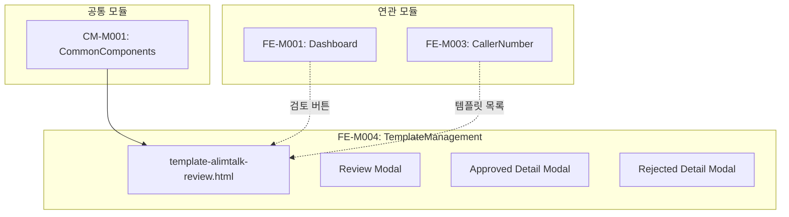

# FE-M004: TemplateManagement 모듈 상세 개발 설계서

## 1. 모듈 개요

### 1.1 모듈 식별 정보
- **모듈 ID**: FE-M004
- **모듈명**: TemplateManagement (템플릿 관리)
- **담당 개발자**: Frontend Developer
- **예상 개발 기간**: 4일
- **우선순위**: P0 (최우선)

### 1.2 모듈 목적 및 범위
- **핵심 기능**:
  1. 알림톡 템플릿 검수 대기 목록 조회
  2. 템플릿 상세 검토 및 승인/반려
  3. 승인 완료 템플릿 목록 조회
  4. 반려 템플릿 목록 및 재검수 요청 관리

- **비즈니스 가치**: 카카오 비즈 메시지 정책 준수를 위한 템플릿 사전 검수 및 품질 관리

- **제외 범위**:
  - 템플릿 생성 (프론트엔드 영역)
  - 카카오 API 연동 (백엔드 영역)
  - 템플릿 발송 (FE-M005에서 처리)

### 1.3 목표 사용자
- **주 사용자 그룹**: 템플릿 검수 담당자, 운영팀
- **사용자 페르소나**:
  - 카카오 정책에 따라 템플릿을 검수하는 심사 담당자
  - 반려된 템플릿의 수정 사항을 확인하는 CS 담당자
- **사용 시나리오**:
  - 신청된 템플릿 내용 검토 및 카카오 정책 준수 확인
  - 부적절한 템플릿 반려 및 사유 안내
  - 승인된 템플릿 현황 모니터링

---

## 2. 기술 아키텍처

### 2.1 모듈 구조
```
FE-M004-TemplateManagement/
├── template-alimtalk-review.html    # 알림톡 템플릿 검수 페이지
├── components/
│   ├── template-table/              # 템플릿 목록 테이블
│   ├── template-preview/            # 템플릿 미리보기
│   ├── review-modal/                # 검수 상세 모달
│   ├── approved-detail-modal/       # 승인 완료 상세 모달
│   └── rejected-detail-modal/       # 반려 상세 모달
├── services/
│   └── template-service.js          # 템플릿 서비스
└── tests/
    └── template.test.js             # 단위 테스트
```

### 2.2 기술 스택
- **마크업**: HTML5
- **스타일링**: CSS3 (CSS Variables, Flexbox, Grid)
- **스크립트**: Vanilla JavaScript (ES6+)
- **의존성**: admin-common.css, admin-common.js

---

## 3. 인터페이스 정의

### 3.1 외부 의존성
```javascript
const ExternalDependencies = {
    modules: ['CM-M001'],
    apis: [
        '/api/admin/templates/pending',
        '/api/admin/templates/approved',
        '/api/admin/templates/rejected',
        '/api/admin/templates/{id}',
        '/api/admin/templates/{id}/approve',
        '/api/admin/templates/{id}/reject'
    ],
    sharedComponents: [
        'modal', 'tabs', 'badge', 'table', 'pagination', 'btn'
    ],
    utils: [
        'openModal', 'closeModal', 'confirmAction', 'showToast', 'formatDate'
    ]
};
```

### 3.2 제공 인터페이스
```javascript
const TemplateManagementModule = {
    pages: {
        ReviewPage: 'template-alimtalk-review.html'
    },
    
    services: {
        loadPendingTemplates: (params) => Promise,
        loadApprovedTemplates: (params) => Promise,
        loadRejectedTemplates: (params) => Promise,
        getTemplateDetail: (id) => Promise,
        approveTemplate: (id) => Promise,
        rejectTemplate: (id, reason) => Promise
    },
    
    events: {
        onTemplateApproved: 'template:approved',
        onTemplateRejected: 'template:rejected'
    }
};
```

### 3.3 API 명세
```javascript
const APIEndpoints = {
    GET_PENDING_TEMPLATES: {
        method: 'GET',
        path: '/api/admin/templates/pending',
        request: {
            page: Number,
            size: Number,
            search: String,
            category: String  // 'info' | 'ad' | 'all'
        },
        response: {
            content: Array,    // Template[]
            totalElements: Number,
            totalPages: Number
        },
        errors: ['401', '403', '500']
    },
    
    GET_TEMPLATE_DETAIL: {
        method: 'GET',
        path: '/api/admin/templates/{id}',
        response: {
            id: String,
            templateName: String,
            category: String,
            member: Object,
            messageContent: String,
            buttonType: String,
            buttonName: String,
            buttonUrl: String,
            status: String,
            requestDate: String,
            reviewHistory: Array
        },
        errors: ['401', '403', '404']
    },
    
    POST_APPROVE: {
        method: 'POST',
        path: '/api/admin/templates/{id}/approve',
        response: {
            success: Boolean,
            kakaoApprovalNo: String
        },
        errors: ['401', '403', '404', '400']
    },
    
    POST_REJECT: {
        method: 'POST',
        path: '/api/admin/templates/{id}/reject',
        request: {
            reasonType: String,
            reasonDetail: String
        },
        response: {
            success: Boolean,
            message: String
        },
        errors: ['401', '403', '404', '400']
    }
};
```

---

## 4. 데이터 모델

### 4.1 엔티티 정의
```typescript
// 템플릿 기본 정보
interface Template {
    id: string;
    templateName: string;
    category: 'info' | 'ad';       // 정보성/광고성
    memberName: string;
    memberEmail: string;
    requestDate: string;
    status: 'pending' | 'approved' | 'rejected';
}

// 템플릿 상세 정보
interface TemplateDetail {
    id: string;
    templateName: string;
    category: 'info' | 'ad';
    member: {
        name: string;
        email: string;
        company: string;
    };
    messageContent: string;
    variables: Variable[];          // 변수 목록
    buttonType: 'WL' | 'AL' | 'DS' | 'BK' | 'MD' | 'none';
    buttonName: string;
    buttonUrl: string;
    extraContent: string;           // 부가 정보
    status: string;
    requestDate: string;
    reviewHistory: ReviewHistory[];
}

// 템플릿 변수
interface Variable {
    name: string;                   // 예: #{고객명}
    description: string;
}

// 검토 이력
interface ReviewHistory {
    date: string;
    action: 'submitted' | 'approved' | 'rejected';
    adminName: string;
    comment?: string;
}

// 승인 완료 템플릿
interface ApprovedTemplate {
    id: string;
    templateName: string;
    category: string;
    memberName: string;
    memberEmail: string;
    approvedDate: string;
    approver: string;
    kakaoApprovalNo: string;
}

// 반려 템플릿
interface RejectedTemplate {
    id: string;
    templateName: string;
    category: string;
    memberName: string;
    memberEmail: string;
    rejectedDate: string;
    rejectReasonType: string;
    rejectReasonDetail: string;
}
```

### 4.2 상태 관리 스키마
```javascript
const TemplateManagementState = {
    activeTab: 'pending',       // 'pending' | 'approved' | 'rejected'
    pendingList: [],
    approvedList: [],
    rejectedList: [],
    selectedTemplate: null,
    currentPage: 1,
    totalPages: 1,
    searchParams: {},
    isLoading: false,
    
    actions: {
        setActiveTab(tab) { this.activeTab = tab; },
        setList(tab, list) { this[`${tab}List`] = list; },
        setSelectedTemplate(template) { this.selectedTemplate = template; }
    }
};
```

---

## 5. 핵심 컴포넌트 명세

### 5.1 탭 기반 목록 (TabList)
```html
<!-- template-tabs.html -->
<div class="tabs">
    <button class="tab active" data-tab="pending" onclick="switchTab('pending')">
        검수 대기 <span class="badge badge-warning">12</span>
    </button>
    <button class="tab" data-tab="approved" onclick="switchTab('approved')">
        승인 완료
    </button>
    <button class="tab" data-tab="rejected" onclick="switchTab('rejected')">
        반려
    </button>
</div>

<div id="tabContent">
    <!-- 탭 내용이 동적으로 로드됨 -->
</div>
```

```javascript
// template-tabs.js
function switchTab(tabName) {
    // 탭 버튼 활성화
    document.querySelectorAll('.tabs .tab').forEach(t => {
        t.classList.remove('active');
    });
    document.querySelector(`[data-tab="${tabName}"]`).classList.add('active');
    
    // 탭 내용 로드
    switch(tabName) {
        case 'pending':
            loadPendingTemplates().then(renderPendingTable);
            break;
        case 'approved':
            loadApprovedTemplates().then(renderApprovedTable);
            break;
        case 'rejected':
            loadRejectedTemplates().then(renderRejectedTable);
            break;
    }
    
    TemplateManagementState.activeTab = tabName;
}
```

### 5.2 검수 대기 상세 모달 (ReviewModal)
```html
<!-- review-modal.html -->
<div class="modal" id="reviewDetailModal">
    <div class="modal-content" style="max-width: 900px;">
        <div class="modal-header">
            <h3 class="modal-title">템플릿 상세 검토</h3>
            <button class="modal-close" onclick="closeModal('reviewDetailModal')">&times;</button>
        </div>
        
        <div style="max-height: 70vh; overflow-y: auto;">
            <div class="template-review-layout">
                <!-- 좌측: 템플릿 정보 -->
                <div class="template-info">
                    <h4>템플릿 정보</h4>
                    <div class="detail-row">
                        <span class="detail-label">템플릿명</span>
                        <span class="detail-value" id="reviewTemplateName"></span>
                    </div>
                    <div class="detail-row">
                        <span class="detail-label">카테고리</span>
                        <span class="detail-value" id="reviewCategory"></span>
                    </div>
                    <div class="detail-row">
                        <span class="detail-label">신청자</span>
                        <span class="detail-value" id="reviewMember"></span>
                    </div>
                    
                    <h4 style="margin-top: 20px;">메시지 내용</h4>
                    <div class="message-content" id="reviewMessageContent"></div>
                    
                    <h4 style="margin-top: 20px;">버튼 설정</h4>
                    <div class="button-info">
                        <div class="detail-row">
                            <span class="detail-label">버튼 타입</span>
                            <span class="detail-value" id="reviewButtonType"></span>
                        </div>
                        <div class="detail-row">
                            <span class="detail-label">버튼명</span>
                            <span class="detail-value" id="reviewButtonName"></span>
                        </div>
                        <div class="detail-row">
                            <span class="detail-label">버튼 URL</span>
                            <span class="detail-value" id="reviewButtonUrl"></span>
                        </div>
                    </div>
                </div>
                
                <!-- 우측: 미리보기 -->
                <div class="template-preview">
                    <h4>미리보기</h4>
                    <div class="phone-preview">
                        <div class="preview-message" id="previewMessage"></div>
                        <div class="preview-button" id="previewButton"></div>
                    </div>
                </div>
            </div>
        </div>
        
        <div class="modal-footer">
            <button class="btn btn-danger" onclick="openRejectForm()">반려</button>
            <button class="btn btn-success" onclick="handleApproveTemplate()">승인</button>
        </div>
    </div>
</div>
```

```javascript
// review-modal.js
function openReviewDetail(id) {
    loadTemplateDetail(id).then(template => {
        currentTemplateId = id;
        renderReviewDetail(template);
        openModal('reviewDetailModal');
    });
}

function renderReviewDetail(template) {
    document.getElementById('reviewTemplateName').textContent = template.templateName;
    document.getElementById('reviewCategory').textContent = 
        template.category === 'info' ? '정보성' : '광고성';
    document.getElementById('reviewMember').textContent = 
        `${template.member.name} (${template.member.email})`;
    document.getElementById('reviewMessageContent').textContent = template.messageContent;
    document.getElementById('reviewButtonType').textContent = 
        getButtonTypeName(template.buttonType);
    document.getElementById('reviewButtonName').textContent = template.buttonName || '-';
    document.getElementById('reviewButtonUrl').textContent = template.buttonUrl || '-';
    
    // 미리보기 렌더링
    renderPreview(template);
}

function renderPreview(template) {
    const previewMessage = document.getElementById('previewMessage');
    const previewButton = document.getElementById('previewButton');
    
    // 변수를 예시 값으로 치환
    let previewContent = template.messageContent;
    template.variables.forEach(v => {
        previewContent = previewContent.replace(v.name, `[${v.description}]`);
    });
    
    previewMessage.textContent = previewContent;
    
    if (template.buttonType !== 'none' && template.buttonName) {
        previewButton.innerHTML = `<button class="preview-btn">${template.buttonName}</button>`;
    } else {
        previewButton.innerHTML = '';
    }
}

function getButtonTypeName(type) {
    const types = {
        'WL': '웹링크',
        'AL': '앱링크',
        'DS': '배송조회',
        'BK': '봇키워드',
        'MD': '메시지전달',
        'none': '없음'
    };
    return types[type] || type;
}
```

### 5.3 승인/반려 처리
```javascript
// approval-actions.js
function handleApproveTemplate() {
    confirmAction('이 템플릿을 승인하시겠습니까?', () => {
        approveTemplate(currentTemplateId)
            .then(result => {
                showToast('템플릿이 승인되었습니다.', 'success');
                closeModal('reviewDetailModal');
                refreshTemplateList();
            })
            .catch(error => {
                showToast('승인 처리에 실패했습니다.', 'error');
            });
    });
}

function openRejectForm() {
    // 반려 사유 입력 폼 표시
    const modal = document.getElementById('reviewDetailModal');
    const footer = modal.querySelector('.modal-footer');
    
    footer.innerHTML = `
        <div class="reject-form" style="width: 100%;">
            <div class="form-group">
                <label class="form-label">반려 사유 유형</label>
                <select class="form-control" id="rejectReasonType">
                    <option value="">선택하세요</option>
                    <option value="policy">카카오 정책 위반</option>
                    <option value="content">부적절한 내용</option>
                    <option value="variable">변수 오류</option>
                    <option value="button">버튼 설정 오류</option>
                    <option value="other">기타</option>
                </select>
            </div>
            <div class="form-group">
                <label class="form-label">상세 사유</label>
                <textarea class="form-control" id="rejectReasonDetail" rows="3" 
                          placeholder="반려 사유를 상세히 입력해주세요."></textarea>
            </div>
            <div style="display: flex; gap: 12px; justify-content: flex-end;">
                <button class="btn btn-outline" onclick="cancelReject()">취소</button>
                <button class="btn btn-danger" onclick="confirmReject()">반려 확정</button>
            </div>
        </div>
    `;
}

function cancelReject() {
    const modal = document.getElementById('reviewDetailModal');
    const footer = modal.querySelector('.modal-footer');
    
    footer.innerHTML = `
        <button class="btn btn-danger" onclick="openRejectForm()">반려</button>
        <button class="btn btn-success" onclick="handleApproveTemplate()">승인</button>
    `;
}

function confirmReject() {
    const reasonType = document.getElementById('rejectReasonType').value;
    const reasonDetail = document.getElementById('rejectReasonDetail').value;
    
    if (!reasonType) {
        showToast('반려 사유 유형을 선택해주세요.', 'error');
        return;
    }
    
    if (!reasonDetail.trim()) {
        showToast('상세 사유를 입력해주세요.', 'error');
        return;
    }
    
    rejectTemplate(currentTemplateId, { reasonType, reasonDetail })
        .then(() => {
            showToast('템플릿이 반려되었습니다.', 'success');
            closeModal('reviewDetailModal');
            refreshTemplateList();
        })
        .catch(error => {
            showToast('반려 처리에 실패했습니다.', 'error');
        });
}
```

### 5.4 승인 완료 상세 모달
```javascript
// approved-detail-modal.js
function openApprovedDetail(id) {
    const template = {
        id: id,
        templateName: "쿠폰 발급 알림톡",
        category: "정보성",
        member: "최지영 (choi@example.com)",
        approvedDate: "2024-11-17 15:30",
        messageContent: "안녕하세요, [#{고객명}]님!\n[#{서비스명}]에서 특별한 쿠폰을 준비했습니다.",
        buttonType: "URL",
        buttonName: "쿠폰 확인하기",
        buttonUrl: "https://example.com/coupon",
        approver: "관리자A",
        kakaoApprovalNo: "K1234567890"
    };
    
    document.getElementById('approvedTemplateName').textContent = template.templateName;
    document.getElementById('approvedCategory').textContent = template.category;
    document.getElementById('approvedMember').textContent = template.member;
    document.getElementById('approvedDate').textContent = template.approvedDate;
    document.getElementById('approvedMessageContent').textContent = template.messageContent;
    document.getElementById('approvedButtonType').textContent = template.buttonType;
    document.getElementById('approvedButtonName').textContent = template.buttonName;
    document.getElementById('approvedButtonUrl').textContent = template.buttonUrl;
    document.getElementById('approvedApprover').textContent = template.approver;
    document.getElementById('approvedKakaoApprovalNo').textContent = template.kakaoApprovalNo;
    
    openModal('approvedDetailModal');
}
```

### 5.5 반려 상세 모달
```javascript
// rejected-detail-modal.js
function openRejectedDetail(id) {
    const template = {
        id: id,
        templateName: "이벤트 안내 알림톡",
        category: "광고성",
        member: "정수진 (jung@example.com)",
        rejectedDate: "2024-11-16 11:20",
        messageContent: "🎉 [#{서비스명}] 특별 이벤트!\n지금 참여하고 푸짐한 경품을 받으세요!",
        rejectReasonType: "광고성 문구 포함",
        rejectReasonDetail: "템플릿 내용에 '특별 이벤트', '푸짐한 경품' 등 광고성 문구가 포함되어 있습니다."
    };
    
    document.getElementById('rejectedTemplateName').textContent = template.templateName;
    document.getElementById('rejectedCategory').textContent = template.category;
    document.getElementById('rejectedMember').textContent = template.member;
    document.getElementById('rejectedRejectedDate').textContent = template.rejectedDate;
    document.getElementById('rejectedMessageContent').textContent = template.messageContent;
    document.getElementById('rejectedReasonType').textContent = template.rejectReasonType;
    document.getElementById('rejectedReasonDetail').textContent = template.rejectReasonDetail;
    
    openModal('rejectedDetailModal');
}
```

---

## 6. 이벤트 및 메시징

### 6.1 발행 이벤트
```javascript
const TemplateEvents = {
    APPROVED: 'template:approved',
    REJECTED: 'template:rejected',
    TAB_CHANGED: 'template:tab:changed'
};
```

### 6.2 구독 이벤트
```javascript
const SubscribedEvents = {
    'dashboard:pending:click': (type) => {
        if (type === 'template') {
            location.href = 'template-alimtalk-review.html';
        }
    },
    'kakaoProfile:template:view': (profileId) => {
        // 특정 프로필의 템플릿만 필터링하여 표시
        filterByProfile(profileId);
    }
};
```

---

## 7. 에러 처리

### 7.1 에러 코드 정의
```javascript
const TemplateErrorCode = {
    NOT_FOUND: 'TEMPLATE_001',
    ALREADY_APPROVED: 'TEMPLATE_002',
    ALREADY_REJECTED: 'TEMPLATE_003',
    KAKAO_SYNC_FAILED: 'TEMPLATE_004',
    INVALID_CONTENT: 'TEMPLATE_005'
};

const ErrorMessages = {
    'TEMPLATE_001': '템플릿 정보를 찾을 수 없습니다.',
    'TEMPLATE_002': '이미 승인된 템플릿입니다.',
    'TEMPLATE_003': '이미 반려된 템플릿입니다.',
    'TEMPLATE_004': '카카오 동기화에 실패했습니다.',
    'TEMPLATE_005': '템플릿 내용이 유효하지 않습니다.'
};
```

---

## 8. 테스트 전략

### 8.1 단위 테스트
```javascript
describe('Template Module', () => {
    describe('Preview Rendering', () => {
        it('should replace variables with descriptions', () => {
            const template = {
                messageContent: '안녕하세요, #{고객명}님!',
                variables: [{ name: '#{고객명}', description: '고객명' }]
            };
            
            const preview = renderPreviewContent(template);
            expect(preview).toContain('[고객명]');
        });
    });
    
    describe('Tab Switching', () => {
        it('should load correct data on tab switch', () => {
            switchTab('approved');
            
            expect(TemplateManagementState.activeTab).toBe('approved');
        });
    });
});
```

### 8.2 통합 테스트
```javascript
describe('Template Integration', () => {
    it('should complete approval flow', async () => {
        await openReviewDetail('template123');
        
        mockConfirm(true);
        await handleApproveTemplate();
        
        expect(showToast).toHaveBeenCalledWith('템플릿이 승인되었습니다.', 'success');
    });
    
    it('should complete rejection flow with reason', async () => {
        await openReviewDetail('template456');
        openRejectForm();
        
        document.getElementById('rejectReasonType').value = 'policy';
        document.getElementById('rejectReasonDetail').value = '카카오 정책 위반';
        
        await confirmReject();
        
        expect(showToast).toHaveBeenCalledWith('템플릿이 반려되었습니다.', 'success');
    });
});
```

---

## 9. 성능 최적화

### 9.1 캐싱 전략
```javascript
const TemplateCache = {
    lists: {
        pending: null,
        approved: null,
        rejected: null
    },
    details: new Map(),
    TTL: 60000
};
```

### 9.2 최적화 기법
- **탭 데이터 캐싱**: 탭 전환 시 이전 데이터 캐시 활용
- **미리보기 최적화**: 변수 치환 결과 메모이제이션

---

## 10. 보안 고려사항

### 10.1 인증/인가
- **권한 체크**: 템플릿 승인/반려 권한 확인
- **감사 로그**: 모든 검수 작업 로깅

### 10.2 데이터 보호
- **XSS 방지**: 템플릿 내용 렌더링 시 이스케이프 처리

---

## 11. 배포 및 모니터링

### 11.1 파일 구조
```
admin/
├── template-alimtalk-review.html
├── css/
│   └── admin-common.css
└── js/
    └── admin-common.js
```

---

## 12. 개발 가이드라인

### 12.1 코딩 컨벤션
- **함수 명명**: `render` (렌더링), `handle` (이벤트), `open/close` (모달)

### 12.2 PR 체크리스트
- [ ] 탭 전환 정상 동작 확인
- [ ] 검수 상세 모달 렌더링 확인
- [ ] 미리보기 변수 치환 확인
- [ ] 승인/반려 처리 확인
- [ ] 반려 사유 유효성 검사 확인

---

## 13. 의존성 그래프



---

## 14. 버전 히스토리

| 버전 | 날짜 | 변경 내용 | 작성자 |
|------|------|----------|--------|
| 1.0.0 | 2024-12-15 | 초기 문서 작성 | - |

