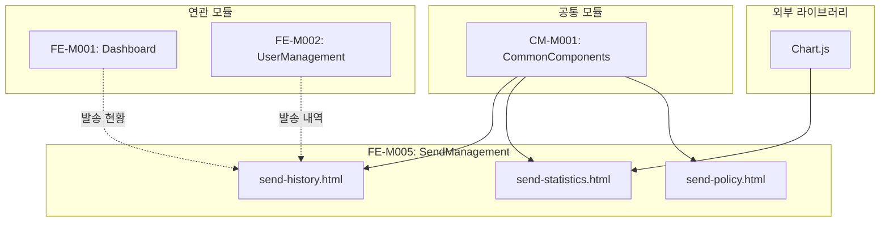

# FE-M005: SendManagement 모듈 상세 개발 설계서

## 1. 모듈 개요

### 1.1 모듈 식별 정보
- **모듈 ID**: FE-M005
- **모듈명**: SendManagement (발송 관리)
- **담당 개발자**: Frontend Developer
- **예상 개발 기간**: 6일
- **우선순위**: P0 (최우선)

### 1.2 모듈 목적 및 범위
- **핵심 기능**:
  1. 발송 내역 모니터링 및 검색
  2. 발송 통계 시각화 (일별/월별 차트)
  3. 발송 정책 관리 (제한 설정, 스팸 모니터링)
  4. 재발송 및 발송 취소 처리
  5. 통계 데이터 Excel 다운로드

- **비즈니스 가치**: 메시지 발송 현황 실시간 모니터링 및 서비스 품질 관리

- **제외 범위**:
  - 실제 메시지 발송 처리 (백엔드 영역)
  - 회원별 발송 설정 (FE-M002에서 처리)

### 1.3 목표 사용자
- **주 사용자 그룹**: 운영팀, 통계 분석팀, 스팸 관리팀
- **사용자 페르소나**:
  - 실시간 발송 현황을 모니터링하는 운영 담당자
  - 발송 통계를 분석하는 데이터 분석가
  - 스팸 발송을 차단하는 보안 담당자
- **사용 시나리오**:
  - 대량 발송 진행 상황 실시간 모니터링
  - 일별/월별 발송 추이 분석 및 리포트 작성
  - 스팸 의심 발송 차단 및 경고 처리

---

## 2. 기술 아키텍처

### 2.1 모듈 구조
```
FE-M005-SendManagement/
├── send-history.html           # 발송 내역 모니터링 페이지
├── send-statistics.html        # 발송 통계 페이지
├── send-policy.html            # 발송 정책 관리 페이지
├── components/
│   ├── history-table/          # 발송 내역 테이블
│   ├── detail-modal/           # 발송 상세 모달
│   ├── charts/                 # 차트 컴포넌트
│   │   ├── line-chart.js       # 라인 차트 (발송 추이)
│   │   ├── doughnut-chart.js   # 도넛 차트 (메시지 타입)
│   │   └── bar-chart.js        # 바 차트 (성공률)
│   ├── spam-monitor/           # 스팸 모니터링
│   └── policy-form/            # 정책 설정 폼
├── services/
│   └── send-service.js         # 발송 서비스
└── tests/
    └── send.test.js            # 단위 테스트
```

### 2.2 기술 스택
- **마크업**: HTML5
- **스타일링**: CSS3 (CSS Variables, Flexbox, Grid)
- **스크립트**: Vanilla JavaScript (ES6+)
- **차트 라이브러리**: Chart.js 4.x
- **의존성**: admin-common.css, admin-common.js

---

## 3. 인터페이스 정의

### 3.1 외부 의존성
```javascript
const ExternalDependencies = {
    modules: ['CM-M001'],
    apis: [
        '/api/admin/sends',
        '/api/admin/sends/{id}',
        '/api/admin/sends/{id}/resend',
        '/api/admin/sends/statistics',
        '/api/admin/sends/policy',
        '/api/admin/spam-monitor'
    ],
    sharedComponents: [
        'modal', 'tabs', 'badge', 'table', 'pagination', 'btn', 'stat-card'
    ],
    utils: [
        'openModal', 'closeModal', 'confirmAction', 'showToast',
        'formatNumber', 'formatDate', 'createPagination'
    ],
    externalLibs: ['Chart.js']
};
```

### 3.2 제공 인터페이스
```javascript
const SendManagementModule = {
    pages: {
        HistoryPage: 'send-history.html',
        StatisticsPage: 'send-statistics.html',
        PolicyPage: 'send-policy.html'
    },
    
    services: {
        loadSendHistory: (params) => Promise,
        getSendDetail: (id) => Promise,
        resendFailed: (id) => Promise,
        loadStatistics: (params) => Promise,
        savePolicy: (policy) => Promise,
        blockSpammer: (userId) => Promise,
        warnSpammer: (userId) => Promise
    },
    
    events: {
        onResendComplete: 'send:resend:complete',
        onPolicySaved: 'send:policy:saved',
        onSpammerBlocked: 'send:spammer:blocked'
    }
};
```

### 3.3 API 명세
```javascript
const APIEndpoints = {
    GET_SEND_HISTORY: {
        method: 'GET',
        path: '/api/admin/sends',
        request: {
            page: Number,
            size: Number,
            search: String,
            status: String,       // 'all' | 'completed' | 'processing' | 'failed'
            messageType: String,  // 'SMS' | 'LMS' | 'MMS' | 'ALIMTALK' | 'all'
            callerNumber: String,
            dateFrom: String,
            dateTo: String
        },
        response: {
            content: Array,       // SendHistory[]
            totalElements: Number,
            totalPages: Number,
            stats: {
                total: Number,
                success: Number,
                fail: Number,
                processing: Number
            }
        },
        errors: ['401', '403', '500']
    },
    
    GET_SEND_DETAIL: {
        method: 'GET',
        path: '/api/admin/sends/{id}',
        response: {
            id: String,
            member: Object,
            callerNumber: String,
            messageType: String,
            sendDate: String,
            totalCount: Number,
            successCount: Number,
            failCount: Number,
            status: String,
            recipients: Array,    // RecipientDetail[]
            content: String
        },
        errors: ['401', '403', '404']
    },
    
    POST_RESEND: {
        method: 'POST',
        path: '/api/admin/sends/{id}/resend',
        request: {
            targetType: String    // 'all' | 'failed'
        },
        response: {
            success: Boolean,
            resendId: String
        },
        errors: ['401', '403', '404', '400']
    },
    
    GET_STATISTICS: {
        method: 'GET',
        path: '/api/admin/sends/statistics',
        request: {
            periodType: String,   // 'daily' | 'monthly'
            dateFrom: String,
            dateTo: String
        },
        response: {
            summary: {
                totalSend: Number,
                successRate: Number,
                totalAmount: Number,
                avgSendPerDay: Number
            },
            dailyTrend: Array,    // { date, total, success, fail }[]
            byMessageType: Array, // { type, count, percentage }[]
            successRateByType: Array,
            top10Members: Array   // 월별 전용
        },
        errors: ['401', '403', '500']
    },
    
    GET_SPAM_MONITOR: {
        method: 'GET',
        path: '/api/admin/spam-monitor',
        response: {
            suspiciousUsers: Array  // SpamSuspect[]
        },
        errors: ['401', '403', '500']
    },
    
    POST_BLOCK_SPAMMER: {
        method: 'POST',
        path: '/api/admin/spam-monitor/{userId}/block',
        response: {
            success: Boolean
        },
        errors: ['401', '403', '404']
    }
};
```

---

## 4. 데이터 모델

### 4.1 엔티티 정의
```typescript
// 발송 내역
interface SendHistory {
    id: string;
    sendDate: string;
    memberName: string;
    memberEmail: string;
    callerNumber: string;
    messageType: 'SMS' | 'LMS' | 'MMS' | 'ALIMTALK' | 'BRANDTALK';
    totalCount: number;
    successCount: number;
    failCount: number;
    status: 'completed' | 'processing' | 'failed';
}

// 발송 상세
interface SendDetail {
    id: string;
    member: {
        name: string;
        email: string;
        company: string;
    };
    callerNumber: string;
    messageType: string;
    sendDate: string;
    completeDate: string;
    totalCount: number;
    successCount: number;
    failCount: number;
    status: string;
    content: string;
    recipients: RecipientDetail[];
}

// 수신자 상세
interface RecipientDetail {
    phone: string;
    status: 'success' | 'failed';
    resultCode: string;
    resultMessage: string;
    sentAt: string;
}

// 발송 통계 요약
interface StatisticsSummary {
    totalSend: number;
    successRate: number;
    totalAmount: number;
    avgSendPerDay: number;
}

// 일별 추이 데이터
interface DailyTrend {
    date: string;
    total: number;
    success: number;
    fail: number;
}

// 메시지 타입별 현황
interface TypeDistribution {
    type: string;
    count: number;
    percentage: number;
}

// 스팸 의심 사용자
interface SpamSuspect {
    userId: string;
    memberName: string;
    memberEmail: string;
    sendCount: number;
    failRate: number;
    pattern: string;
    detectedAt: string;
}

// 발송 정책
interface SendPolicy {
    dailyLimit: number;
    hourlyLimit: number;
    restrictedTimeStart: string;
    restrictedTimeEnd: string;
    bulkApprovalThreshold: number;
    spamKeywords: string[];
}
```

### 4.2 상태 관리 스키마
```javascript
const SendManagementState = {
    // 발송 내역
    historyList: [],
    selectedSend: null,
    historyStats: { total: 0, success: 0, fail: 0, processing: 0 },
    
    // 통계
    statisticsData: null,
    periodType: 'daily',
    charts: {
        trendChart: null,
        typeChart: null,
        rateChart: null
    },
    
    // 정책
    currentPolicy: null,
    spamMonitorList: [],
    
    // 공통
    currentPage: 1,
    totalPages: 1,
    searchParams: {},
    isLoading: false
};
```

---

## 5. 핵심 컴포넌트 명세

### 5.1 발송 내역 테이블
```html
<!-- send-history-table.html -->
<div class="stats-grid" style="margin-bottom: 24px;">
    <div class="stat-card">
        <div class="stat-card-header">
            <div class="stat-card-title">총 발송 건수</div>
            <div class="stat-card-icon icon-send">
                <svg><!-- icon --></svg>
            </div>
        </div>
        <div class="stat-card-value" id="statTotal">0</div>
    </div>
    <div class="stat-card">
        <div class="stat-card-header">
            <div class="stat-card-title">성공</div>
            <div class="stat-card-icon icon-success">
                <svg><!-- icon --></svg>
            </div>
        </div>
        <div class="stat-card-value" id="statSuccess">0</div>
    </div>
    <div class="stat-card">
        <div class="stat-card-header">
            <div class="stat-card-title">실패</div>
            <div class="stat-card-icon icon-fail">
                <svg><!-- icon --></svg>
            </div>
        </div>
        <div class="stat-card-value" id="statFail">0</div>
    </div>
    <div class="stat-card">
        <div class="stat-card-header">
            <div class="stat-card-title">진행중</div>
            <div class="stat-card-icon icon-processing">
                <svg><!-- icon --></svg>
            </div>
        </div>
        <div class="stat-card-value" id="statProcessing">0</div>
    </div>
</div>

<div class="search-filter-bar">
    <select class="form-control" id="callerNumberFilter">
        <option value="">발신번호 (전체)</option>
    </select>
    <select class="form-control" id="messageTypeFilter">
        <option value="">메시지 타입 (전체)</option>
        <option value="SMS">SMS</option>
        <option value="LMS">LMS</option>
        <option value="MMS">MMS</option>
        <option value="ALIMTALK">알림톡</option>
    </select>
    <select class="form-control" id="statusFilter">
        <option value="">상태 (전체)</option>
        <option value="completed">완료</option>
        <option value="processing">진행중</option>
        <option value="failed">실패</option>
    </select>
    <input type="text" class="form-control" id="recipientSearch" 
           placeholder="수신번호 검색">
    <input type="date" class="form-control" id="dateFrom">
    <input type="date" class="form-control" id="dateTo">
    <button class="btn btn-primary" onclick="searchHistory()">검색</button>
    <button class="btn btn-outline" onclick="resetSearch()">초기화</button>
    <button class="btn btn-secondary" onclick="downloadExcel()">엑셀 다운로드</button>
</div>
```

```javascript
// send-history.js
function loadSendHistory(params = {}) {
    const searchParams = {
        page: SendManagementState.currentPage,
        size: 20,
        ...SendManagementState.searchParams,
        ...params
    };
    
    fetch(`/api/admin/sends?${new URLSearchParams(searchParams)}`)
        .then(response => response.json())
        .then(data => {
            renderHistoryTable(data.content);
            renderStats(data.stats);
            createPagination(data.currentPage, data.totalPages, 'pagination');
        });
}

function renderHistoryTable(sends) {
    const tbody = document.querySelector('#historyTable tbody');
    
    tbody.innerHTML = sends.map(send => `
        <tr>
            <td>${formatDate(send.sendDate)}</td>
            <td>${send.memberName} (${send.memberEmail})</td>
            <td>${send.callerNumber}</td>
            <td>${getMessageTypeBadge(send.messageType)}</td>
            <td>${formatNumber(send.totalCount)}</td>
            <td>${formatNumber(send.successCount)}</td>
            <td>${formatNumber(send.failCount)}</td>
            <td>${getStatusBadge(send.status)}</td>
            <td>
                <button class="btn btn-outline btn-sm" onclick="openSendDetail('${send.id}')">
                    상세
                </button>
                ${send.status === 'failed' ? 
                    `<button class="btn btn-primary btn-sm" onclick="handleResend('${send.id}')">재발송</button>` 
                    : ''}
            </td>
        </tr>
    `).join('');
}

function renderStats(stats) {
    document.getElementById('statTotal').textContent = formatNumber(stats.total);
    document.getElementById('statSuccess').textContent = formatNumber(stats.success);
    document.getElementById('statFail').textContent = formatNumber(stats.fail);
    document.getElementById('statProcessing').textContent = formatNumber(stats.processing);
}
```

### 5.2 발송 상세 모달
```javascript
// send-detail-modal.js
function openSendDetail(id) {
    fetch(`/api/admin/sends/${id}`)
        .then(response => response.json())
        .then(detail => {
            renderSendDetail(detail);
            openModal('sendDetailModal');
        });
}

function renderSendDetail(detail) {
    // 기본 정보
    document.getElementById('detailMember').textContent = 
        `${detail.member.name} (${detail.member.email})`;
    document.getElementById('detailCallerNumber').textContent = detail.callerNumber;
    document.getElementById('detailMessageType').innerHTML = 
        getMessageTypeBadge(detail.messageType);
    document.getElementById('detailSendDate').textContent = formatDate(detail.sendDate);
    document.getElementById('detailStatus').innerHTML = getStatusBadge(detail.status);
    
    // 발송 현황
    document.getElementById('detailTotalCount').textContent = formatNumber(detail.totalCount);
    document.getElementById('detailSuccessCount').textContent = formatNumber(detail.successCount);
    document.getElementById('detailFailCount').textContent = formatNumber(detail.failCount);
    
    // 메시지 내용
    document.getElementById('detailContent').textContent = detail.content;
    
    // 실패 상세 (실패 건이 있는 경우)
    if (detail.failCount > 0) {
        document.getElementById('failDetailSection').style.display = 'block';
        renderFailedRecipients(detail.recipients.filter(r => r.status === 'failed'));
    } else {
        document.getElementById('failDetailSection').style.display = 'none';
    }
    
    // 버튼 설정
    const actionButtons = document.getElementById('detailActionButtons');
    if (detail.failCount > 0) {
        actionButtons.innerHTML = `
            <button class="btn btn-primary" onclick="handleResendFailed('${detail.id}')">
                실패 건 재발송
            </button>
            <button class="btn btn-secondary" onclick="downloadDetailExcel('${detail.id}')">
                엑셀 다운로드
            </button>
        `;
    } else {
        actionButtons.innerHTML = `
            <button class="btn btn-secondary" onclick="downloadDetailExcel('${detail.id}')">
                엑셀 다운로드
            </button>
        `;
    }
}

function handleResendFailed(id) {
    confirmAction('실패한 건들을 재발송하시겠습니까?', () => {
        fetch(`/api/admin/sends/${id}/resend`, {
            method: 'POST',
            headers: { 'Content-Type': 'application/json' },
            body: JSON.stringify({ targetType: 'failed' })
        })
        .then(response => response.json())
        .then(result => {
            showToast('재발송이 요청되었습니다.', 'success');
            closeModal('sendDetailModal');
            loadSendHistory();
        })
        .catch(error => {
            showToast('재발송 요청에 실패했습니다.', 'error');
        });
    });
}
```

### 5.3 발송 통계 차트
```javascript
// send-statistics.js
let trendChart = null;
let typeChart = null;
let rateChart = null;

function initCharts() {
    // 일별 발송 추이 차트 (Line)
    const trendCtx = document.getElementById('trendChart').getContext('2d');
    trendChart = new Chart(trendCtx, {
        type: 'line',
        data: {
            labels: [],
            datasets: [
                {
                    label: '총 발송',
                    data: [],
                    borderColor: '#3b82f6',
                    backgroundColor: 'rgba(59, 130, 246, 0.1)',
                    fill: true,
                    tension: 0.4
                },
                {
                    label: '성공',
                    data: [],
                    borderColor: '#10b981',
                    backgroundColor: 'transparent',
                    tension: 0.4
                },
                {
                    label: '실패',
                    data: [],
                    borderColor: '#ef4444',
                    backgroundColor: 'transparent',
                    tension: 0.4
                }
            ]
        },
        options: {
            responsive: true,
            maintainAspectRatio: false,
            plugins: {
                legend: { position: 'top' }
            },
            scales: {
                y: { beginAtZero: true }
            }
        }
    });
    
    // 메시지 타입별 현황 차트 (Doughnut)
    const typeCtx = document.getElementById('typeChart').getContext('2d');
    typeChart = new Chart(typeCtx, {
        type: 'doughnut',
        data: {
            labels: [],
            datasets: [{
                data: [],
                backgroundColor: [
                    '#3b82f6', '#10b981', '#f59e0b', '#8b5cf6', '#ec4899'
                ]
            }]
        },
        options: {
            responsive: true,
            maintainAspectRatio: false,
            plugins: {
                legend: { position: 'right' }
            }
        }
    });
    
    // 성공률 통계 차트 (Stacked Bar)
    const rateCtx = document.getElementById('rateChart').getContext('2d');
    rateChart = new Chart(rateCtx, {
        type: 'bar',
        data: {
            labels: [],
            datasets: [
                {
                    label: '성공',
                    data: [],
                    backgroundColor: '#10b981'
                },
                {
                    label: '실패',
                    data: [],
                    backgroundColor: '#ef4444'
                }
            ]
        },
        options: {
            responsive: true,
            maintainAspectRatio: false,
            plugins: {
                legend: { position: 'top' }
            },
            scales: {
                x: { stacked: true },
                y: { stacked: true, max: 100 }
            }
        }
    });
}

function updateCharts(data) {
    // 추이 차트 업데이트
    trendChart.data.labels = data.dailyTrend.map(d => d.date);
    trendChart.data.datasets[0].data = data.dailyTrend.map(d => d.total);
    trendChart.data.datasets[1].data = data.dailyTrend.map(d => d.success);
    trendChart.data.datasets[2].data = data.dailyTrend.map(d => d.fail);
    trendChart.update();
    
    // 타입별 차트 업데이트
    typeChart.data.labels = data.byMessageType.map(d => d.type);
    typeChart.data.datasets[0].data = data.byMessageType.map(d => d.count);
    typeChart.update();
    
    // 성공률 차트 업데이트
    rateChart.data.labels = data.successRateByType.map(d => d.type);
    rateChart.data.datasets[0].data = data.successRateByType.map(d => d.successRate);
    rateChart.data.datasets[1].data = data.successRateByType.map(d => 100 - d.successRate);
    rateChart.update();
}

function searchStatistics() {
    const periodType = document.querySelector('#periodTypeSelect').value;
    const dateFrom = document.getElementById('statDateFrom').value;
    const dateTo = document.getElementById('statDateTo').value;
    
    // 일별/월별에 따라 UI 조정
    if (periodType === 'daily') {
        document.getElementById('dailyFilter').style.display = 'flex';
        document.getElementById('monthlyFilter').style.display = 'none';
        document.getElementById('top10MembersCard').style.display = 'none';
        document.querySelector('.card-title').textContent = '일별 발송 건수 추이';
    } else {
        document.getElementById('dailyFilter').style.display = 'none';
        document.getElementById('monthlyFilter').style.display = 'flex';
        document.getElementById('top10MembersCard').style.display = 'block';
        document.querySelector('.card-title').textContent = '월별 발송 건수 추이';
    }
    
    fetch(`/api/admin/sends/statistics?periodType=${periodType}&dateFrom=${dateFrom}&dateTo=${dateTo}`)
        .then(response => response.json())
        .then(data => {
            updateSummaryCards(data.summary);
            updateCharts(data);
            
            if (periodType === 'monthly' && data.top10Members) {
                renderTop10Members(data.top10Members);
            }
        });
}

function renderTop10Members(members) {
    const tbody = document.getElementById('top10MembersTableBody');
    tbody.innerHTML = members.map((member, index) => `
        <tr>
            <td>
                <span class="badge ${index < 3 ? 'badge-primary' : 'badge-secondary'} badge-circle">
                    ${index + 1}
                </span>
            </td>
            <td>${member.companyName}</td>
            <td>
                ${index < 3 
                    ? `<strong style="color: var(--admin-primary);">${formatNumber(member.sendCount)}건</strong>`
                    : `${formatNumber(member.sendCount)}건`
                }
            </td>
            <td><span class="badge badge-success">${member.successRate}%</span></td>
        </tr>
    `).join('');
}
```

### 5.4 발송 정책 관리
```javascript
// send-policy.js
function loadPolicy() {
    fetch('/api/admin/sends/policy')
        .then(response => response.json())
        .then(policy => {
            document.getElementById('dailyLimit').value = policy.dailyLimit;
            document.getElementById('hourlyLimit').value = policy.hourlyLimit;
            document.getElementById('restrictedTimeStart').value = policy.restrictedTimeStart;
            document.getElementById('restrictedTimeEnd').value = policy.restrictedTimeEnd;
            document.getElementById('bulkApprovalThreshold').value = policy.bulkApprovalThreshold;
            document.getElementById('spamKeywords').value = policy.spamKeywords.join('\n');
        });
}

function savePolicy() {
    const policy = {
        dailyLimit: parseInt(document.getElementById('dailyLimit').value),
        hourlyLimit: parseInt(document.getElementById('hourlyLimit').value),
        restrictedTimeStart: document.getElementById('restrictedTimeStart').value,
        restrictedTimeEnd: document.getElementById('restrictedTimeEnd').value,
        bulkApprovalThreshold: parseInt(document.getElementById('bulkApprovalThreshold').value),
        spamKeywords: document.getElementById('spamKeywords').value
            .split('\n')
            .map(k => k.trim())
            .filter(k => k)
    };
    
    // 유효성 검사
    if (policy.dailyLimit < 0 || policy.hourlyLimit < 0) {
        showToast('발송 제한은 0 이상이어야 합니다.', 'error');
        return;
    }
    
    confirmAction('정책을 저장하시겠습니까?', () => {
        fetch('/api/admin/sends/policy', {
            method: 'PUT',
            headers: { 'Content-Type': 'application/json' },
            body: JSON.stringify(policy)
        })
        .then(response => response.json())
        .then(() => {
            showToast('정책이 저장되었습니다.', 'success');
        })
        .catch(error => {
            showToast('정책 저장에 실패했습니다.', 'error');
        });
    });
}
```

### 5.5 스팸 모니터링
```javascript
// spam-monitor.js
function loadSpamMonitor() {
    fetch('/api/admin/spam-monitor')
        .then(response => response.json())
        .then(data => {
            renderSpamList(data.suspiciousUsers);
        });
}

function renderSpamList(users) {
    const tbody = document.querySelector('#spamTable tbody');
    
    tbody.innerHTML = users.map(user => `
        <tr>
            <td>${user.memberName}</td>
            <td>${user.memberEmail}</td>
            <td>${formatNumber(user.sendCount)}</td>
            <td><span class="badge badge-danger">${user.failRate}%</span></td>
            <td>${user.pattern}</td>
            <td>${formatDate(user.detectedAt)}</td>
            <td>
                <button class="btn btn-warning btn-sm" onclick="warnSpammer('${user.userId}')">
                    경고
                </button>
                <button class="btn btn-danger btn-sm" onclick="blockSpammer('${user.userId}')">
                    차단
                </button>
                <button class="btn btn-outline btn-sm" onclick="openSpamDetail('${user.userId}')">
                    상세
                </button>
            </td>
        </tr>
    `).join('');
}

function blockSpammer(userId) {
    confirmAction('이 사용자의 발송을 차단하시겠습니까?', () => {
        fetch(`/api/admin/spam-monitor/${userId}/block`, { method: 'POST' })
            .then(response => response.json())
            .then(() => {
                showToast('사용자가 차단되었습니다.', 'success');
                loadSpamMonitor();
            })
            .catch(error => {
                showToast('차단 처리에 실패했습니다.', 'error');
            });
    });
}

function warnSpammer(userId) {
    confirmAction('이 사용자에게 경고를 발송하시겠습니까?', () => {
        fetch(`/api/admin/spam-monitor/${userId}/warn`, { method: 'POST' })
            .then(response => response.json())
            .then(() => {
                showToast('경고가 발송되었습니다.', 'success');
            })
            .catch(error => {
                showToast('경고 발송에 실패했습니다.', 'error');
            });
    });
}
```

---

## 6. 이벤트 및 메시징

### 6.1 발행 이벤트
```javascript
const SendEvents = {
    RESEND_COMPLETE: 'send:resend:complete',
    POLICY_SAVED: 'send:policy:saved',
    SPAMMER_BLOCKED: 'send:spammer:blocked',
    STATISTICS_LOADED: 'send:statistics:loaded'
};
```

### 6.2 구독 이벤트
```javascript
const SubscribedEvents = {
    'user:activity:sends': (userId) => {
        // 특정 사용자의 발송 내역 필터링
        loadSendHistory({ userId });
    }
};
```

---

## 7. 에러 처리

### 7.1 에러 코드 정의
```javascript
const SendErrorCode = {
    NOT_FOUND: 'SEND_001',
    RESEND_FAILED: 'SEND_002',
    POLICY_INVALID: 'SEND_003',
    BLOCK_FAILED: 'SEND_004',
    CHART_RENDER_FAILED: 'SEND_005'
};
```

---

## 8. 테스트 전략

### 8.1 단위 테스트
```javascript
describe('Send Module', () => {
    describe('Statistics Charts', () => {
        it('should update chart data correctly', () => {
            const mockData = {
                dailyTrend: [
                    { date: '2024-12-01', total: 100, success: 95, fail: 5 }
                ]
            };
            
            updateCharts(mockData);
            
            expect(trendChart.data.labels).toContain('2024-12-01');
        });
    });
    
    describe('Policy Validation', () => {
        it('should reject negative limits', () => {
            document.getElementById('dailyLimit').value = -1;
            
            const result = validatePolicy();
            expect(result).toBe(false);
        });
    });
});
```

---

## 9. 성능 최적화

### 9.1 캐싱 전략
```javascript
const SendCache = {
    statistics: null,
    statisticsTTL: 300000,  // 5분
    
    getStatistics(params) {
        const key = JSON.stringify(params);
        if (this.statistics && this.statistics.key === key) {
            if (Date.now() - this.statistics.timestamp < this.statisticsTTL) {
                return this.statistics.data;
            }
        }
        return null;
    }
};
```

### 9.2 최적화 기법
- **차트 최적화**: 데이터 포인트 수 제한 (최대 31일)
- **테이블 가상화**: 대량 데이터 시 가상 스크롤
- **Excel 다운로드**: Web Worker를 통한 백그라운드 처리

---

## 10. 보안 고려사항

### 10.1 인증/인가
- **권한 체크**: 정책 수정, 스팸 차단 권한 확인

### 10.2 데이터 보호
- **수신번호 마스킹**: 목록에서 중간 4자리 마스킹

---

## 11. 배포 및 모니터링

### 11.1 파일 구조
```
admin/
├── send-history.html
├── send-statistics.html
├── send-policy.html
├── css/
│   └── admin-common.css
└── js/
    └── admin-common.js
```

### 11.2 외부 라이브러리
- Chart.js 4.x (CDN)

---

## 12. 개발 가이드라인

### 12.1 코딩 컨벤션
- **차트 변수**: `xxxChart` 형태로 전역 관리
- **API 호출**: `fetch` with async/await 패턴

### 12.2 PR 체크리스트
- [ ] 발송 내역 테이블 렌더링 확인
- [ ] 상세 모달 정상 동작 확인
- [ ] 재발송 기능 확인
- [ ] 차트 렌더링 및 업데이트 확인
- [ ] 일별/월별 전환 정상 동작 확인
- [ ] 정책 저장 및 유효성 검사 확인
- [ ] 스팸 모니터링 차단/경고 기능 확인

---

## 13. 의존성 그래프



---

## 14. 버전 히스토리

| 버전 | 날짜 | 변경 내용 | 작성자 |
|------|------|----------|--------|
| 1.0.0 | 2024-12-15 | 초기 문서 작성 | - |

