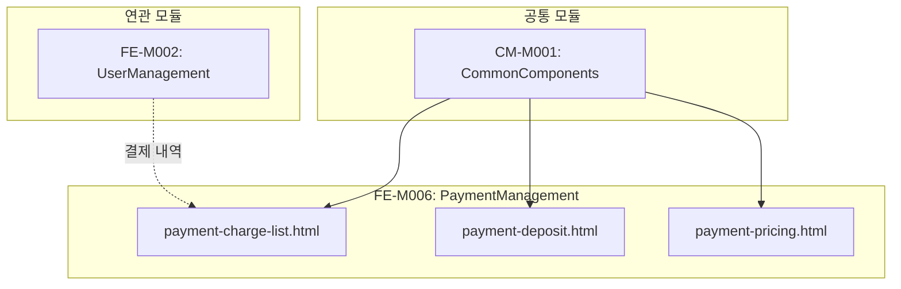

# FE-M006: PaymentManagement 모듈 상세 개발 설계서

## 1. 모듈 개요

### 1.1 모듈 식별 정보
- **모듈 ID**: FE-M006
- **모듈명**: PaymentManagement (결제 관리)
- **담당 개발자**: Frontend Developer
- **예상 개발 기간**: 5일
- **우선순위**: P1 (높음)

### 1.2 모듈 목적 및 범위
- **핵심 기능**:
  1. 충전 내역 조회 및 관리
  2. 무통장입금 입금 확인 처리
  3. 요금 설정 및 할인 정책 관리
  4. 결제 취소 및 환불 처리
  5. 결제 통계 Excel 다운로드

- **비즈니스 가치**: 서비스 수익 관리 및 정확한 결제 처리를 통한 고객 신뢰 확보

- **제외 범위**:
  - 실제 PG사 연동 (백엔드 영역)
  - 회원 직접 충전 (프론트엔드 영역)
  - 정산 처리 (별도 시스템)

### 1.3 목표 사용자
- **주 사용자 그룹**: 재무팀, 운영팀
- **사용자 페르소나**:
  - 무통장입금을 확인하는 재무 담당자
  - 요금 정책을 설정하는 운영 매니저
  - 결제 문의를 처리하는 CS 담당자
- **사용 시나리오**:
  - 무통장입금 내역 확인 및 잔액 충전 처리
  - 신규 요금제 및 할인 정책 설정
  - 결제 오류 건 확인 및 처리

---

## 2. 기술 아키텍처

### 2.1 모듈 구조
```
FE-M006-PaymentManagement/
├── payment-charge-list.html     # 충전 내역 페이지
├── payment-deposit.html         # 입금 확인 페이지
├── payment-pricing.html         # 요금 설정 페이지
├── components/
│   ├── charge-table/            # 충전 내역 테이블
│   ├── charge-detail-modal/     # 충전 상세 모달
│   ├── deposit-table/           # 입금 대기 테이블
│   ├── deposit-confirm-modal/   # 입금 확인 모달
│   ├── pricing-form/            # 요금 설정 폼
│   └── discount-modal/          # 할인 설정 모달
├── services/
│   └── payment-service.js       # 결제 서비스
└── tests/
    └── payment.test.js          # 단위 테스트
```

### 2.2 기술 스택
- **마크업**: HTML5
- **스타일링**: CSS3 (CSS Variables, Flexbox, Grid)
- **스크립트**: Vanilla JavaScript (ES6+)
- **의존성**: admin-common.css, admin-common.js

---

## 3. 인터페이스 정의

### 3.1 외부 의존성
```javascript
const ExternalDependencies = {
    modules: ['CM-M001'],
    apis: [
        '/api/admin/payments/charges',
        '/api/admin/payments/charges/{id}',
        '/api/admin/payments/deposits/pending',
        '/api/admin/payments/deposits/{id}/confirm',
        '/api/admin/payments/pricing',
        '/api/admin/payments/discounts'
    ],
    sharedComponents: [
        'modal', 'tabs', 'badge', 'table', 'pagination', 'btn', 'stat-card', 'form-control'
    ],
    utils: [
        'openModal', 'closeModal', 'confirmAction', 'showToast',
        'formatNumber', 'formatDate', 'createPagination'
    ]
};
```

### 3.2 제공 인터페이스
```javascript
const PaymentManagementModule = {
    pages: {
        ChargeListPage: 'payment-charge-list.html',
        DepositPage: 'payment-deposit.html',
        PricingPage: 'payment-pricing.html'
    },
    
    services: {
        loadChargeList: (params) => Promise,
        getChargeDetail: (id) => Promise,
        confirmDeposit: (id, data) => Promise,
        rejectDeposit: (id, reason) => Promise,
        cancelCharge: (id, reason) => Promise,
        savePricing: (pricing) => Promise,
        addDiscount: (discount) => Promise,
        updateDiscount: (id, discount) => Promise,
        deleteDiscount: (id) => Promise
    },
    
    events: {
        onDepositConfirmed: 'payment:deposit:confirmed',
        onChargesCancelled: 'payment:charge:cancelled',
        onPricingSaved: 'payment:pricing:saved'
    }
};
```

### 3.3 API 명세
```javascript
const APIEndpoints = {
    GET_CHARGE_LIST: {
        method: 'GET',
        path: '/api/admin/payments/charges',
        request: {
            page: Number,
            size: Number,
            search: String,
            paymentMethod: String,  // 'card' | 'bank' | 'kakao' | 'all'
            status: String,         // 'completed' | 'pending' | 'failed' | 'cancelled'
            dateFrom: String,
            dateTo: String
        },
        response: {
            content: Array,         // Charge[]
            totalElements: Number,
            totalPages: Number,
            stats: {
                totalAmount: Number,
                completedAmount: Number,
                pendingAmount: Number,
                failedCount: Number
            }
        },
        errors: ['401', '403', '500']
    },
    
    GET_CHARGE_DETAIL: {
        method: 'GET',
        path: '/api/admin/payments/charges/{id}',
        response: {
            id: String,
            member: Object,
            amount: Number,
            paymentMethod: String,
            status: String,
            createdAt: String,
            completedAt: String,
            transactionId: String,
            cardInfo: Object,
            bankInfo: Object
        },
        errors: ['401', '403', '404']
    },
    
    GET_PENDING_DEPOSITS: {
        method: 'GET',
        path: '/api/admin/payments/deposits/pending',
        response: {
            content: Array,         // PendingDeposit[]
            totalElements: Number,
            pendingCount: Number,
            pendingAmount: Number
        },
        errors: ['401', '403', '500']
    },
    
    POST_CONFIRM_DEPOSIT: {
        method: 'POST',
        path: '/api/admin/payments/deposits/{id}/confirm',
        request: {
            depositorName: String,
            depositDate: String,
            depositAmount: Number
        },
        response: {
            success: Boolean,
            newBalance: Number
        },
        errors: ['401', '403', '404', '400']
    },
    
    POST_REJECT_DEPOSIT: {
        method: 'POST',
        path: '/api/admin/payments/deposits/{id}/reject',
        request: {
            reason: String
        },
        response: {
            success: Boolean
        },
        errors: ['401', '403', '404', '400']
    },
    
    PUT_PRICING: {
        method: 'PUT',
        path: '/api/admin/payments/pricing',
        request: {
            smsPrice: Number,
            lmsPrice: Number,
            mmsPrice: Number,
            alimtalkPrice: Number,
            brandtalkPrice: Number
        },
        response: {
            success: Boolean
        },
        errors: ['401', '403', '400']
    },
    
    POST_DISCOUNT: {
        method: 'POST',
        path: '/api/admin/payments/discounts',
        request: {
            minAmount: Number,
            maxAmount: Number,
            discountType: String,   // 'rate' | 'amount'
            discountValue: Number
        },
        response: {
            success: Boolean,
            id: String
        },
        errors: ['401', '403', '400']
    }
};
```

---

## 4. 데이터 모델

### 4.1 엔티티 정의
```typescript
// 충전 내역
interface Charge {
    id: string;
    memberName: string;
    memberEmail: string;
    amount: number;
    paymentMethod: 'card' | 'bank' | 'kakao' | 'naver';
    status: 'completed' | 'pending' | 'failed' | 'cancelled';
    createdAt: string;
    completedAt: string;
}

// 충전 상세
interface ChargeDetail {
    id: string;
    member: {
        name: string;
        email: string;
        company: string;
    };
    amount: number;
    paymentMethod: string;
    status: string;
    createdAt: string;
    completedAt: string;
    transactionId: string;
    cardInfo?: {
        cardName: string;
        cardNumber: string;   // 마스킹됨
        installment: number;
    };
    bankInfo?: {
        bankName: string;
        accountNumber: string; // 마스킹됨
        depositorName: string;
    };
}

// 입금 대기 건
interface PendingDeposit {
    id: string;
    memberName: string;
    memberEmail: string;
    requestAmount: number;
    bankName: string;
    accountNumber: string;
    depositorName: string;
    requestDate: string;
    dueDate: string;
}

// 요금 설정
interface Pricing {
    smsPrice: number;
    lmsPrice: number;
    mmsPrice: number;
    alimtalkPrice: number;
    brandtalkPrice: number;
    updatedAt: string;
    updatedBy: string;
}

// 할인 구간
interface Discount {
    id: string;
    minAmount: number;
    maxAmount: number;
    discountType: 'rate' | 'amount';
    discountValue: number;
    isActive: boolean;
}
```

### 4.2 상태 관리 스키마
```javascript
const PaymentManagementState = {
    // 충전 내역
    chargeList: [],
    selectedCharge: null,
    chargeStats: { totalAmount: 0, completedAmount: 0, pendingAmount: 0, failedCount: 0 },
    
    // 입금 확인
    pendingDeposits: [],
    selectedDeposit: null,
    pendingCount: 0,
    
    // 요금 설정
    pricing: null,
    discounts: [],
    
    // 공통
    currentPage: 1,
    totalPages: 1,
    searchParams: {},
    isLoading: false
};
```

---

## 5. 핵심 컴포넌트 명세

### 5.1 충전 내역 테이블
```html
<!-- charge-list.html -->
<div class="stats-grid" style="margin-bottom: 24px;">
    <div class="stat-card">
        <div class="stat-card-header">
            <div class="stat-card-title">총 충전 금액</div>
            <div class="stat-card-icon icon-money">
                <svg><!-- icon --></svg>
            </div>
        </div>
        <div class="stat-card-value" id="statTotalAmount">₩0</div>
    </div>
    <div class="stat-card">
        <div class="stat-card-header">
            <div class="stat-card-title">완료 금액</div>
            <div class="stat-card-icon icon-success">
                <svg><!-- icon --></svg>
            </div>
        </div>
        <div class="stat-card-value" id="statCompletedAmount">₩0</div>
    </div>
    <div class="stat-card">
        <div class="stat-card-header">
            <div class="stat-card-title">대기 금액</div>
            <div class="stat-card-icon icon-pending">
                <svg><!-- icon --></svg>
            </div>
        </div>
        <div class="stat-card-value" id="statPendingAmount">₩0</div>
    </div>
    <div class="stat-card">
        <div class="stat-card-header">
            <div class="stat-card-title">실패 건수</div>
            <div class="stat-card-icon icon-fail">
                <svg><!-- icon --></svg>
            </div>
        </div>
        <div class="stat-card-value" id="statFailedCount">0건</div>
    </div>
</div>

<div class="search-filter-bar">
    <input type="text" class="form-control" id="searchInput" placeholder="회원명 또는 이메일">
    <select class="form-control" id="paymentMethodFilter">
        <option value="">결제 수단 (전체)</option>
        <option value="card">신용카드</option>
        <option value="bank">무통장입금</option>
        <option value="kakao">카카오페이</option>
        <option value="naver">네이버페이</option>
    </select>
    <select class="form-control" id="statusFilter">
        <option value="">상태 (전체)</option>
        <option value="completed">완료</option>
        <option value="pending">대기</option>
        <option value="failed">실패</option>
        <option value="cancelled">취소</option>
    </select>
    <input type="date" class="form-control" id="dateFrom">
    <input type="date" class="form-control" id="dateTo">
    <button class="btn btn-primary" onclick="searchCharges()">검색</button>
    <button class="btn btn-outline" onclick="resetSearch()">초기화</button>
    <button class="btn btn-secondary" onclick="downloadExcel()">엑셀 다운로드</button>
</div>
```

```javascript
// charge-list.js
function loadChargeList(params = {}) {
    const searchParams = {
        page: PaymentManagementState.currentPage,
        size: 20,
        ...PaymentManagementState.searchParams,
        ...params
    };
    
    fetch(`/api/admin/payments/charges?${new URLSearchParams(searchParams)}`)
        .then(response => response.json())
        .then(data => {
            renderChargeTable(data.content);
            renderStats(data.stats);
            createPagination(data.currentPage, data.totalPages, 'pagination');
        });
}

function renderChargeTable(charges) {
    const tbody = document.querySelector('#chargeTable tbody');
    
    tbody.innerHTML = charges.map(charge => `
        <tr>
            <td>${formatDate(charge.createdAt)}</td>
            <td>${charge.memberName} (${charge.memberEmail})</td>
            <td>₩${formatNumber(charge.amount)}</td>
            <td>${getPaymentMethodBadge(charge.paymentMethod)}</td>
            <td>${getStatusBadge(charge.status)}</td>
            <td>
                <button class="btn btn-outline btn-sm" onclick="openChargeDetail('${charge.id}')">
                    상세
                </button>
                ${charge.status === 'pending' && charge.paymentMethod === 'bank' ? 
                    `<button class="btn btn-primary btn-sm" onclick="openDepositConfirm('${charge.id}')">입금 확인</button>` 
                    : ''}
                ${charge.status === 'failed' ? 
                    `<button class="btn btn-danger btn-sm" onclick="cancelCharge('${charge.id}')">취소</button>` 
                    : ''}
            </td>
        </tr>
    `).join('');
}

function getPaymentMethodBadge(method) {
    const badges = {
        'card': '<span class="badge badge-info">신용카드</span>',
        'bank': '<span class="badge badge-secondary">무통장입금</span>',
        'kakao': '<span class="badge badge-warning">카카오페이</span>',
        'naver': '<span class="badge badge-success">네이버페이</span>'
    };
    return badges[method] || '<span class="badge badge-secondary">기타</span>';
}
```

### 5.2 충전 상세 모달
```javascript
// charge-detail-modal.js
function openChargeDetail(id) {
    fetch(`/api/admin/payments/charges/${id}`)
        .then(response => response.json())
        .then(detail => {
            renderChargeDetail(detail);
            openModal('chargeDetailModal');
        });
}

function renderChargeDetail(detail) {
    document.getElementById('detailMember').textContent = 
        `${detail.member.name} (${detail.member.email})`;
    document.getElementById('detailAmount').textContent = `₩${formatNumber(detail.amount)}`;
    document.getElementById('detailPaymentMethod').innerHTML = 
        getPaymentMethodBadge(detail.paymentMethod);
    document.getElementById('detailStatus').innerHTML = getStatusBadge(detail.status);
    document.getElementById('detailCreatedAt').textContent = formatDate(detail.createdAt);
    document.getElementById('detailCompletedAt').textContent = 
        detail.completedAt ? formatDate(detail.completedAt) : '-';
    document.getElementById('detailTransactionId').textContent = 
        detail.transactionId || '-';
    
    // 결제 수단별 상세 정보
    const paymentInfoSection = document.getElementById('paymentInfoSection');
    if (detail.cardInfo) {
        paymentInfoSection.innerHTML = `
            <div class="detail-row">
                <span class="detail-label">카드사</span>
                <span class="detail-value">${detail.cardInfo.cardName}</span>
            </div>
            <div class="detail-row">
                <span class="detail-label">카드번호</span>
                <span class="detail-value">${detail.cardInfo.cardNumber}</span>
            </div>
            <div class="detail-row">
                <span class="detail-label">할부</span>
                <span class="detail-value">${detail.cardInfo.installment === 0 ? '일시불' : `${detail.cardInfo.installment}개월`}</span>
            </div>
        `;
    } else if (detail.bankInfo) {
        paymentInfoSection.innerHTML = `
            <div class="detail-row">
                <span class="detail-label">입금 은행</span>
                <span class="detail-value">${detail.bankInfo.bankName}</span>
            </div>
            <div class="detail-row">
                <span class="detail-label">계좌번호</span>
                <span class="detail-value">${detail.bankInfo.accountNumber}</span>
            </div>
            <div class="detail-row">
                <span class="detail-label">입금자명</span>
                <span class="detail-value">${detail.bankInfo.depositorName || '-'}</span>
            </div>
        `;
    }
    
    // 버튼 설정
    const actionButtons = document.getElementById('detailActionButtons');
    let buttons = [];
    
    if (detail.status === 'completed') {
        buttons.push(`<button class="btn btn-danger" onclick="handleCancelCharge('${detail.id}')">결제 취소</button>`);
    }
    if (detail.status === 'pending' && detail.paymentMethod === 'bank') {
        buttons.push(`<button class="btn btn-success" onclick="handleConfirmDeposit('${detail.id}')">입금 확인</button>`);
    }
    
    actionButtons.innerHTML = buttons.join('');
}

function handleCancelCharge(id) {
    const reason = prompt('결제 취소 사유를 입력해주세요:');
    if (reason === null) return;
    
    if (!reason.trim()) {
        showToast('취소 사유를 입력해주세요.', 'error');
        return;
    }
    
    confirmAction('정말 이 결제를 취소하시겠습니까?', () => {
        fetch(`/api/admin/payments/charges/${id}/cancel`, {
            method: 'POST',
            headers: { 'Content-Type': 'application/json' },
            body: JSON.stringify({ reason })
        })
        .then(response => response.json())
        .then(() => {
            showToast('결제가 취소되었습니다.', 'success');
            closeModal('chargeDetailModal');
            loadChargeList();
        })
        .catch(error => {
            showToast('결제 취소에 실패했습니다.', 'error');
        });
    });
}
```

### 5.3 입금 확인 처리
```html
<!-- deposit-confirm.html -->
<div class="card">
    <div class="card-header">
        <div class="flex-between">
            <div>
                <h3 class="card-title">입금 대기 목록</h3>
                <div class="card-description">무통장입금 확인이 필요한 건</div>
            </div>
            <div>
                <span class="badge badge-warning" style="font-size: 14px;">
                    대기 <span id="pendingCount">0</span>건 / ₩<span id="pendingAmount">0</span>
                </span>
            </div>
        </div>
    </div>
    <div class="table-container">
        <table id="depositTable">
            <thead>
                <tr>
                    <th>신청일시</th>
                    <th>회원</th>
                    <th>신청 금액</th>
                    <th>입금 은행</th>
                    <th>계좌번호</th>
                    <th>예금주</th>
                    <th>입금 기한</th>
                    <th>관리</th>
                </tr>
            </thead>
            <tbody id="depositTableBody"></tbody>
        </table>
    </div>
</div>
```

```javascript
// deposit-confirm.js
function loadPendingDeposits() {
    fetch('/api/admin/payments/deposits/pending')
        .then(response => response.json())
        .then(data => {
            renderDepositTable(data.content);
            document.getElementById('pendingCount').textContent = data.pendingCount;
            document.getElementById('pendingAmount').textContent = formatNumber(data.pendingAmount);
        });
}

function renderDepositTable(deposits) {
    const tbody = document.getElementById('depositTableBody');
    
    tbody.innerHTML = deposits.map(deposit => {
        const isOverdue = new Date(deposit.dueDate) < new Date();
        return `
            <tr ${isOverdue ? 'style="background-color: #fef2f2;"' : ''}>
                <td>${formatDate(deposit.requestDate)}</td>
                <td>${deposit.memberName}<br><small>${deposit.memberEmail}</small></td>
                <td>₩${formatNumber(deposit.requestAmount)}</td>
                <td>${deposit.bankName}</td>
                <td>${deposit.accountNumber}</td>
                <td>${deposit.depositorName}</td>
                <td>
                    ${formatDate(deposit.dueDate)}
                    ${isOverdue ? '<br><span class="badge badge-danger">기한 초과</span>' : ''}
                </td>
                <td>
                    <button class="btn btn-success btn-sm" onclick="openDepositConfirmModal('${deposit.id}')">
                        입금 확인
                    </button>
                    <button class="btn btn-outline btn-sm" onclick="openDepositRejectModal('${deposit.id}')">
                        미입금
                    </button>
                </td>
            </tr>
        `;
    }).join('');
}

function openDepositConfirmModal(id) {
    currentDepositId = id;
    
    // 모달 필드 초기화
    document.getElementById('confirmDepositorName').value = '';
    document.getElementById('confirmDepositDate').value = new Date().toISOString().split('T')[0];
    document.getElementById('confirmDepositAmount').value = '';
    
    openModal('depositConfirmModal');
}

function confirmDeposit() {
    const depositorName = document.getElementById('confirmDepositorName').value;
    const depositDate = document.getElementById('confirmDepositDate').value;
    const depositAmount = parseInt(document.getElementById('confirmDepositAmount').value);
    
    if (!depositorName.trim()) {
        showToast('입금자명을 입력해주세요.', 'error');
        return;
    }
    
    if (!depositDate) {
        showToast('입금일을 선택해주세요.', 'error');
        return;
    }
    
    if (!depositAmount || depositAmount <= 0) {
        showToast('올바른 입금 금액을 입력해주세요.', 'error');
        return;
    }
    
    fetch(`/api/admin/payments/deposits/${currentDepositId}/confirm`, {
        method: 'POST',
        headers: { 'Content-Type': 'application/json' },
        body: JSON.stringify({ depositorName, depositDate, depositAmount })
    })
    .then(response => response.json())
    .then(result => {
        showToast(`입금이 확인되었습니다. 새 잔액: ₩${formatNumber(result.newBalance)}`, 'success');
        closeModal('depositConfirmModal');
        loadPendingDeposits();
    })
    .catch(error => {
        showToast('입금 확인 처리에 실패했습니다.', 'error');
    });
}

function openDepositRejectModal(id) {
    currentDepositId = id;
    document.getElementById('rejectReason').value = '';
    openModal('depositRejectModal');
}

function rejectDeposit() {
    const reason = document.getElementById('rejectReason').value;
    
    if (!reason.trim()) {
        showToast('미입금 사유를 입력해주세요.', 'error');
        return;
    }
    
    confirmAction('이 입금 건을 미입금 처리하시겠습니까?', () => {
        fetch(`/api/admin/payments/deposits/${currentDepositId}/reject`, {
            method: 'POST',
            headers: { 'Content-Type': 'application/json' },
            body: JSON.stringify({ reason })
        })
        .then(response => response.json())
        .then(() => {
            showToast('미입금 처리되었습니다.', 'success');
            closeModal('depositRejectModal');
            loadPendingDeposits();
        })
        .catch(error => {
            showToast('처리에 실패했습니다.', 'error');
        });
    });
}
```

### 5.4 요금 설정
```javascript
// pricing-form.js
function loadPricing() {
    fetch('/api/admin/payments/pricing')
        .then(response => response.json())
        .then(pricing => {
            document.getElementById('smsPrice').value = pricing.smsPrice;
            document.getElementById('lmsPrice').value = pricing.lmsPrice;
            document.getElementById('mmsPrice').value = pricing.mmsPrice;
            document.getElementById('alimtalkPrice').value = pricing.alimtalkPrice;
            document.getElementById('brandtalkPrice').value = pricing.brandtalkPrice;
            
            document.getElementById('lastUpdated').textContent = 
                `마지막 수정: ${formatDate(pricing.updatedAt)} (${pricing.updatedBy})`;
        });
}

function savePricing(applyType) {
    const pricing = {
        smsPrice: parseFloat(document.getElementById('smsPrice').value),
        lmsPrice: parseFloat(document.getElementById('lmsPrice').value),
        mmsPrice: parseFloat(document.getElementById('mmsPrice').value),
        alimtalkPrice: parseFloat(document.getElementById('alimtalkPrice').value),
        brandtalkPrice: parseFloat(document.getElementById('brandtalkPrice').value)
    };
    
    // 유효성 검사
    for (const [key, value] of Object.entries(pricing)) {
        if (isNaN(value) || value < 0) {
            showToast('모든 요금은 0 이상의 숫자여야 합니다.', 'error');
            return;
        }
    }
    
    if (applyType === 'schedule') {
        openScheduleModal(pricing);
        return;
    }
    
    confirmAction('요금을 즉시 적용하시겠습니까?', () => {
        fetch('/api/admin/payments/pricing', {
            method: 'PUT',
            headers: { 'Content-Type': 'application/json' },
            body: JSON.stringify({ ...pricing, applyType: 'immediate' })
        })
        .then(response => response.json())
        .then(() => {
            showToast('요금이 적용되었습니다.', 'success');
            loadPricing();
        })
        .catch(error => {
            showToast('요금 적용에 실패했습니다.', 'error');
        });
    });
}
```

### 5.5 할인 구간 관리
```javascript
// discount-management.js
function loadDiscounts() {
    fetch('/api/admin/payments/discounts')
        .then(response => response.json())
        .then(discounts => {
            renderDiscountTable(discounts);
        });
}

function renderDiscountTable(discounts) {
    const tbody = document.querySelector('#discountTable tbody');
    
    tbody.innerHTML = discounts.map(discount => `
        <tr>
            <td>₩${formatNumber(discount.minAmount)} ~ ₩${formatNumber(discount.maxAmount)}</td>
            <td>
                ${discount.discountType === 'rate' 
                    ? `${discount.discountValue}%` 
                    : `₩${formatNumber(discount.discountValue)}`}
            </td>
            <td>
                ${discount.isActive 
                    ? '<span class="badge badge-success">활성</span>' 
                    : '<span class="badge badge-secondary">비활성</span>'}
            </td>
            <td>
                <button class="btn btn-outline btn-sm" onclick="editDiscount('${discount.id}')">
                    수정
                </button>
                <button class="btn btn-danger btn-sm" onclick="deleteDiscount('${discount.id}')">
                    삭제
                </button>
            </td>
        </tr>
    `).join('');
}

function openAddDiscountModal() {
    document.getElementById('discountMinAmount').value = '';
    document.getElementById('discountMaxAmount').value = '';
    document.getElementById('discountType').value = 'rate';
    document.getElementById('discountValue').value = '';
    
    openModal('addDiscountModal');
}

function saveDiscountAdd(event) {
    event.preventDefault();
    event.stopPropagation();
    
    const minAmount = parseInt(document.getElementById('discountMinAmount').value);
    const maxAmount = parseInt(document.getElementById('discountMaxAmount').value);
    const discountType = document.getElementById('discountType').value;
    const discountValue = parseFloat(document.getElementById('discountValue').value);
    
    // 유효성 검사
    if (isNaN(minAmount) || minAmount < 0) {
        showToast('최소 금액을 올바르게 입력해주세요.', 'error');
        return;
    }
    
    if (isNaN(maxAmount) || maxAmount <= minAmount) {
        showToast('최대 금액은 최소 금액보다 커야 합니다.', 'error');
        return;
    }
    
    if (isNaN(discountValue) || discountValue <= 0) {
        showToast('할인 값을 올바르게 입력해주세요.', 'error');
        return;
    }
    
    if (discountType === 'rate' && discountValue > 100) {
        showToast('할인율은 100%를 초과할 수 없습니다.', 'error');
        return;
    }
    
    fetch('/api/admin/payments/discounts', {
        method: 'POST',
        headers: { 'Content-Type': 'application/json' },
        body: JSON.stringify({ minAmount, maxAmount, discountType, discountValue })
    })
    .then(response => response.json())
    .then(() => {
        showToast('할인 구간이 추가되었습니다.', 'success');
        closeModal('addDiscountModal');
        loadDiscounts();
    })
    .catch(error => {
        showToast('할인 구간 추가에 실패했습니다.', 'error');
    });
}

function deleteDiscount(id) {
    confirmAction('이 할인 구간을 삭제하시겠습니까?', () => {
        fetch(`/api/admin/payments/discounts/${id}`, { method: 'DELETE' })
            .then(response => response.json())
            .then(() => {
                showToast('할인 구간이 삭제되었습니다.', 'success');
                loadDiscounts();
            })
            .catch(error => {
                showToast('삭제에 실패했습니다.', 'error');
            });
    });
}
```

---

## 6. 이벤트 및 메시징

### 6.1 발행 이벤트
```javascript
const PaymentEvents = {
    DEPOSIT_CONFIRMED: 'payment:deposit:confirmed',
    CHARGE_CANCELLED: 'payment:charge:cancelled',
    PRICING_UPDATED: 'payment:pricing:updated',
    DISCOUNT_CHANGED: 'payment:discount:changed'
};
```

---

## 7. 에러 처리

### 7.1 에러 코드 정의
```javascript
const PaymentErrorCode = {
    CHARGE_NOT_FOUND: 'PAYMENT_001',
    ALREADY_CONFIRMED: 'PAYMENT_002',
    CANCEL_FAILED: 'PAYMENT_003',
    INVALID_AMOUNT: 'PAYMENT_004',
    DISCOUNT_OVERLAP: 'PAYMENT_005'
};
```

---

## 8. 테스트 전략

### 8.1 단위 테스트
```javascript
describe('Payment Module', () => {
    describe('Deposit Confirmation', () => {
        it('should validate deposit amount', () => {
            document.getElementById('confirmDepositAmount').value = '-100';
            
            const result = validateDepositForm();
            expect(result).toBe(false);
        });
    });
    
    describe('Discount Validation', () => {
        it('should reject rate over 100%', () => {
            const result = validateDiscount({
                discountType: 'rate',
                discountValue: 150
            });
            expect(result).toBe(false);
        });
    });
});
```

---

## 9. 보안 고려사항

### 9.1 인증/인가
- **권한 체크**: 결제 취소, 요금 설정 권한 확인

### 9.2 데이터 보호
- **카드번호 마스킹**: 중간 8자리 마스킹
- **계좌번호 마스킹**: 뒷 4자리만 표시
- **금액 변경 로그**: 모든 금액 변경 작업 감사 로그 기록

---

## 10. 배포 및 모니터링

### 10.1 파일 구조
```
admin/
├── payment-charge-list.html
├── payment-deposit.html
├── payment-pricing.html
├── css/
│   └── admin-common.css
└── js/
    └── admin-common.js
```

---

## 11. 개발 가이드라인

### 11.1 PR 체크리스트
- [ ] 충전 내역 테이블 렌더링 확인
- [ ] 충전 상세 모달 정상 동작 확인
- [ ] 입금 확인 폼 유효성 검사 확인
- [ ] 미입금 처리 기능 확인
- [ ] 요금 설정 저장 기능 확인
- [ ] 할인 구간 CRUD 기능 확인
- [ ] 금액 포맷팅 정상 표시 확인

---

## 12. 의존성 그래프



---

## 13. 버전 히스토리

| 버전 | 날짜 | 변경 내용 | 작성자 |
|------|------|----------|--------|
| 1.0.0 | 2024-12-15 | 초기 문서 작성 | - |

