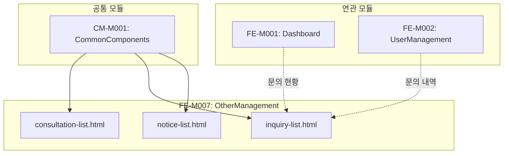

# FE-M007: OtherManagement 모듈 상세 개발 설계서

## 1. 모듈 개요

### 1.1 모듈 식별 정보
- **모듈 ID**: FE-M007
- **모듈명**: OtherManagement (기타 관리)
- **담당 개발자**: Frontend Developer
- **예상 개발 기간**: 5일
- **우선순위**: P1 (높음)

### 1.2 모듈 목적 및 범위
- **핵심 기능**:
  1. 상담 신청 관리 (신규 신청, 상담 진행, 완료)
  2. 1:1 문의 관리 (답변 작성, 담당자 배정)
  3. 공지사항 관리 (등록, 수정, 삭제)
  4. 상담 이력 관리 및 메모

- **비즈니스 가치**: 고객 상담 및 커뮤니케이션을 통한 서비스 품질 향상 및 신규 고객 확보

- **제외 범위**:
  - FAQ 관리 (별도 CMS)
  - 자동 응답 설정 (백엔드 영역)

### 1.3 목표 사용자
- **주 사용자 그룹**: CS팀, 영업팀, 마케팅팀
- **사용자 페르소나**:
  - 상담 신청을 처리하는 영업 담당자
  - 고객 문의에 답변하는 CS 담당자
  - 공지사항을 작성하는 운영 담당자
- **사용 시나리오**:
  - 신규 상담 신청 확인 및 담당자 배정
  - 고객 문의 답변 및 처리 완료
  - 서비스 공지사항 등록

---

## 2. 기술 아키텍처

### 2.1 모듈 구조
```
FE-M007-OtherManagement/
├── consultation-list.html       # 상담 신청 관리 페이지
├── inquiry-list.html            # 문의 관리 페이지
├── notice-list.html             # 공지사항 관리 페이지
├── components/
│   ├── consultation-table/      # 상담 신청 테이블
│   ├── consultation-modal/      # 상담 상세 모달
│   ├── inquiry-table/           # 문의 테이블
│   ├── inquiry-modal/           # 문의 상세 모달
│   ├── notice-table/            # 공지사항 테이블
│   └── notice-modal/            # 공지사항 등록/수정 모달
├── services/
│   └── other-service.js         # 기타 관리 서비스
└── tests/
    └── other.test.js            # 단위 테스트
```

### 2.2 기술 스택
- **마크업**: HTML5
- **스타일링**: CSS3 (CSS Variables, Flexbox, Grid)
- **스크립트**: Vanilla JavaScript (ES6+)
- **의존성**: admin-common.css, admin-common.js

---

## 3. 인터페이스 정의

### 3.1 외부 의존성
```javascript
const ExternalDependencies = {
    modules: ['CM-M001'],
    apis: [
        '/api/admin/consultations',
        '/api/admin/consultations/{id}',
        '/api/admin/inquiries',
        '/api/admin/inquiries/{id}',
        '/api/admin/inquiries/{id}/answer',
        '/api/admin/notices',
        '/api/admin/notices/{id}'
    ],
    sharedComponents: [
        'modal', 'badge', 'table', 'pagination', 'btn', 'stat-card', 'form-control'
    ],
    utils: [
        'openModal', 'closeModal', 'confirmAction', 'showToast', 'formatDate'
    ]
};
```

### 3.2 제공 인터페이스
```javascript
const OtherManagementModule = {
    pages: {
        ConsultationPage: 'consultation-list.html',
        InquiryPage: 'inquiry-list.html',
        NoticePage: 'notice-list.html'
    },
    
    services: {
        // 상담 신청
        loadConsultations: (params) => Promise,
        getConsultationDetail: (id) => Promise,
        updateConsultationStatus: (id, status) => Promise,
        assignConsultant: (id, adminId) => Promise,
        addConsultationMemo: (id, memo) => Promise,
        
        // 문의 관리
        loadInquiries: (params) => Promise,
        getInquiryDetail: (id) => Promise,
        answerInquiry: (id, answer) => Promise,
        assignInquiryManager: (id, adminId) => Promise,
        
        // 공지사항
        loadNotices: (params) => Promise,
        createNotice: (notice) => Promise,
        updateNotice: (id, notice) => Promise,
        deleteNotice: (id) => Promise
    },
    
    events: {
        onConsultationUpdated: 'consultation:updated',
        onInquiryAnswered: 'inquiry:answered',
        onNoticeCreated: 'notice:created'
    }
};
```

### 3.3 API 명세
```javascript
const APIEndpoints = {
    // 상담 신청 API
    GET_CONSULTATIONS: {
        method: 'GET',
        path: '/api/admin/consultations',
        request: {
            page: Number,
            size: Number,
            search: String,
            status: String,       // 'NEW' | 'IN_PROGRESS' | 'COMPLETED' | 'CONTRACTED'
            messageType: String,
            dateFrom: String,
            dateTo: String
        },
        response: {
            content: Array,       // Consultation[]
            totalElements: Number,
            stats: {
                newCount: Number,
                inProgressCount: Number,
                completedCount: Number,
                contractedCount: Number
            }
        }
    },
    
    GET_CONSULTATION_DETAIL: {
        method: 'GET',
        path: '/api/admin/consultations/{id}',
        response: {
            id: String,
            companyName: String,
            contactName: String,
            contactPhone: String,
            contactEmail: String,
            messageTypes: Array,
            expectedVolume: String,
            content: String,
            status: String,
            assignedAdmin: Object,
            nextContactDate: String,
            memos: Array,
            history: Array
        }
    },
    
    PUT_CONSULTATION_STATUS: {
        method: 'PUT',
        path: '/api/admin/consultations/{id}/status',
        request: {
            status: String,
            memo: String
        },
        response: { success: Boolean }
    },
    
    // 문의 관리 API
    GET_INQUIRIES: {
        method: 'GET',
        path: '/api/admin/inquiries',
        request: {
            page: Number,
            size: Number,
            search: String,
            status: String,       // 'pending' | 'answered' | 'closed'
            category: String,
            dateFrom: String,
            dateTo: String
        },
        response: {
            content: Array,       // Inquiry[]
            totalElements: Number,
            stats: {
                totalCount: Number,
                pendingCount: Number,
                todayCount: Number,
                urgentCount: Number
            }
        }
    },
    
    POST_INQUIRY_ANSWER: {
        method: 'POST',
        path: '/api/admin/inquiries/{id}/answer',
        request: {
            answer: String,
            isComplete: Boolean
        },
        response: {
            success: Boolean
        }
    },
    
    // 공지사항 API
    GET_NOTICES: {
        method: 'GET',
        path: '/api/admin/notices',
        request: {
            page: Number,
            size: Number,
            search: String,
            isImportant: Boolean
        },
        response: {
            content: Array,       // Notice[]
            totalElements: Number
        }
    },
    
    POST_NOTICE: {
        method: 'POST',
        path: '/api/admin/notices',
        request: {
            title: String,
            content: String,
            isImportant: Boolean,
            exposureStart: String,
            exposureEnd: String
        },
        response: {
            success: Boolean,
            id: String
        }
    }
};
```

---

## 4. 데이터 모델

### 4.1 엔티티 정의
```typescript
// 상담 신청
interface Consultation {
    id: string;
    companyName: string;
    contactName: string;
    contactPhone: string;
    contactEmail: string;
    messageTypes: string[];      // ['SMS', 'ALIMTALK', ...]
    expectedVolume: string;      // '1만건 미만', '1만~10만건', ...
    content: string;
    status: 'NEW' | 'IN_PROGRESS' | 'COMPLETED' | 'CONTRACTED';
    assignedAdmin: Admin | null;
    nextContactDate: string;
    createdAt: string;
}

// 상담 이력
interface ConsultationHistory {
    date: string;
    action: string;              // 'created', 'status_changed', 'memo_added', ...
    adminName: string;
    detail: string;
}

// 상담 메모
interface ConsultationMemo {
    id: string;
    content: string;
    createdBy: string;
    createdAt: string;
}

// 1:1 문의
interface Inquiry {
    id: string;
    memberName: string;
    memberEmail: string;
    category: string;            // '결제', '발송', '기술지원', '기타'
    title: string;
    content: string;
    attachments: Attachment[];
    status: 'pending' | 'answered' | 'closed';
    assignedAdmin: Admin | null;
    createdAt: string;
    answers: Answer[];
}

// 문의 답변
interface Answer {
    id: string;
    content: string;
    createdBy: string;
    createdAt: string;
}

// 첨부파일
interface Attachment {
    id: string;
    fileName: string;
    fileUrl: string;
    fileSize: number;
}

// 공지사항
interface Notice {
    id: string;
    title: string;
    content: string;
    isImportant: boolean;
    viewCount: number;
    exposureStart: string;
    exposureEnd: string;
    createdBy: string;
    createdAt: string;
    updatedAt: string;
}
```

### 4.2 상태 관리 스키마
```javascript
const OtherManagementState = {
    // 상담 신청
    consultations: [],
    selectedConsultation: null,
    consultationStats: { newCount: 0, inProgressCount: 0, completedCount: 0, contractedCount: 0 },
    
    // 문의 관리
    inquiries: [],
    selectedInquiry: null,
    inquiryStats: { totalCount: 0, pendingCount: 0, todayCount: 0, urgentCount: 0 },
    
    // 공지사항
    notices: [],
    selectedNotice: null,
    
    // 공통
    currentPage: 1,
    totalPages: 1,
    searchParams: {},
    isLoading: false
};
```

---

## 5. 핵심 컴포넌트 명세

### 5.1 상담 신청 관리
```html
<!-- consultation-list.html -->
<div class="stats-grid" style="margin-bottom: 24px;">
    <div class="stat-card">
        <div class="stat-card-header">
            <div class="stat-card-title">신규 신청</div>
            <div class="stat-card-icon icon-pending">
                <svg><!-- icon --></svg>
            </div>
        </div>
        <div class="stat-card-value" id="statNew">0건</div>
        <div class="stat-card-change">
            <span>오늘 <span id="todayNew">0</span>건</span>
        </div>
    </div>
    <div class="stat-card">
        <div class="stat-card-header">
            <div class="stat-card-title">상담 진행중</div>
            <div class="stat-card-icon icon-processing">
                <svg><!-- icon --></svg>
            </div>
        </div>
        <div class="stat-card-value" id="statInProgress">0건</div>
    </div>
    <div class="stat-card">
        <div class="stat-card-header">
            <div class="stat-card-title">상담 완료</div>
            <div class="stat-card-icon icon-success">
                <svg><!-- icon --></svg>
            </div>
        </div>
        <div class="stat-card-value" id="statCompleted">0건</div>
    </div>
    <div class="stat-card">
        <div class="stat-card-header">
            <div class="stat-card-title">계약 전환</div>
            <div class="stat-card-icon icon-money">
                <svg><!-- icon --></svg>
            </div>
        </div>
        <div class="stat-card-value" id="statContracted">0건</div>
    </div>
</div>
```

```javascript
// consultation-list.js
function loadConsultations(params = {}) {
    fetch(`/api/admin/consultations?${new URLSearchParams(params)}`)
        .then(response => response.json())
        .then(data => {
            renderConsultationTable(data.content);
            renderConsultationStats(data.stats);
            createPagination(data.currentPage, data.totalPages, 'pagination');
        });
}

function renderConsultationTable(consultations) {
    const tbody = document.getElementById('consultationTableBody');
    
    tbody.innerHTML = consultations.map(item => `
        <tr>
            <td>${formatDate(item.createdAt)}</td>
            <td>${item.companyName}</td>
            <td>${item.contactName}</td>
            <td>${item.contactPhone}</td>
            <td>${item.messageTypes.join(', ')}</td>
            <td>${item.expectedVolume}</td>
            <td>${getConsultationStatusBadge(item.status)}</td>
            <td>${item.assignedAdmin ? item.assignedAdmin.name : '-'}</td>
            <td>
                <button class="btn btn-outline btn-sm" onclick="openConsultationDetail('${item.id}')">
                    상세
                </button>
            </td>
        </tr>
    `).join('');
}

function getConsultationStatusBadge(status) {
    const badges = {
        'NEW': '<span class="badge badge-warning">신규 신청</span>',
        'IN_PROGRESS': '<span class="badge badge-info">상담 진행중</span>',
        'COMPLETED': '<span class="badge badge-secondary">상담 완료</span>',
        'CONTRACTED': '<span class="badge badge-success">계약 전환</span>'
    };
    return badges[status] || '<span class="badge badge-secondary">-</span>';
}
```

### 5.2 상담 상세 모달
```javascript
// consultation-detail-modal.js
function openConsultationDetail(id) {
    fetch(`/api/admin/consultations/${id}`)
        .then(response => response.json())
        .then(detail => {
            currentConsultationId = id;
            renderConsultationDetail(detail);
            openModal('consultationDetailModal');
        });
}

function renderConsultationDetail(detail) {
    // 신청 정보
    document.getElementById('detailCompanyName').textContent = detail.companyName;
    document.getElementById('detailContactName').textContent = detail.contactName;
    document.getElementById('detailContactPhone').textContent = detail.contactPhone;
    document.getElementById('detailContactEmail').textContent = detail.contactEmail;
    document.getElementById('detailMessageTypes').textContent = detail.messageTypes.join(', ');
    document.getElementById('detailExpectedVolume').textContent = detail.expectedVolume;
    document.getElementById('detailContent').textContent = detail.content;
    
    // 관리 정보
    document.getElementById('detailStatus').value = detail.status;
    document.getElementById('detailAssignedAdmin').value = 
        detail.assignedAdmin ? detail.assignedAdmin.id : '';
    document.getElementById('detailNextContactDate').value = detail.nextContactDate || '';
    
    // 상담 이력
    renderConsultationHistory(detail.history);
    
    // 메모
    renderConsultationMemos(detail.memos);
}

function renderConsultationHistory(history) {
    const container = document.getElementById('consultationHistory');
    
    container.innerHTML = history.map(h => `
        <div class="history-item">
            <div class="history-date">${formatDate(h.date)}</div>
            <div class="history-content">
                <strong>${h.adminName}</strong>: ${h.detail}
            </div>
        </div>
    `).join('');
}

function updateConsultationStatus() {
    const status = document.getElementById('detailStatus').value;
    const assignedAdmin = document.getElementById('detailAssignedAdmin').value;
    const nextContactDate = document.getElementById('detailNextContactDate').value;
    
    fetch(`/api/admin/consultations/${currentConsultationId}`, {
        method: 'PUT',
        headers: { 'Content-Type': 'application/json' },
        body: JSON.stringify({ status, assignedAdmin, nextContactDate })
    })
    .then(response => response.json())
    .then(() => {
        showToast('상담 정보가 업데이트되었습니다.', 'success');
        loadConsultations();
    })
    .catch(error => {
        showToast('업데이트에 실패했습니다.', 'error');
    });
}

function addConsultationMemo() {
    const memo = document.getElementById('newMemo').value;
    
    if (!memo.trim()) {
        showToast('메모 내용을 입력해주세요.', 'error');
        return;
    }
    
    fetch(`/api/admin/consultations/${currentConsultationId}/memo`, {
        method: 'POST',
        headers: { 'Content-Type': 'application/json' },
        body: JSON.stringify({ content: memo })
    })
    .then(response => response.json())
    .then(() => {
        showToast('메모가 추가되었습니다.', 'success');
        document.getElementById('newMemo').value = '';
        openConsultationDetail(currentConsultationId);
    })
    .catch(error => {
        showToast('메모 추가에 실패했습니다.', 'error');
    });
}
```

### 5.3 문의 관리
```javascript
// inquiry-list.js
function loadInquiries(params = {}) {
    fetch(`/api/admin/inquiries?${new URLSearchParams(params)}`)
        .then(response => response.json())
        .then(data => {
            renderInquiryTable(data.content);
            renderInquiryStats(data.stats);
            createPagination(data.currentPage, data.totalPages, 'pagination');
        });
}

function renderInquiryTable(inquiries) {
    const tbody = document.querySelector('#inquiryTable tbody');
    
    tbody.innerHTML = inquiries.map(inquiry => `
        <tr>
            <td>${formatDate(inquiry.createdAt)}</td>
            <td>${inquiry.memberName}</td>
            <td>${getCategoryBadge(inquiry.category)}</td>
            <td>${inquiry.title}</td>
            <td>${getInquiryStatusBadge(inquiry.status)}</td>
            <td>${inquiry.assignedAdmin ? inquiry.assignedAdmin.name : '-'}</td>
            <td>
                <button class="btn btn-outline btn-sm" onclick="openInquiryDetail('${inquiry.id}')">
                    상세
                </button>
            </td>
        </tr>
    `).join('');
}

function openInquiryDetail(id) {
    fetch(`/api/admin/inquiries/${id}`)
        .then(response => response.json())
        .then(detail => {
            currentInquiryId = id;
            renderInquiryDetail(detail);
            openModal('inquiryDetailModal');
        });
}

function renderInquiryDetail(detail) {
    document.getElementById('detailMember').textContent = 
        `${detail.memberName} (${detail.memberEmail})`;
    document.getElementById('detailCategory').innerHTML = getCategoryBadge(detail.category);
    document.getElementById('detailTitle').textContent = detail.title;
    document.getElementById('detailContent').textContent = detail.content;
    document.getElementById('detailStatus').innerHTML = getInquiryStatusBadge(detail.status);
    
    // 첨부파일
    const attachmentSection = document.getElementById('attachmentSection');
    if (detail.attachments && detail.attachments.length > 0) {
        attachmentSection.innerHTML = detail.attachments.map(att => `
            <div class="attachment-item">
                <span>${att.fileName}</span>
                <button class="btn btn-sm btn-outline" onclick="downloadAttachment('${att.fileUrl}')">
                    다운로드
                </button>
            </div>
        `).join('');
    } else {
        attachmentSection.innerHTML = '<span>첨부파일 없음</span>';
    }
    
    // 담당자 배정
    document.getElementById('inquiryAssignedAdmin').value = 
        detail.assignedAdmin ? detail.assignedAdmin.id : '';
    
    // 답변 이력
    renderAnswerHistory(detail.answers);
    
    // 답변 입력 영역 표시 (미답변인 경우)
    document.getElementById('answerFormSection').style.display = 
        detail.status === 'pending' ? 'block' : 'none';
}

function renderAnswerHistory(answers) {
    const container = document.getElementById('answerHistory');
    
    if (!answers || answers.length === 0) {
        container.innerHTML = '<p>답변 이력이 없습니다.</p>';
        return;
    }
    
    container.innerHTML = answers.map(answer => `
        <div class="answer-item">
            <div class="answer-header">
                <strong>${answer.createdBy}</strong>
                <span>${formatDate(answer.createdAt)}</span>
            </div>
            <div class="answer-content">${answer.content}</div>
            <div class="answer-actions">
                <button class="btn btn-sm btn-outline" onclick="editAnswer('${answer.id}')">수정</button>
                <button class="btn btn-sm btn-danger" onclick="deleteAnswer('${answer.id}')">삭제</button>
            </div>
        </div>
    `).join('');
}

function submitAnswer(isComplete) {
    const answer = document.getElementById('answerContent').value;
    
    if (!answer.trim()) {
        showToast('답변 내용을 입력해주세요.', 'error');
        return;
    }
    
    fetch(`/api/admin/inquiries/${currentInquiryId}/answer`, {
        method: 'POST',
        headers: { 'Content-Type': 'application/json' },
        body: JSON.stringify({ answer, isComplete })
    })
    .then(response => response.json())
    .then(() => {
        showToast(isComplete ? '답변이 등록되고 문의가 완료되었습니다.' : '답변이 저장되었습니다.', 'success');
        closeModal('inquiryDetailModal');
        loadInquiries();
    })
    .catch(error => {
        showToast('답변 등록에 실패했습니다.', 'error');
    });
}

function assignInquiryManager() {
    const adminId = document.getElementById('inquiryAssignedAdmin').value;
    
    fetch(`/api/admin/inquiries/${currentInquiryId}/assign`, {
        method: 'POST',
        headers: { 'Content-Type': 'application/json' },
        body: JSON.stringify({ adminId })
    })
    .then(response => response.json())
    .then(() => {
        showToast('담당자가 배정되었습니다.', 'success');
    })
    .catch(error => {
        showToast('담당자 배정에 실패했습니다.', 'error');
    });
}
```

### 5.4 공지사항 관리
```javascript
// notice-list.js
function loadNotices(params = {}) {
    fetch(`/api/admin/notices?${new URLSearchParams(params)}`)
        .then(response => response.json())
        .then(data => {
            renderNoticeTable(data.content);
            createPagination(data.currentPage, data.totalPages, 'pagination');
        });
}

function renderNoticeTable(notices) {
    const tbody = document.querySelector('#noticeTable tbody');
    
    tbody.innerHTML = notices.map(notice => `
        <tr>
            <td>
                ${notice.isImportant ? '<span class="badge badge-danger">중요</span> ' : ''}
                ${notice.title}
            </td>
            <td>${formatDate(notice.createdAt)}</td>
            <td>${notice.createdBy}</td>
            <td>${formatNumber(notice.viewCount)}</td>
            <td>
                ${formatDate(notice.exposureStart)} ~ ${formatDate(notice.exposureEnd)}
            </td>
            <td>
                <button class="btn btn-outline btn-sm" onclick="editNotice('${notice.id}')">
                    수정
                </button>
                <button class="btn btn-danger btn-sm" onclick="deleteNotice('${notice.id}')">
                    삭제
                </button>
            </td>
        </tr>
    `).join('');
}

function openAddNoticeModal() {
    document.getElementById('noticeModalTitle').textContent = '공지사항 등록';
    document.getElementById('noticeTitle').value = '';
    document.getElementById('noticeContent').value = '';
    document.getElementById('noticeIsImportant').checked = false;
    document.getElementById('noticeExposureStart').value = '';
    document.getElementById('noticeExposureEnd').value = '';
    
    currentNoticeId = null;
    openModal('addNoticeModal');
}

function editNotice(id) {
    fetch(`/api/admin/notices/${id}`)
        .then(response => response.json())
        .then(notice => {
            document.getElementById('noticeModalTitle').textContent = '공지사항 수정';
            document.getElementById('noticeTitle').value = notice.title;
            document.getElementById('noticeContent').value = notice.content;
            document.getElementById('noticeIsImportant').checked = notice.isImportant;
            document.getElementById('noticeExposureStart').value = notice.exposureStart.split('T')[0];
            document.getElementById('noticeExposureEnd').value = notice.exposureEnd.split('T')[0];
            
            currentNoticeId = id;
            openModal('addNoticeModal');
        });
}

function saveNotice() {
    const notice = {
        title: document.getElementById('noticeTitle').value,
        content: document.getElementById('noticeContent').value,
        isImportant: document.getElementById('noticeIsImportant').checked,
        exposureStart: document.getElementById('noticeExposureStart').value,
        exposureEnd: document.getElementById('noticeExposureEnd').value
    };
    
    // 유효성 검사
    if (!notice.title.trim()) {
        showToast('제목을 입력해주세요.', 'error');
        return;
    }
    
    if (!notice.content.trim()) {
        showToast('내용을 입력해주세요.', 'error');
        return;
    }
    
    if (!notice.exposureStart || !notice.exposureEnd) {
        showToast('노출 기간을 설정해주세요.', 'error');
        return;
    }
    
    if (new Date(notice.exposureEnd) < new Date(notice.exposureStart)) {
        showToast('종료일은 시작일 이후여야 합니다.', 'error');
        return;
    }
    
    const url = currentNoticeId 
        ? `/api/admin/notices/${currentNoticeId}` 
        : '/api/admin/notices';
    const method = currentNoticeId ? 'PUT' : 'POST';
    
    fetch(url, {
        method,
        headers: { 'Content-Type': 'application/json' },
        body: JSON.stringify(notice)
    })
    .then(response => response.json())
    .then(() => {
        showToast(currentNoticeId ? '공지사항이 수정되었습니다.' : '공지사항이 등록되었습니다.', 'success');
        closeModal('addNoticeModal');
        loadNotices();
    })
    .catch(error => {
        showToast('저장에 실패했습니다.', 'error');
    });
}

function deleteNotice(id) {
    confirmAction('이 공지사항을 삭제하시겠습니까?', () => {
        fetch(`/api/admin/notices/${id}`, { method: 'DELETE' })
            .then(response => response.json())
            .then(() => {
                showToast('공지사항이 삭제되었습니다.', 'success');
                loadNotices();
            })
            .catch(error => {
                showToast('삭제에 실패했습니다.', 'error');
            });
    });
}
```

---

## 6. 이벤트 및 메시징

### 6.1 발행 이벤트
```javascript
const OtherEvents = {
    CONSULTATION_UPDATED: 'consultation:updated',
    CONSULTATION_ASSIGNED: 'consultation:assigned',
    INQUIRY_ANSWERED: 'inquiry:answered',
    NOTICE_CREATED: 'notice:created',
    NOTICE_UPDATED: 'notice:updated'
};
```

---

## 7. 에러 처리

### 7.1 에러 코드 정의
```javascript
const OtherErrorCode = {
    CONSULTATION_NOT_FOUND: 'OTHER_001',
    INQUIRY_NOT_FOUND: 'OTHER_002',
    NOTICE_NOT_FOUND: 'OTHER_003',
    INVALID_STATUS: 'OTHER_004',
    ATTACHMENT_DOWNLOAD_FAILED: 'OTHER_005'
};
```

---

## 8. 테스트 전략

### 8.1 단위 테스트
```javascript
describe('Other Module', () => {
    describe('Notice Validation', () => {
        it('should reject empty title', () => {
            document.getElementById('noticeTitle').value = '';
            const result = validateNotice();
            expect(result).toBe(false);
        });
        
        it('should reject invalid date range', () => {
            document.getElementById('noticeExposureStart').value = '2024-12-31';
            document.getElementById('noticeExposureEnd').value = '2024-12-01';
            const result = validateNotice();
            expect(result).toBe(false);
        });
    });
});
```

---

## 9. 보안 고려사항

### 9.1 인증/인가
- **권한 체크**: 상담 담당자 배정, 공지사항 수정/삭제 권한

### 9.2 데이터 보호
- **연락처 마스킹**: 목록에서 전화번호 일부 마스킹
- **첨부파일 검증**: 다운로드 시 권한 확인

---

## 10. 배포 및 모니터링

### 10.1 파일 구조
```
admin/
├── consultation-list.html
├── inquiry-list.html
├── notice-list.html
├── css/
│   └── admin-common.css
└── js/
    └── admin-common.js
```

---

## 11. 개발 가이드라인

### 11.1 PR 체크리스트
- [ ] 상담 신청 목록 및 상세 확인
- [ ] 상담 상태 변경 및 메모 기능 확인
- [ ] 문의 목록 및 답변 기능 확인
- [ ] 담당자 배정 기능 확인
- [ ] 공지사항 CRUD 기능 확인
- [ ] 노출 기간 유효성 검사 확인

---

## 12. 의존성 그래프



---

## 13. 버전 히스토리

| 버전 | 날짜 | 변경 내용 | 작성자 |
|------|------|----------|--------|
| 1.0.0 | 2024-12-15 | 초기 문서 작성 | - |


