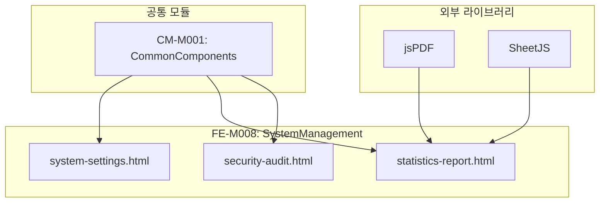

# FE-M008: SystemManagement 모듈 상세 개발 설계서

## 1. 모듈 개요

### 1.1 모듈 식별 정보
- **모듈 ID**: FE-M008
- **모듈명**: SystemManagement (시스템 관리)
- **담당 개발자**: Frontend Developer
- **예상 개발 기간**: 6일
- **우선순위**: P2 (중간)

### 1.2 모듈 목적 및 범위
- **핵심 기능**:
  1. 시스템 설정 관리 (기본/발송/외부연동/데이터)
  2. 통계 및 리포트 생성 (일별/월별/커스텀)
  3. 보안 및 감사 로그 관리
  4. 접근 제어 설정 (IP 화이트리스트, 2단계 인증)
  5. PDF/Excel 리포트 다운로드

- **비즈니스 가치**: 시스템 안정성 및 보안 유지, 운영 의사결정 지원

- **제외 범위**:
  - 서버 인프라 관리 (DevOps 영역)
  - 실시간 모니터링 (별도 대시보드)

### 1.3 목표 사용자
- **주 사용자 그룹**: 시스템 관리자, 보안 담당자, 경영진
- **사용자 페르소나**:
  - 시스템 설정을 관리하는 IT 관리자
  - 보안 로그를 모니터링하는 보안 담당자
  - 경영 리포트를 확인하는 경영진
- **사용 시나리오**:
  - 외부 API 연동 설정 및 테스트
  - 이상 접근 로그 확인 및 IP 차단
  - 월별 운영 리포트 생성 및 공유

---

## 2. 기술 아키텍처

### 2.1 모듈 구조
```
FE-M008-SystemManagement/
├── system-settings.html         # 시스템 설정 페이지
├── statistics-report.html       # 통계 및 리포트 페이지
├── security-audit.html          # 보안 및 감사 페이지
├── components/
│   ├── settings-tabs/           # 설정 탭 컴포넌트
│   │   ├── basic-settings.html
│   │   ├── send-settings.html
│   │   ├── external-settings.html
│   │   └── data-settings.html
│   ├── report-tabs/             # 리포트 탭 컴포넌트
│   │   ├── daily-report.html
│   │   ├── monthly-report.html
│   │   └── custom-report.html
│   ├── security-tabs/           # 보안 탭 컴포넌트
│   │   ├── access-control.html
│   │   ├── security-log.html
│   │   └── audit-log.html
│   └── modals/                  # 모달 컴포넌트
├── services/
│   ├── settings-service.js
│   ├── report-service.js
│   └── security-service.js
└── tests/
    └── system.test.js
```

### 2.2 기술 스택
- **마크업**: HTML5
- **스타일링**: CSS3 (CSS Variables, Flexbox, Grid)
- **스크립트**: Vanilla JavaScript (ES6+)
- **PDF 생성**: jsPDF 2.x
- **Excel 생성**: SheetJS (xlsx) 0.18.x
- **의존성**: admin-common.css, admin-common.js

---

## 3. 인터페이스 정의

### 3.1 외부 의존성
```javascript
const ExternalDependencies = {
    modules: ['CM-M001'],
    apis: [
        '/api/admin/settings',
        '/api/admin/settings/external/test',
        '/api/admin/reports/daily',
        '/api/admin/reports/monthly',
        '/api/admin/reports/custom',
        '/api/admin/security/access-control',
        '/api/admin/security/logs',
        '/api/admin/audit/logs'
    ],
    sharedComponents: [
        'modal', 'tabs', 'badge', 'table', 'pagination', 'btn', 'form-control'
    ],
    utils: [
        'openModal', 'closeModal', 'confirmAction', 'showToast', 'formatDate', 'formatNumber'
    ],
    externalLibs: ['jsPDF', 'xlsx']
};
```

### 3.2 제공 인터페이스
```javascript
const SystemManagementModule = {
    pages: {
        SettingsPage: 'system-settings.html',
        ReportPage: 'statistics-report.html',
        SecurityPage: 'security-audit.html'
    },
    
    services: {
        // 시스템 설정
        getSettings: () => Promise,
        saveSettings: (settings) => Promise,
        testExternalApi: (type) => Promise,
        runManualBackup: () => Promise,
        
        // 리포트
        generateDailyReport: (date) => Promise,
        generateMonthlyReport: (year, month) => Promise,
        generateCustomReport: (params) => Promise,
        downloadReportPDF: (reportData) => void,
        downloadReportExcel: (reportData) => void,
        
        // 보안
        getAccessControlSettings: () => Promise,
        saveAccessControlSettings: (settings) => Promise,
        addIpWhitelist: (ip) => Promise,
        removeIpWhitelist: (ip) => Promise,
        getSecurityLogs: (params) => Promise,
        getAuditLogs: (params) => Promise,
        blockIp: (ip) => Promise
    },
    
    events: {
        onSettingsSaved: 'system:settings:saved',
        onReportGenerated: 'system:report:generated',
        onIpBlocked: 'system:ip:blocked'
    }
};
```

### 3.3 API 명세
```javascript
const APIEndpoints = {
    // 시스템 설정 API
    GET_SETTINGS: {
        method: 'GET',
        path: '/api/admin/settings',
        response: {
            basic: {
                siteName: String,
                siteUrl: String,
                adminEmail: String,
                timezone: String,
                language: String
            },
            send: {
                defaultSenderId: String,
                retryCount: Number,
                retryInterval: Number,
                maxBatchSize: Number
            },
            external: {
                kakaoApiKey: String,
                kakaoApiStatus: String,
                smsApiKey: String,
                smsApiStatus: String,
                pgApiKey: String,
                pgApiStatus: String
            },
            data: {
                logRetentionDays: Number,
                backupEnabled: Boolean,
                backupSchedule: String,
                lastBackupDate: String
            }
        }
    },
    
    PUT_SETTINGS: {
        method: 'PUT',
        path: '/api/admin/settings/{section}',
        request: Object,
        response: { success: Boolean }
    },
    
    POST_TEST_EXTERNAL_API: {
        method: 'POST',
        path: '/api/admin/settings/external/test',
        request: {
            type: String  // 'kakao' | 'sms' | 'pg'
        },
        response: {
            success: Boolean,
            message: String,
            responseTime: Number
        }
    },
    
    // 리포트 API
    GET_DAILY_REPORT: {
        method: 'GET',
        path: '/api/admin/reports/daily',
        request: {
            date: String
        },
        response: {
            date: String,
            summary: {
                totalSend: Number,
                successRate: Number,
                totalCharge: Number,
                newUsers: Number
            },
            sendByType: Array,
            sendByHour: Array,
            topMembers: Array
        }
    },
    
    GET_MONTHLY_REPORT: {
        method: 'GET',
        path: '/api/admin/reports/monthly',
        request: {
            year: Number,
            month: Number
        },
        response: {
            year: Number,
            month: Number,
            summary: Object,
            dailyTrend: Array,
            comparison: Object
        }
    },
    
    // 보안 API
    GET_ACCESS_CONTROL: {
        method: 'GET',
        path: '/api/admin/security/access-control',
        response: {
            ipWhitelist: Array,
            twoFactorEnabled: Boolean,
            sessionTimeout: Number,
            passwordPolicy: Object
        }
    },
    
    GET_SECURITY_LOGS: {
        method: 'GET',
        path: '/api/admin/security/logs',
        request: {
            page: Number,
            size: Number,
            type: String,     // 'login' | 'access_denied' | 'suspicious' | 'all'
            dateFrom: String,
            dateTo: String
        },
        response: {
            content: Array,   // SecurityLog[]
            totalElements: Number
        }
    },
    
    GET_AUDIT_LOGS: {
        method: 'GET',
        path: '/api/admin/audit/logs',
        request: {
            page: Number,
            size: Number,
            action: String,   // 'create' | 'update' | 'delete' | 'all'
            targetType: String,
            adminId: String,
            dateFrom: String,
            dateTo: String
        },
        response: {
            content: Array,   // AuditLog[]
            totalElements: Number
        }
    }
};
```

---

## 4. 데이터 모델

### 4.1 엔티티 정의
```typescript
// 시스템 설정
interface SystemSettings {
    basic: BasicSettings;
    send: SendSettings;
    external: ExternalSettings;
    data: DataSettings;
}

interface BasicSettings {
    siteName: string;
    siteUrl: string;
    adminEmail: string;
    timezone: string;
    language: string;
}

interface SendSettings {
    defaultSenderId: string;
    retryCount: number;
    retryInterval: number;
    maxBatchSize: number;
}

interface ExternalSettings {
    kakaoApiKey: string;
    kakaoApiStatus: 'connected' | 'disconnected' | 'error';
    smsApiKey: string;
    smsApiStatus: string;
    pgApiKey: string;
    pgApiStatus: string;
}

interface DataSettings {
    logRetentionDays: number;
    backupEnabled: boolean;
    backupSchedule: string;
    lastBackupDate: string;
}

// 리포트
interface DailyReport {
    date: string;
    summary: ReportSummary;
    sendByType: TypeStat[];
    sendByHour: HourlyStat[];
    topMembers: MemberStat[];
}

interface MonthlyReport {
    year: number;
    month: number;
    summary: ReportSummary;
    dailyTrend: DailyStat[];
    comparison: {
        prevMonth: ReportSummary;
        changeRate: ChangeRate;
    };
}

interface ReportSummary {
    totalSend: number;
    successRate: number;
    totalCharge: number;
    newUsers: number;
    activeUsers: number;
}

// 보안 로그
interface SecurityLog {
    id: string;
    timestamp: string;
    type: 'login' | 'login_failed' | 'access_denied' | 'suspicious';
    ip: string;
    userAgent: string;
    adminId: string;
    adminName: string;
    detail: string;
    location: string;
}

// 감사 로그
interface AuditLog {
    id: string;
    timestamp: string;
    action: 'create' | 'update' | 'delete';
    targetType: string;       // 'user', 'callerNumber', 'template', ...
    targetId: string;
    adminId: string;
    adminName: string;
    beforeData: object;
    afterData: object;
    ip: string;
}

// 접근 제어
interface AccessControl {
    ipWhitelist: string[];
    twoFactorEnabled: boolean;
    sessionTimeout: number;   // 분 단위
    passwordPolicy: {
        minLength: number;
        requireUppercase: boolean;
        requireNumber: boolean;
        requireSpecial: boolean;
        expirationDays: number;
    };
}
```

### 4.2 상태 관리 스키마
```javascript
const SystemManagementState = {
    // 설정
    settings: null,
    activeSettingsTab: 'basic',
    
    // 리포트
    currentReport: null,
    activeReportTab: 'daily',
    
    // 보안
    securityLogs: [],
    auditLogs: [],
    accessControl: null,
    activeSecurityTab: 'access',
    
    // 공통
    currentPage: 1,
    totalPages: 1,
    searchParams: {},
    isLoading: false
};
```

---

## 5. 핵심 컴포넌트 명세

### 5.1 시스템 설정 탭
```html
<!-- system-settings.html -->
<div class="tabs">
    <button class="tab active" data-tab="basic" onclick="switchSettingsTab('basic')">
        기본 설정
    </button>
    <button class="tab" data-tab="send" onclick="switchSettingsTab('send')">
        발송 설정
    </button>
    <button class="tab" data-tab="external" onclick="switchSettingsTab('external')">
        외부 연동
    </button>
    <button class="tab" data-tab="data" onclick="switchSettingsTab('data')">
        데이터 관리
    </button>
</div>

<div id="settingsContent"></div>
```

```javascript
// system-settings.js
function loadSettings() {
    fetch('/api/admin/settings')
        .then(response => response.json())
        .then(settings => {
            SystemManagementState.settings = settings;
            renderSettingsTab(SystemManagementState.activeSettingsTab);
        });
}

function switchSettingsTab(tabName) {
    document.querySelectorAll('.tabs .tab').forEach(t => t.classList.remove('active'));
    document.querySelector(`[data-tab="${tabName}"]`).classList.add('active');
    
    SystemManagementState.activeSettingsTab = tabName;
    renderSettingsTab(tabName);
}

function renderSettingsTab(tabName) {
    const settings = SystemManagementState.settings;
    const container = document.getElementById('settingsContent');
    
    switch(tabName) {
        case 'basic':
            container.innerHTML = renderBasicSettings(settings.basic);
            break;
        case 'send':
            container.innerHTML = renderSendSettings(settings.send);
            break;
        case 'external':
            container.innerHTML = renderExternalSettings(settings.external);
            break;
        case 'data':
            container.innerHTML = renderDataSettings(settings.data);
            break;
    }
}

function renderExternalSettings(external) {
    return `
        <div class="card">
            <div class="card-header">
                <h3 class="card-title">외부 API 연동 설정</h3>
            </div>
            <div class="settings-section">
                <h4>카카오 비즈 API</h4>
                <div class="form-group">
                    <label class="form-label">API Key</label>
                    <div style="display: flex; gap: 12px;">
                        <input type="password" class="form-control" id="kakaoApiKey" 
                               value="${external.kakaoApiKey}" style="flex: 1;">
                        <button class="btn btn-outline" onclick="testExternalApi('kakao')">
                            연동 테스트
                        </button>
                    </div>
                </div>
                <div class="api-status">
                    상태: ${getApiStatusBadge(external.kakaoApiStatus)}
                </div>
            </div>
            
            <div class="settings-section">
                <h4>SMS API</h4>
                <div class="form-group">
                    <label class="form-label">API Key</label>
                    <div style="display: flex; gap: 12px;">
                        <input type="password" class="form-control" id="smsApiKey" 
                               value="${external.smsApiKey}" style="flex: 1;">
                        <button class="btn btn-outline" onclick="testExternalApi('sms')">
                            연동 테스트
                        </button>
                    </div>
                </div>
                <div class="api-status">
                    상태: ${getApiStatusBadge(external.smsApiStatus)}
                </div>
            </div>
            
            <div class="settings-section">
                <h4>PG API</h4>
                <div class="form-group">
                    <label class="form-label">API Key</label>
                    <div style="display: flex; gap: 12px;">
                        <input type="password" class="form-control" id="pgApiKey" 
                               value="${external.pgApiKey}" style="flex: 1;">
                        <button class="btn btn-outline" onclick="testExternalApi('pg')">
                            연동 테스트
                        </button>
                    </div>
                </div>
                <div class="api-status">
                    상태: ${getApiStatusBadge(external.pgApiStatus)}
                </div>
            </div>
        </div>
    `;
}

function testExternalApi(type) {
    const statusBadge = document.querySelector(`#${type}ApiKey`).parentElement
                               .parentElement.nextElementSibling;
    statusBadge.innerHTML = '상태: <span class="badge badge-info">테스트 중...</span>';
    
    fetch('/api/admin/settings/external/test', {
        method: 'POST',
        headers: { 'Content-Type': 'application/json' },
        body: JSON.stringify({ type })
    })
    .then(response => response.json())
    .then(result => {
        if (result.success) {
            statusBadge.innerHTML = `상태: <span class="badge badge-success">연결됨 (${result.responseTime}ms)</span>`;
            showToast(`${type.toUpperCase()} API 연동 테스트 성공`, 'success');
        } else {
            statusBadge.innerHTML = `상태: <span class="badge badge-danger">연결 실패</span>`;
            showToast(`${type.toUpperCase()} API 연동 테스트 실패: ${result.message}`, 'error');
        }
    })
    .catch(error => {
        statusBadge.innerHTML = `상태: <span class="badge badge-danger">오류</span>`;
        showToast('연동 테스트 중 오류가 발생했습니다.', 'error');
    });
}

function saveSettings(section) {
    const settings = collectSettingsData(section);
    
    fetch(`/api/admin/settings/${section}`, {
        method: 'PUT',
        headers: { 'Content-Type': 'application/json' },
        body: JSON.stringify(settings)
    })
    .then(response => response.json())
    .then(() => {
        showToast('설정이 저장되었습니다.', 'success');
        loadSettings();
    })
    .catch(error => {
        showToast('설정 저장에 실패했습니다.', 'error');
    });
}
```

### 5.2 리포트 생성 및 다운로드
```javascript
// statistics-report.js
function generateDailyReport() {
    const date = document.getElementById('dailyReportDate').value;
    
    if (!date) {
        showToast('날짜를 선택해주세요.', 'error');
        return;
    }
    
    showLoading('reportContent');
    
    fetch(`/api/admin/reports/daily?date=${date}`)
        .then(response => response.json())
        .then(report => {
            SystemManagementState.currentReport = { type: 'daily', data: report };
            renderDailyReport(report);
            showToast('일별 리포트가 생성되었습니다.', 'success');
        })
        .catch(error => {
            showToast('리포트 생성에 실패했습니다.', 'error');
        });
}

function renderDailyReport(report) {
    const container = document.getElementById('reportContent');
    
    container.innerHTML = `
        <div class="report-header">
            <h3>일별 리포트 - ${report.date}</h3>
            <div class="report-actions">
                <button class="btn btn-primary" onclick="downloadReportPDF()">
                    PDF 다운로드
                </button>
                <button class="btn btn-secondary" onclick="downloadReportExcel()">
                    Excel 다운로드
                </button>
            </div>
        </div>
        
        <div class="report-summary">
            <div class="summary-card">
                <div class="summary-title">총 발송</div>
                <div class="summary-value">${formatNumber(report.summary.totalSend)}건</div>
            </div>
            <div class="summary-card">
                <div class="summary-title">성공률</div>
                <div class="summary-value">${report.summary.successRate}%</div>
            </div>
            <div class="summary-card">
                <div class="summary-title">총 충전</div>
                <div class="summary-value">₩${formatNumber(report.summary.totalCharge)}</div>
            </div>
            <div class="summary-card">
                <div class="summary-title">신규 가입</div>
                <div class="summary-value">${report.summary.newUsers}명</div>
            </div>
        </div>
        
        <div class="report-detail">
            <h4>메시지 타입별 발송</h4>
            <table>
                <thead>
                    <tr>
                        <th>타입</th>
                        <th>발송 건수</th>
                        <th>성공</th>
                        <th>실패</th>
                        <th>성공률</th>
                    </tr>
                </thead>
                <tbody>
                    ${report.sendByType.map(item => `
                        <tr>
                            <td>${item.type}</td>
                            <td>${formatNumber(item.total)}</td>
                            <td>${formatNumber(item.success)}</td>
                            <td>${formatNumber(item.fail)}</td>
                            <td>${item.successRate}%</td>
                        </tr>
                    `).join('')}
                </tbody>
            </table>
        </div>
    `;
}

function downloadReportPDF() {
    const report = SystemManagementState.currentReport;
    if (!report) {
        showToast('먼저 리포트를 생성해주세요.', 'error');
        return;
    }
    
    const { jsPDF } = window.jspdf;
    const doc = new jsPDF();
    
    // 한글 폰트 설정 (실제로는 폰트 파일 필요)
    doc.setFont('helvetica');
    
    // 제목
    doc.setFontSize(20);
    doc.text(`${report.type === 'daily' ? '일별' : '월별'} 리포트`, 105, 20, { align: 'center' });
    
    // 날짜
    doc.setFontSize(12);
    doc.text(`생성일: ${new Date().toLocaleDateString('ko-KR')}`, 105, 30, { align: 'center' });
    
    // 요약 정보
    doc.setFontSize(14);
    doc.text('요약', 20, 50);
    
    doc.setFontSize(10);
    const summary = report.data.summary;
    doc.text(`총 발송: ${formatNumber(summary.totalSend)}건`, 20, 60);
    doc.text(`성공률: ${summary.successRate}%`, 20, 70);
    doc.text(`총 충전: ${formatNumber(summary.totalCharge)}원`, 20, 80);
    doc.text(`신규 가입: ${summary.newUsers}명`, 20, 90);
    
    // 파일 저장
    const fileName = `report_${report.type}_${new Date().toISOString().split('T')[0]}.pdf`;
    doc.save(fileName);
    
    showToast('PDF가 다운로드되었습니다.', 'success');
}

function downloadReportExcel() {
    const report = SystemManagementState.currentReport;
    if (!report) {
        showToast('먼저 리포트를 생성해주세요.', 'error');
        return;
    }
    
    // 워크시트 데이터 준비
    const summaryData = [
        ['항목', '값'],
        ['총 발송', report.data.summary.totalSend],
        ['성공률', `${report.data.summary.successRate}%`],
        ['총 충전', report.data.summary.totalCharge],
        ['신규 가입', report.data.summary.newUsers]
    ];
    
    const typeData = [
        ['타입', '발송 건수', '성공', '실패', '성공률'],
        ...report.data.sendByType.map(item => [
            item.type, item.total, item.success, item.fail, `${item.successRate}%`
        ])
    ];
    
    // 워크북 생성
    const wb = XLSX.utils.book_new();
    
    const ws1 = XLSX.utils.aoa_to_sheet(summaryData);
    XLSX.utils.book_append_sheet(wb, ws1, '요약');
    
    const ws2 = XLSX.utils.aoa_to_sheet(typeData);
    XLSX.utils.book_append_sheet(wb, ws2, '타입별 발송');
    
    // 파일 다운로드
    const fileName = `report_${report.type}_${new Date().toISOString().split('T')[0]}.xlsx`;
    XLSX.writeFile(wb, fileName);
    
    showToast('Excel이 다운로드되었습니다.', 'success');
}
```

### 5.3 보안 및 감사 로그
```javascript
// security-audit.js
function loadSecurityLogs(params = {}) {
    const searchParams = {
        page: SystemManagementState.currentPage,
        size: 20,
        ...SystemManagementState.searchParams,
        ...params
    };
    
    fetch(`/api/admin/security/logs?${new URLSearchParams(searchParams)}`)
        .then(response => response.json())
        .then(data => {
            renderSecurityLogTable(data.content);
            createPagination(data.currentPage, data.totalPages, 'securityPagination');
        });
}

function renderSecurityLogTable(logs) {
    const tbody = document.querySelector('#securityLogTable tbody');
    
    tbody.innerHTML = logs.map(log => `
        <tr>
            <td>${formatDate(log.timestamp)}</td>
            <td>${getSecurityTypeBadge(log.type)}</td>
            <td>${log.ip}</td>
            <td>${log.adminName || '-'}</td>
            <td>${log.detail}</td>
            <td>${log.location || '-'}</td>
            <td>
                <button class="btn btn-outline btn-sm" onclick="openSecurityLogDetail('${log.id}')">
                    상세
                </button>
                ${log.type !== 'login' ? 
                    `<button class="btn btn-danger btn-sm" onclick="blockIp('${log.ip}')">IP 차단</button>` 
                    : ''}
            </td>
        </tr>
    `).join('');
}

function getSecurityTypeBadge(type) {
    const badges = {
        'login': '<span class="badge badge-success">로그인</span>',
        'login_failed': '<span class="badge badge-warning">로그인 실패</span>',
        'access_denied': '<span class="badge badge-danger">접근 거부</span>',
        'suspicious': '<span class="badge badge-danger">의심 활동</span>'
    };
    return badges[type] || '<span class="badge badge-secondary">기타</span>';
}

function loadAuditLogs(params = {}) {
    const searchParams = {
        page: SystemManagementState.currentPage,
        size: 20,
        ...SystemManagementState.searchParams,
        ...params
    };
    
    fetch(`/api/admin/audit/logs?${new URLSearchParams(searchParams)}`)
        .then(response => response.json())
        .then(data => {
            renderAuditLogTable(data.content);
            createPagination(data.currentPage, data.totalPages, 'auditPagination');
        });
}

function renderAuditLogTable(logs) {
    const tbody = document.querySelector('#auditLogTable tbody');
    
    tbody.innerHTML = logs.map(log => `
        <tr>
            <td>${formatDate(log.timestamp)}</td>
            <td>${getActionBadge(log.action)}</td>
            <td>${log.targetType}</td>
            <td>${log.targetId}</td>
            <td>${log.adminName}</td>
            <td>${log.ip}</td>
            <td>
                <button class="btn btn-outline btn-sm" onclick="openAuditLogDetail('${log.id}')">
                    상세
                </button>
            </td>
        </tr>
    `).join('');
}

function openAuditLogDetail(id) {
    // 감사 로그 상세 조회
    const log = SystemManagementState.auditLogs.find(l => l.id === id);
    if (!log) return;
    
    document.getElementById('auditDetailTimestamp').textContent = formatDate(log.timestamp);
    document.getElementById('auditDetailAction').innerHTML = getActionBadge(log.action);
    document.getElementById('auditDetailTarget').textContent = `${log.targetType} (${log.targetId})`;
    document.getElementById('auditDetailAdmin').textContent = log.adminName;
    document.getElementById('auditDetailIp').textContent = log.ip;
    
    // 변경 전/후 데이터
    document.getElementById('auditDetailBefore').textContent = 
        JSON.stringify(log.beforeData, null, 2);
    document.getElementById('auditDetailAfter').textContent = 
        JSON.stringify(log.afterData, null, 2);
    
    openModal('auditLogDetailModal');
}

function blockIp(ip) {
    confirmAction(`${ip} 주소를 차단하시겠습니까?`, () => {
        fetch('/api/admin/security/ip-block', {
            method: 'POST',
            headers: { 'Content-Type': 'application/json' },
            body: JSON.stringify({ ip })
        })
        .then(response => response.json())
        .then(() => {
            showToast(`${ip} 주소가 차단되었습니다.`, 'success');
            loadSecurityLogs();
        })
        .catch(error => {
            showToast('IP 차단에 실패했습니다.', 'error');
        });
    });
}
```

### 5.4 접근 제어 설정
```javascript
// access-control.js
function loadAccessControl() {
    fetch('/api/admin/security/access-control')
        .then(response => response.json())
        .then(data => {
            SystemManagementState.accessControl = data;
            renderAccessControl(data);
        });
}

function renderAccessControl(data) {
    // IP 화이트리스트
    const ipList = document.getElementById('ipWhitelist');
    ipList.innerHTML = data.ipWhitelist.map(ip => `
        <div class="ip-item">
            <span>${ip}</span>
            <button class="btn btn-sm btn-danger" onclick="removeIpWhitelist('${ip}')">
                삭제
            </button>
        </div>
    `).join('');
    
    // 2단계 인증
    document.getElementById('twoFactorEnabled').checked = data.twoFactorEnabled;
    
    // 세션 타임아웃
    document.getElementById('sessionTimeout').value = data.sessionTimeout;
    
    // 비밀번호 정책
    document.getElementById('pwMinLength').value = data.passwordPolicy.minLength;
    document.getElementById('pwRequireUppercase').checked = data.passwordPolicy.requireUppercase;
    document.getElementById('pwRequireNumber').checked = data.passwordPolicy.requireNumber;
    document.getElementById('pwRequireSpecial').checked = data.passwordPolicy.requireSpecial;
    document.getElementById('pwExpirationDays').value = data.passwordPolicy.expirationDays;
}

function addIpWhitelist() {
    const ip = prompt('추가할 IP 주소를 입력하세요:');
    if (!ip) return;
    
    // IP 형식 검증
    const ipRegex = /^(?:(?:25[0-5]|2[0-4][0-9]|[01]?[0-9][0-9]?)\.){3}(?:25[0-5]|2[0-4][0-9]|[01]?[0-9][0-9]?)$/;
    if (!ipRegex.test(ip)) {
        showToast('올바른 IP 주소 형식이 아닙니다.', 'error');
        return;
    }
    
    fetch('/api/admin/security/ip-whitelist', {
        method: 'POST',
        headers: { 'Content-Type': 'application/json' },
        body: JSON.stringify({ ip })
    })
    .then(response => response.json())
    .then(() => {
        showToast('IP가 추가되었습니다.', 'success');
        loadAccessControl();
    })
    .catch(error => {
        showToast('IP 추가에 실패했습니다.', 'error');
    });
}

function removeIpWhitelist(ip) {
    confirmAction(`${ip} 주소를 화이트리스트에서 제거하시겠습니까?`, () => {
        fetch(`/api/admin/security/ip-whitelist/${encodeURIComponent(ip)}`, {
            method: 'DELETE'
        })
        .then(response => response.json())
        .then(() => {
            showToast('IP가 제거되었습니다.', 'success');
            loadAccessControl();
        })
        .catch(error => {
            showToast('IP 제거에 실패했습니다.', 'error');
        });
    });
}

function saveAccessControl() {
    const settings = {
        twoFactorEnabled: document.getElementById('twoFactorEnabled').checked,
        sessionTimeout: parseInt(document.getElementById('sessionTimeout').value),
        passwordPolicy: {
            minLength: parseInt(document.getElementById('pwMinLength').value),
            requireUppercase: document.getElementById('pwRequireUppercase').checked,
            requireNumber: document.getElementById('pwRequireNumber').checked,
            requireSpecial: document.getElementById('pwRequireSpecial').checked,
            expirationDays: parseInt(document.getElementById('pwExpirationDays').value)
        }
    };
    
    fetch('/api/admin/security/access-control', {
        method: 'PUT',
        headers: { 'Content-Type': 'application/json' },
        body: JSON.stringify(settings)
    })
    .then(response => response.json())
    .then(() => {
        showToast('접근 제어 설정이 저장되었습니다.', 'success');
    })
    .catch(error => {
        showToast('설정 저장에 실패했습니다.', 'error');
    });
}
```

---

## 6. 이벤트 및 메시징

### 6.1 발행 이벤트
```javascript
const SystemEvents = {
    SETTINGS_SAVED: 'system:settings:saved',
    REPORT_GENERATED: 'system:report:generated',
    IP_BLOCKED: 'system:ip:blocked',
    BACKUP_COMPLETED: 'system:backup:completed'
};
```

---

## 7. 에러 처리

### 7.1 에러 코드 정의
```javascript
const SystemErrorCode = {
    SETTINGS_SAVE_FAILED: 'SYSTEM_001',
    API_TEST_FAILED: 'SYSTEM_002',
    REPORT_GENERATION_FAILED: 'SYSTEM_003',
    BACKUP_FAILED: 'SYSTEM_004',
    IP_BLOCK_FAILED: 'SYSTEM_005',
    INVALID_IP_FORMAT: 'SYSTEM_006'
};
```

---

## 8. 테스트 전략

### 8.1 단위 테스트
```javascript
describe('System Module', () => {
    describe('IP Validation', () => {
        it('should validate correct IP format', () => {
            expect(isValidIp('192.168.1.1')).toBe(true);
            expect(isValidIp('256.1.1.1')).toBe(false);
            expect(isValidIp('abc.def.ghi.jkl')).toBe(false);
        });
    });
    
    describe('Report Generation', () => {
        it('should generate PDF correctly', () => {
            const mockReport = { type: 'daily', data: mockDailyData };
            SystemManagementState.currentReport = mockReport;
            
            // PDF 생성 테스트
            expect(() => downloadReportPDF()).not.toThrow();
        });
    });
});
```

---

## 9. 보안 고려사항

### 9.1 인증/인가
- **최고 관리자 전용**: 시스템 설정 변경 권한
- **API 키 보호**: 화면에 마스킹 표시, 저장 시 암호화

### 9.2 데이터 보호
- **감사 로그 무결성**: 로그 삭제/수정 불가
- **접근 로그**: 모든 설정 변경 작업 기록

---

## 10. 배포 및 모니터링

### 10.1 파일 구조
```
admin/
├── system-settings.html
├── statistics-report.html
├── security-audit.html
├── css/
│   └── admin-common.css
└── js/
    └── admin-common.js
```

### 10.2 외부 라이브러리
- jsPDF 2.x (CDN)
- SheetJS (xlsx) 0.18.x (CDN)

---

## 11. 개발 가이드라인

### 11.1 PR 체크리스트
- [ ] 설정 탭 전환 정상 동작 확인
- [ ] API 연동 테스트 기능 확인
- [ ] 리포트 생성 및 PDF/Excel 다운로드 확인
- [ ] 보안 로그 조회 및 IP 차단 확인
- [ ] 감사 로그 상세 (변경 전/후) 표시 확인
- [ ] 접근 제어 설정 저장 확인

---

## 12. 의존성 그래프



---

## 13. 버전 히스토리

| 버전 | 날짜 | 변경 내용 | 작성자 |
|------|------|----------|--------|
| 1.0.0 | 2024-12-15 | 초기 문서 작성 | - |


