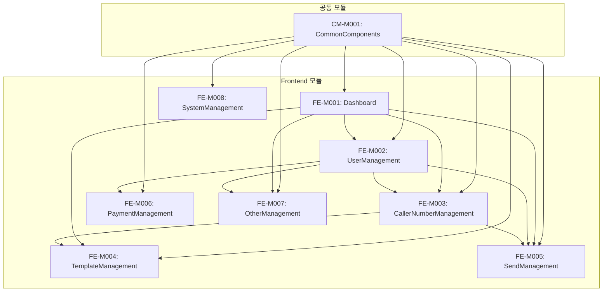

# 톡벨 어드민 시스템 - 모듈 설계서 인덱스

## 1. 프로젝트 구조

```
tokbell-admin/
├── css/
│   └── admin-common.css        # 공통 CSS 스타일
├── js/
│   ├── admin-common.js         # 공통 JavaScript 함수
│   └── sidebar.js              # 사이드바 관련
├── docs/
│   ├── modules/                # 모듈 설계서
│   │   ├── INDEX.md           # 이 파일
│   │   ├── FE-M001-Dashboard.md
│   │   ├── FE-M002-UserManagement.md
│   │   ├── FE-M003-CallerNumberManagement.md
│   │   ├── FE-M004-TemplateManagement.md
│   │   ├── FE-M005-SendManagement.md
│   │   ├── FE-M006-PaymentManagement.md
│   │   ├── FE-M007-OtherManagement.md
│   │   ├── FE-M008-SystemManagement.md
│   │   └── CM-M001-CommonComponents.md
│   └── *.md                    # 기능정의서
└── *.html                      # 페이지 파일
```

## 2. 모듈 목록

### Frontend 모듈

| 모듈 ID | 모듈명 | 설명 | 담당 파일 | 우선순위 |
|---------|--------|------|----------|----------|
| FE-M001 | Dashboard | 대시보드 모듈 | index.html | P0 |
| FE-M002 | UserManagement | 사용자 관리 모듈 | user-list.html, user-permission.html | P0 |
| FE-M003 | CallerNumberManagement | 발신번호 관리 모듈 | caller-number-*.html, kakao-profile-list.html | P0 |
| FE-M004 | TemplateManagement | 템플릿 관리 모듈 | template-alimtalk-review.html | P0 |
| FE-M005 | SendManagement | 발송 관리 모듈 | send-history.html, send-statistics.html, send-policy.html | P0 |
| FE-M006 | PaymentManagement | 결제 관리 모듈 | payment-*.html | P1 |
| FE-M007 | OtherManagement | 기타 관리 모듈 | consultation-list.html, inquiry-list.html, notice-list.html | P1 |
| FE-M008 | SystemManagement | 시스템 관리 모듈 | system-settings.html, statistics-report.html, security-audit.html | P2 |

### 공통 모듈

| 모듈 ID | 모듈명 | 설명 | 담당 파일 | 우선순위 |
|---------|--------|------|----------|----------|
| CM-M001 | CommonComponents | 공통 컴포넌트 모듈 | admin-common.css, admin-common.js | P0 |

## 3. 모듈 의존성 관계



## 4. 모듈별 의존성 상세

### FE-M001: Dashboard
- **의존**: CM-M001
- **피의존**: 없음
- **연관 페이지 링크**: FE-M002, FE-M003, FE-M004, FE-M005, FE-M007

### FE-M002: UserManagement
- **의존**: CM-M001
- **피의존**: FE-M001
- **연관 페이지 링크**: FE-M003 (발신번호 목록), FE-M005 (발송 내역), FE-M006 (결제 내역), FE-M007 (문의 내역)

### FE-M003: CallerNumberManagement
- **의존**: CM-M001
- **피의존**: FE-M001, FE-M002
- **연관 페이지 링크**: FE-M004 (템플릿 목록)

### FE-M004: TemplateManagement
- **의존**: CM-M001
- **피의존**: FE-M001, FE-M003
- **연관 페이지 링크**: 없음

### FE-M005: SendManagement
- **의존**: CM-M001
- **피의존**: FE-M001, FE-M002, FE-M003
- **외부 의존**: Chart.js (발송 통계)

### FE-M006: PaymentManagement
- **의존**: CM-M001
- **피의존**: FE-M002
- **연관 페이지 링크**: 없음

### FE-M007: OtherManagement
- **의존**: CM-M001
- **피의존**: FE-M001, FE-M002
- **연관 페이지 링크**: 없음

### FE-M008: SystemManagement
- **의존**: CM-M001
- **피의존**: 없음
- **외부 의존**: jsPDF, SheetJS (리포트 생성)

### CM-M001: CommonComponents
- **의존**: 없음
- **피의존**: 모든 FE 모듈

## 5. 외부 라이브러리 의존성

| 라이브러리 | 버전 | 사용 모듈 | 용도 |
|-----------|------|----------|------|
| Chart.js | 4.x | FE-M005 | 발송 통계 차트 |
| jsPDF | 2.x | FE-M008 | PDF 리포트 생성 |
| SheetJS (xlsx) | 0.18.x | FE-M008, FE-M005, FE-M006 | Excel 다운로드 |

## 6. 개발 가이드라인

### 6.1 파일 명명 규칙
- **HTML 파일**: `kebab-case.html` (예: `user-list.html`)
- **CSS 파일**: `kebab-case.css` (예: `admin-common.css`)
- **JS 파일**: `kebab-case.js` (예: `admin-common.js`)
- **문서 파일**: `PascalCase.md` (예: `FE-M001-Dashboard.md`)

### 6.2 코딩 컨벤션
- **함수명**: `camelCase` (예: `openModal`, `handleSuspendAccount`)
- **클래스명**: `kebab-case` (예: `stat-card`, `admin-sidebar`)
- **상수**: `UPPER_SNAKE_CASE` (예: `MAX_PAGE_SIZE`)
- **ID**: `camelCase` (예: `userDetailModal`, `searchInput`)

### 6.3 CSS 클래스 구조
```css
/* 레이아웃 */
.admin-container, .admin-sidebar, .admin-main, .admin-header, .admin-content

/* 컴포넌트 */
.card, .stat-card, .modal, .tabs, .pagination, .badge

/* 폼 요소 */
.form-group, .form-control, .form-label

/* 버튼 */
.btn, .btn-primary, .btn-secondary, .btn-outline, .btn-danger, .btn-success

/* 테이블 */
.table-container, table, thead, tbody, th, td

/* 유틸리티 */
.search-filter-bar, .filter-group, .filter-item
```

## 7. 버전 히스토리

| 버전 | 날짜 | 변경 내용 | 작성자 |
|------|------|----------|--------|
| 1.0.0 | 2024-12-15 | 초기 문서 작성 | - |


